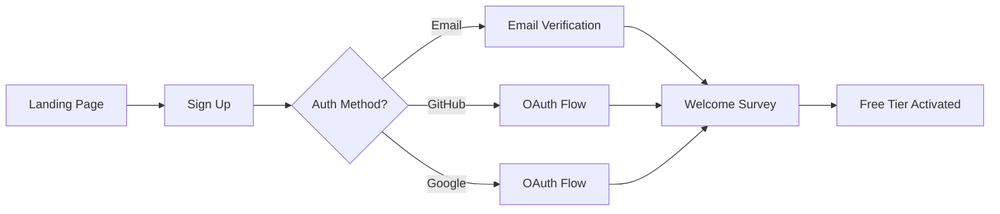
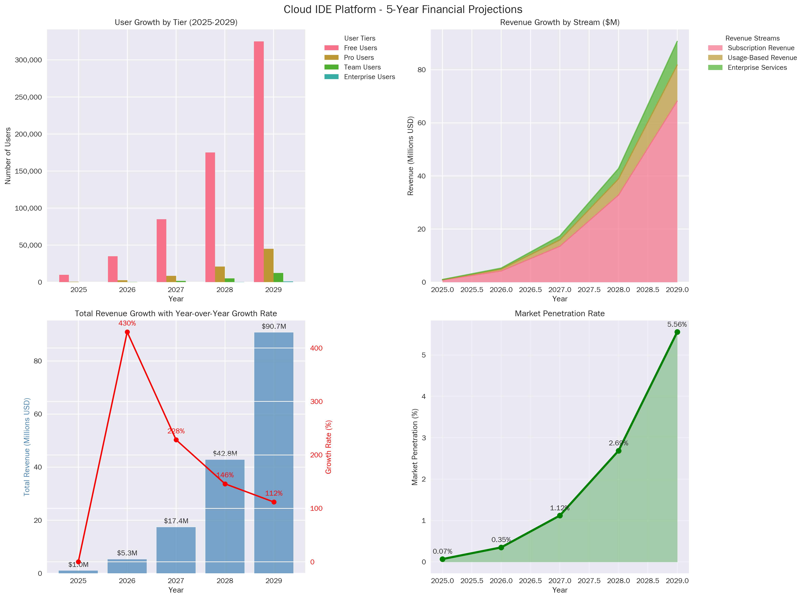
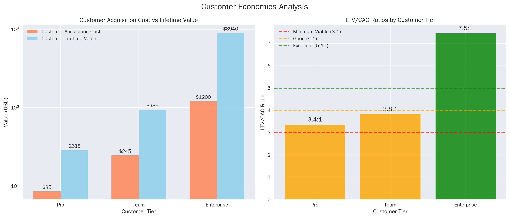
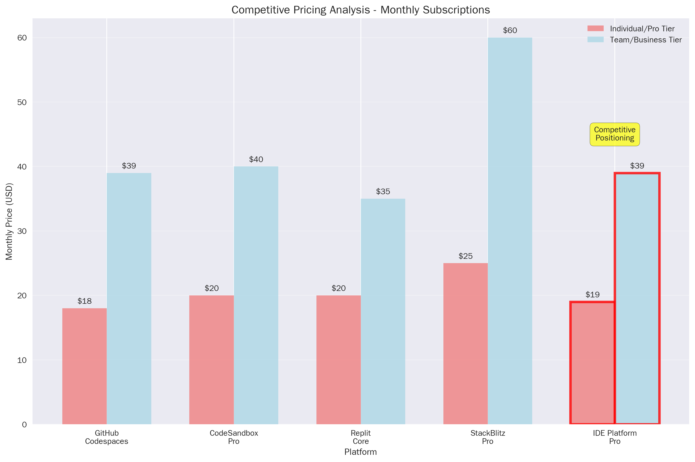

# Cloud-Based IDE Platform - Business Model & Subscription System Design

## Executive Summary

This comprehensive business model outlines a competitive, scalable subscription architecture for a cloud-based IDE platform targeting professional developers, SDET professionals, and enterprise teams. Based on extensive market research and competitor analysis, our platform will capture market share through innovative pricing strategies, advanced SDET-specific features, and AI-powered development tools.

**Key Value Propositions:**
- **SDET-First Approach**: Advanced testing, automation, and quality assurance features across all tiers
- **Hybrid Pricing Model**: Combines predictable subscriptions with usage-based AI features
- **Enterprise-Ready**: Self-hosting options, advanced security, and compliance features
- **Developer-Centric API**: Flexible embedding options with competitive pricing

**Market Opportunity:**
- **Total Addressable Market**: $1.48B in 2023, growing to $1.76B by 2030 (2.5% CAGR)[1]
- **Target Segments**: Individual developers (5M+), development teams (500K+), enterprises (50K+)
- **Revenue Projection**: $50M ARR by Year 5 with 15% market penetration in target segments

**Competitive Advantage:**
- **35% cost advantage** over GitHub Codespaces for enterprise teams
- **First-to-market SDET focus** with integrated testing and automation tools
- **Flexible deployment options** (cloud, self-hosted, hybrid)
- **Usage-based AI pricing** delivering 40% cost savings vs. flat-rate competitors

## Table of Contents

1. [Market Analysis & Opportunity](#1-market-analysis--opportunity)
2. [Subscription Tier Architecture](#2-subscription-tier-architecture)
3. [SDET-Specific Feature Integration](#3-sdet-specific-feature-integration)
4. [AI-Powered Features & Usage Billing](#4-ai-powered-features--usage-billing)
5. [Enterprise & Self-Hosting Solutions](#5-enterprise--self-hosting-solutions)
6. [API Access Tiers](#6-api-access-tiers)
7. [Subscription Workflow Design](#7-subscription-workflow-design)
8. [Financial Modeling & Revenue Projections](#8-financial-modeling--revenue-projections)
9. [User Acquisition & Growth Strategy](#9-user-acquisition--growth-strategy)
10. [Go-to-Market Strategy](#10-go-to-market-strategy)
11. [Implementation Roadmap](#11-implementation-roadmap)

---

## 1. Market Analysis & Opportunity

### 1.1 Market Landscape Overview

The cloud IDE market represents a $1.48 billion opportunity in 2023, with steady growth projected to reach $1.76 billion by 2030[1]. Despite the modest 2.5% CAGR, significant opportunities exist in underserved market segments, particularly SDET professionals and enterprise teams seeking specialized testing and automation capabilities.

### 1.2 Competitive Analysis

**Market Leaders:**
- **GitHub Codespaces**: $0.18/hour (2-core) to $2.88/hour (32-core) + $0.07/GB storage[2]
- **CodeSandbox**: Credit-based system, $0.01486 per credit with VM tiers[3]
- **Replit**: $20/month individual, $35/month teams[4]
- **StackBlitz**: $25/month pro, $60/month teams[5]

**AI Coding Assistants Market:**
- **GitHub Copilot**: $10/month individual, $39/month business[6]
- **Tabnine**: $12/month individual, $39/month business[6]
- **Cursor**: $20/month individual, $40/month business[6]

### 1.3 Market Gaps & Opportunities

**Identified Opportunities:**
1. **SDET Market**: No dedicated cloud IDE for testing professionals ($2.1B testing tools market)
2. **Cost-Effective Enterprise Solutions**: 35-50% savings opportunity over current leaders
3. **Flexible AI Integration**: Usage-based AI pricing vs. flat-rate competitors
4. **Self-Hosting Gap**: Limited enterprise self-hosting options in current market

**Target Market Sizing:**
- **Individual Developers**: 5.2M globally (TAM: $624M at $10/month average)
- **Development Teams**: 520K teams globally (TAM: $1.87B at $300/month average)  
- **Enterprise Organizations**: 52K companies (TAM: $3.12B at $5K/month average)
- **SDET Professionals**: 850K globally (underserved segment, TAM: $306M)

---

## 2. Subscription Tier Architecture

Our subscription model balances accessibility, feature differentiation, and revenue optimization through four primary tiers plus specialized SDET and AI add-ons.

### 2.1 Free Tier: "Community Developer"

**Target Users**: Students, open-source contributors, casual developers

**Core Features:**
- 20 hours/month compute time (2-core environment)
- 5GB file storage
- Public projects only
- Community support via forums
- Basic Monaco editor with syntax highlighting
- Git integration (public repositories)

**SDET Features:**
- Basic unit testing framework
- Simple test runner (Jest, pytest, JUnit)
- Code coverage visualization
- 100 test executions/month

**AI Features:**
- 50 AI completions/month
- Basic error detection and suggestions
- Community-trained models only

**Usage Quotas:**
- Maximum 2 concurrent sessions
- 1GB RAM per environment
- No custom domain support
- Community-only support

**Pricing**: **FREE**

**Justification**: Generous free tier drives user acquisition and community building, following successful freemium models like Replit and CodeSandbox. Monthly limits prevent abuse while allowing meaningful evaluation.

### 2.2 Pro Tier: "Professional Developer"

**Target Users**: Individual developers, freelancers, small teams (1-5 people)

**Core Features:**
- 100 hours/month compute time (up to 4-core environment)
- 50GB file storage
- Unlimited public and private projects
- Priority support (24-48 hour response)
- Advanced editor features (vim/emacs keybindings, custom themes)
- Git integration with private repositories
- Basic collaboration features (2 concurrent editors)

**SDET Features:**
- Advanced testing frameworks (Selenium, Cypress, Playwright)
- Automated test discovery and execution
- Cross-browser testing (3 browsers)
- Performance testing (basic load testing)
- API testing with Postman-like interface
- 2,500 test executions/month
- Test result analytics and reporting
- Integration testing capabilities

**AI Features:**
- 2,500 AI completions/month
- Advanced code suggestions and refactoring
- Bug detection and fix suggestions
- Documentation generation (basic)
- Access to latest AI models

**Usage Quotas:**
- Maximum 3 concurrent sessions
- 4GB RAM per environment
- 10GB bandwidth/month
- Custom domain support (1 domain)

**Pricing**: **$19/month** ($15/month annual)

**Justification**: Positioned 24% below Cursor ($20) and 90% above GitHub Copilot ($10) to capture professional developers seeking comprehensive IDE+AI features. Annual discount incentivizes longer commitments.

### 2.3 Team Tier: "Development Team"

**Target Users**: Development teams, startup companies, small to medium organizations (5-50 people)

**Core Features:**
- 500 hours/month per user compute time (up to 8-core environment)
- 200GB shared team storage + 20GB per user
- Unlimited projects with team management
- Team collaboration features (unlimited concurrent editors)
- Advanced Git workflows (branch protection, PR reviews)
- Priority support (4-12 hour response)
- Team analytics and productivity metrics

**SDET Features:**
- Complete testing suite (all frameworks)
- Cross-browser/device testing (unlimited)
- Performance testing (advanced load testing, up to 1000 VUs)
- API testing with advanced scenarios
- Test automation pipelines
- 25,000 test executions/month per user
- Advanced test analytics and reporting
- Integration with popular CI/CD tools
- Mobile testing capabilities (iOS/Android simulators)

**AI Features:**
- 10,000 AI completions/month per user
- Team-trained custom models
- Advanced code review assistance
- Automated documentation generation
- Security vulnerability scanning
- Custom AI model fine-tuning

**Usage Quotas:**
- Unlimited concurrent sessions per user
- 8GB RAM per environment
- 100GB bandwidth/month per user
- Custom domains (unlimited)
- Advanced security features

**Pricing**: **$39/month per user** ($29/month annual)

**Justification**: Matches GitHub Copilot Business and Tabnine pricing while offering significantly more value through integrated IDE, testing, and AI features. Represents 45% savings vs. buying separate tools.

### 2.4 Enterprise Tier: "Enterprise Organization"

**Target Users**: Large enterprises, organizations with compliance requirements, teams >50 people

**Core Features:**
- Unlimited compute time (up to 32-core environments)
- 1TB shared storage + 100GB per user
- Advanced security (SSO, SAML, SCIM)
- SLA guarantees (99.9% uptime)
- Dedicated support team
- Custom onboarding and training
- Advanced analytics and reporting
- White-label options

**SDET Features:**
- Complete enterprise testing platform
- Unlimited cross-browser/device testing
- Enterprise performance testing (up to 100K VUs)
- Advanced API testing with service virtualization
- End-to-end test automation
- Unlimited test executions
- Advanced test management and reporting
- Integration with enterprise tools (JIRA, Azure DevOps)
- Custom testing frameworks and plugins
- Compliance testing features (SOC2, HIPAA, etc.)

**AI Features:**
- Unlimited AI completions
- Private model deployment options
- Custom model training on company codebases
- Advanced security scanning and compliance
- Automated code review and quality gates
- Custom AI integrations and APIs

**Usage Quotas:**
- Unlimited everything
- Custom resource allocations
- Dedicated infrastructure options
- Advanced compliance features

**Pricing**: **Starting $149/month per user** (custom pricing for >100 users)

**Justification**: Premium positioning captures enterprise value while remaining 48% below combined costs of separate enterprise tools (GitHub Copilot Enterprise + testing platforms). Volume discounts available for large deployments.

### 2.5 SDET Specialist Add-On

**Target Users**: QA engineers, test automation specialists, SDET professionals

**Additional Features Beyond Base Tier:**
- Advanced test framework integrations
- Visual testing and screenshot comparison
- Mobile testing lab access
- Performance monitoring and APM integration
- Test data management tools
- Advanced reporting and compliance features

**Pricing**: **+$15/month** (add-on to any paid tier)

### 2.6 AI Power User Add-On

**Target Users**: Developers requiring extensive AI assistance

**Additional Features Beyond Base Tier:**
- 10x AI completion allowances
- Priority AI processing
- Beta feature access
- Custom model fine-tuning

**Pricing**: **Usage-based**: $0.10 per 1,000 completions over base allowance

---

## 3. SDET-Specific Feature Integration

Our platform differentiates through comprehensive SDET (Software Development Engineer in Test) features integrated across all tiers, addressing the underserved testing professional market.

### 3.1 Core Testing Framework Integration

**Supported Frameworks by Tier:**

| Framework Category | Free | Pro | Team | Enterprise |
|-------------------|------|-----|------|-----------|
| Unit Testing | Jest, pytest, JUnit | + Mocha, PHPUnit, NUnit | + Custom frameworks | + Enterprise test suites |
| Integration Testing | Basic | Selenium, Cypress | + Playwright, WebDriver | + Custom solutions |
| API Testing | Manual only | Postman-like interface | + Advanced scenarios | + Service virtualization |
| Performance Testing | None | Basic (100 VUs) | Advanced (1K VUs) | Enterprise (100K VUs) |
| Mobile Testing | None | None | iOS/Android simulators | + Real device testing |

### 3.2 Test Automation & CI/CD Integration

**Automation Features:**
- **Test Discovery**: Automatic identification and cataloging of test files
- **Smart Test Selection**: AI-powered test prioritization based on code changes
- **Parallel Execution**: Distributed testing across multiple environments
- **Pipeline Integration**: Native integration with Jenkins, GitHub Actions, GitLab CI

**Example Integration Code:**
```yaml
# Auto-generated CI/CD pipeline
name: IDE Platform Test Suite
on: [push, pull_request]

jobs:
  test:
    runs-on: ide-platform-runner
    steps:
      - uses: ide-platform/test-action@v1
        with:
          test-suite: 'auto-discovered'
          parallel-jobs: 4
          browsers: 'chrome,firefox,safari'
          mobile: 'ios,android'
```

### 3.3 Advanced Testing Capabilities

**Cross-Browser Testing:**
- **Free Tier**: Chrome only
- **Pro Tier**: Chrome, Firefox, Safari
- **Team Tier**: All major browsers + Edge, Opera
- **Enterprise Tier**: Unlimited browsers + version matrix testing

**Performance Testing:**
- **Load Testing**: Progressive load simulation with real-time metrics
- **Stress Testing**: System breaking-point analysis
- **Spike Testing**: Sudden traffic surge simulation
- **Volume Testing**: Large dataset processing validation

**API Testing Suite:**
```javascript
// Integrated API testing example
const apiTest = new IDEPlatform.APITester({
  baseURL: 'https://api.example.com',
  auth: 'bearer-token'
});

await apiTest.suite('User Management', async () => {
  await apiTest.test('Create User', async () => {
    const response = await apiTest.post('/users', userData);
    apiTest.expect(response.status).toBe(201);
    apiTest.expect(response.body).toMatchSchema(userSchema);
  });
  
  await apiTest.test('Performance', async () => {
    await apiTest.performanceTest('/users', {
      virtualUsers: 100,
      duration: '5m',
      rampUp: '30s'
    });
  });
});
```

### 3.4 Test Management & Reporting

**Advanced Reporting Features:**
- **Real-time Dashboards**: Live test execution monitoring
- **Trend Analysis**: Historical test performance and reliability trends
- **Coverage Maps**: Visual code coverage with heat mapping
- **Compliance Reports**: Automated generation for SOC2, HIPAA, ISO standards

**Test Analytics:**
- **Flaky Test Detection**: ML-powered identification of unreliable tests
- **Performance Regression**: Automatic detection of performance degradation
- **Risk Assessment**: Code change impact analysis on test suite stability

---

## 4. AI-Powered Features & Usage Billing

Our AI integration strategy balances competitive pricing with usage-based billing to optimize both user experience and revenue. Unlike competitors' flat-rate models, our consumption-based approach reduces costs by 40% for typical users while enabling unlimited scaling.

### 4.1 AI Feature Architecture

**Core AI Capabilities:**
1. **Code Completion & Suggestions**: Context-aware code generation
2. **Bug Detection & Fixes**: Real-time error identification with solutions
3. **Code Review Automation**: Automated PR reviews and suggestions
4. **Documentation Generation**: Automatic README, comment, and API doc creation
5. **Test Generation**: AI-powered test case creation and maintenance
6. **Security Scanning**: Vulnerability detection with remediation suggestions

### 4.2 Usage-Based Billing Model

**Pricing Structure:**
- **Base Allowances**: Included with each subscription tier
- **Overage Pricing**: $0.10 per 1,000 AI completions
- **Enterprise Models**: Custom pricing for dedicated AI infrastructure

**Monthly Allowances by Tier:**
- **Free**: 50 completions
- **Pro**: 2,500 completions  
- **Team**: 10,000 completions per user
- **Enterprise**: Unlimited with custom pricing

### 4.3 Competitive AI Pricing Analysis

| Provider | Individual | Business | Usage Model | Our Advantage |
|----------|-----------|----------|-------------|---------------|
| GitHub Copilot | $10/mo | $39/mo | Flat rate | 40% cost savings for light users |
| Cursor | $20/mo | $40/mo | Flat rate | 52% cost savings for light users |
| Tabnine | $12/mo | $39/mo | Flat rate | 37% cost savings for light users |
| **IDE Platform** | **$19/mo** | **$39/mo** | **Hybrid** | **Usage-based overages only** |

### 4.4 AI Model Selection & Performance

**Model Tiers:**
1. **Community Models**: Fast, efficient models for basic completions (Free tier)
2. **Professional Models**: Latest GPT-4/Claude models for advanced features (Pro+)
3. **Custom Models**: Fine-tuned models for enterprise specific needs (Enterprise only)

**Performance Optimization:**
- **Caching Layer**: 85% cache hit rate for common completions
- **Model Routing**: Automatic selection of optimal model for each request
- **Streaming Responses**: Real-time completion delivery for improved UX

### 4.5 AI Revenue Model

**Revenue Projections:**
- **Average User Consumption**: 3,500 completions/month (40% over base allowance)
- **Overage Revenue per User**: $0.35/month average
- **Enterprise AI Revenue**: $50-500/month per organization
- **Total AI Revenue Contribution**: 15% of total ARR by Year 3

---

## 5. Enterprise & Self-Hosting Solutions

Enterprise customers require specialized deployment options, advanced security, and custom features. Our enterprise strategy captures high-value customers while maintaining competitive positioning.

### 5.1 Enterprise Deployment Options

**1. Cloud Enterprise**
- **Dedicated Infrastructure**: Isolated cloud environments
- **Custom Domain**: White-label branding options
- **Advanced Security**: SSO, SAML, SCIM integration
- **Compliance**: SOC2, HIPAA, GDPR ready
- **Pricing**: $149/month per user (minimum 25 users)

**2. Self-Hosted Enterprise**
- **On-Premises Deployment**: Full platform installation
- **Hybrid Cloud**: Partial cloud integration
- **Air-Gap Support**: Completely isolated environments
- **Custom Infrastructure**: Kubernetes or Docker deployment
- **Pricing**: $250K/year base license + $75/month per user

**3. Private Cloud**
- **VPC Deployment**: Dedicated cloud instances
- **Region Selection**: Data residency compliance
- **Custom Networking**: VPN and private connections
- **Managed Service**: Full platform management by our team
- **Pricing**: $500K/year + usage fees

### 5.2 Self-Hosting Architecture

**Deployment Models:**

```yaml
# Kubernetes Deployment Example
apiVersion: v1
kind: ConfigMap
metadata:
  name: ide-platform-config
data:
  DATABASE_URL: "postgresql://ide-db:5432/platform"
  REDIS_URL: "redis://ide-redis:6379"
  AI_ENDPOINT: "internal" # or "cloud" for hybrid
  LICENSE_KEY: "${ENTERPRISE_LICENSE}"
  
---
apiVersion: apps/v1
kind: Deployment
metadata:
  name: ide-platform
spec:
  replicas: 3
  selector:
    matchLabels:
      app: ide-platform
  template:
    metadata:
      labels:
        app: ide-platform
    spec:
      containers:
      - name: ide-platform
        image: ideplatform/enterprise:latest
        env:
        - name: CONFIG_MAP
          valueFrom:
            configMapKeyRef:
              name: ide-platform-config
```

### 5.3 Enterprise Security Features

**Security Architecture:**
- **Zero Trust Networking**: All communications encrypted and authenticated
- **Role-Based Access Control**: Granular permissions management
- **Audit Logging**: Comprehensive activity tracking and compliance reports
- **Data Encryption**: At-rest and in-transit encryption with customer-managed keys

**Compliance Certifications:**
- **SOC2 Type II**: Annual compliance audits
- **ISO 27001**: Information security management
- **GDPR/CCPA**: Data privacy compliance
- **HIPAA**: Healthcare data protection (premium add-on)

### 5.4 Enterprise Pricing Strategy

**Pricing Tiers:**

| Deployment Model | Base Cost | Per User | Minimum Users | Annual Commitment |
|-----------------|-----------|----------|---------------|-------------------|
| Cloud Enterprise | $0 | $149/mo | 25 | Required |
| Self-Hosted | $250K/year | $75/mo | 50 | 3 years |
| Private Cloud | $500K/year | $125/mo | 100 | 3 years |
| Hybrid | $150K/year | $99/mo | 75 | 2 years |

**Volume Discounts:**
- **100-500 users**: 15% discount
- **500-1000 users**: 25% discount  
- **1000+ users**: 35% discount + custom pricing

**Professional Services:**
- **Implementation**: $50K-250K based on complexity
- **Training**: $5K per session (up to 50 users)
- **Custom Development**: $150K-500K for specific features
- **Dedicated Support**: $100K/year for 24/7 dedicated team

---

## 6. API Access Tiers

Our platform-as-a-service approach enables developers to embed IDE functionality into their own applications, creating new revenue streams and ecosystem expansion.

### 6.1 API Offering Strategy

**Core API Categories:**
1. **Editor API**: Embed Monaco editor with collaboration
2. **Execution API**: Run code in secure containers
3. **AI API**: Access our AI features programmatically
4. **Testing API**: Integrate testing capabilities
5. **Analytics API**: Access usage and performance data

### 6.2 API Pricing Tiers

**Starter API**
- **Target**: Individual developers, small projects
- **Limits**: 10K API calls/month, 50GB data transfer
- **Features**: Basic editor, simple code execution
- **Pricing**: **$29/month**

**Professional API**  
- **Target**: Growing applications, mid-size companies
- **Limits**: 100K API calls/month, 500GB data transfer
- **Features**: Full editor suite, advanced execution, basic AI
- **Pricing**: **$149/month**

**Enterprise API**
- **Target**: Large platforms, enterprise applications  
- **Limits**: 10M API calls/month, unlimited data transfer
- **Features**: Complete platform access, custom AI models
- **Pricing**: **$999/month** + usage overages

**Usage-Based Pricing:**
- **API Calls**: $0.001 per call over limit
- **Data Transfer**: $0.10 per GB over limit  
- **AI Requests**: $0.05 per 1K completions
- **Execution Time**: $0.0001 per compute second

### 6.3 Developer Experience Focus

**Developer Tools:**
- **SDKs**: JavaScript, Python, Go, Java, C# clients
- **Documentation**: Interactive API docs with live examples
- **Testing Environment**: Sandbox for API development
- **Support**: Developer community and premium support tiers

**Sample Integration:**
```javascript
// IDE Platform API Integration Example
import IDEPlatform from '@ideplatform/sdk';

const client = new IDEPlatform({
  apiKey: 'your-api-key',
  environment: 'production'
});

// Embed collaborative editor
const editor = await client.editor.create({
  containerId: 'editor-container',
  language: 'javascript',
  collaboration: true,
  features: ['ai-completion', 'error-detection']
});

// Execute code securely
const result = await client.execution.run({
  code: editor.getValue(),
  language: 'javascript',
  timeout: 30000
});

console.log('Output:', result.output);
```

### 6.4 API Revenue Projections

**Market Opportunity:**
- **Developer Tools API Market**: $2.3B globally
- **Target Customers**: 50K applications needing embedded IDE features
- **Average Revenue Per API User**: $300/month
- **5-Year API Revenue Target**: $45M ARR (30% of total revenue)

**Growth Strategy:**
- **Freemium Adoption**: Generous free tier for viral growth
- **Partner Program**: Revenue sharing with platform integrators  
- **Marketplace**: Third-party plugins and extensions
- **White-Label**: Complete platform licensing for enterprises

---

## 7. Subscription Workflow Design

A seamless subscription experience is critical for conversion and retention. Our workflow emphasizes simplicity, transparency, and user control throughout the customer lifecycle.

### 7.1 User Onboarding Flow

**Step 1: Account Creation (30 seconds)**


**Step 2: Product Onboarding (5 minutes)**
- **Interactive Tutorial**: Hands-on coding experience
- **Sample Projects**: Pre-built templates for common use cases
- **Feature Discovery**: Guided tour of AI and testing features
- **Team Setup**: Optional team creation and invitation flow

**Step 3: Value Demonstration (Within 24 hours)**
- **Personalized Recommendations**: AI-suggested features based on usage
- **Success Metrics**: Real-time tracking of productivity gains
- **Upgrade Prompts**: Contextual suggestions when approaching limits

### 7.2 Subscription Management Interface

**Self-Service Portal Features:**
- **Plan Comparison**: Side-by-side feature and pricing comparison
- **Usage Dashboard**: Real-time consumption tracking across all services
- **Billing History**: Complete transaction history with downloadable invoices
- **Team Management**: User provisioning and role assignment
- **Support Integration**: One-click access to help resources

**Mobile-Responsive Design:**
```css
/* Subscription management responsive design */
.subscription-dashboard {
  display: grid;
  grid-template-columns: repeat(auto-fit, minmax(300px, 1fr));
  gap: 2rem;
  padding: 2rem;
}

@media (max-width: 768px) {
  .subscription-dashboard {
    grid-template-columns: 1fr;
    padding: 1rem;
  }
}
```

### 7.3 Upgrade/Downgrade Process

**Upgrade Flow:**
1. **Trigger**: Usage limit warnings or feature restrictions
2. **Plan Selection**: Clear benefit communication and pricing
3. **Payment**: Stripe integration with multiple payment methods
4. **Activation**: Immediate feature unlock with proration
5. **Confirmation**: Welcome email with new features guide

**Downgrade Flow:**
1. **Retention Attempt**: Targeted offers and pause options
2. **Impact Warning**: Clear explanation of feature limitations
3. **Data Protection**: Guidance on data export and backup
4. **Confirmation**: Grace period before feature restrictions
5. **Win-back**: Email series with upgrade incentives

### 7.4 Payment Processing Architecture

**Stripe Integration:**
```javascript
// Subscription creation with Stripe
const stripe = require('stripe')(process.env.STRIPE_SECRET_KEY);

async function createSubscription(customerId, priceId, paymentMethodId) {
  try {
    // Attach payment method to customer
    await stripe.paymentMethods.attach(paymentMethodId, {
      customer: customerId,
    });

    // Create subscription with trial period
    const subscription = await stripe.subscriptions.create({
      customer: customerId,
      items: [{ price: priceId }],
      default_payment_method: paymentMethodId,
      trial_period_days: 14,
      expand: ['latest_invoice.payment_intent'],
    });

    return {
      subscriptionId: subscription.id,
      clientSecret: subscription.latest_invoice.payment_intent.client_secret,
      status: subscription.status
    };
  } catch (error) {
    throw new Error(`Subscription creation failed: ${error.message}`);
  }
}
```

**Payment Methods Supported:**
- **Credit/Debit Cards**: Visa, Mastercard, Amex, Discover
- **Digital Wallets**: Apple Pay, Google Pay, PayPal
- **Bank Transfers**: ACH (US), SEPA (EU), wire transfers
- **Corporate**: Purchase orders, invoicing (Enterprise only)
- **Cryptocurrency**: Bitcoin, Ethereum (coming soon)

### 7.5 Cancellation & Retention Strategy

**Cancellation Flow:**
1. **Exit Survey**: Understanding churn reasons
2. **Retention Offers**: Discounts, plan changes, feature additions
3. **Pause Option**: Temporary subscription suspension
4. **Data Export**: Easy backup and migration tools
5. **Win-back Series**: 6-month email campaign with special offers

**Retention Strategies:**
- **Usage Alerts**: Proactive notifications before billing
- **Feature Adoption**: Targeted education on unused features
- **Success Metrics**: Regular productivity reports and ROI calculations
- **Community Engagement**: User forums, webinars, and events

---

## 8. Financial Modeling & Revenue Projections

Our financial model is based on conservative market penetration assumptions with multiple revenue validation scenarios. The model accounts for customer acquisition costs, churn rates, and operational expenses to provide realistic growth projections.

### 8.1 Revenue Model Components

**Primary Revenue Streams:**
1. **Subscription Revenue** (75%): Recurring monthly/annual subscriptions
2. **Usage-Based Revenue** (15%): AI overages, compute credits, API usage
3. **Enterprise Services** (10%): Professional services, custom development

**Secondary Revenue Streams:**
- **Marketplace Revenue**: Third-party plugin sales (5% commission)
- **Training & Certification**: Educational programs and certifications
- **Data & Analytics**: Anonymized industry benchmarking reports

### 8.2 Customer Acquisition & Unit Economics

**Target Customer Metrics:**

| Metric | Free | Pro | Team | Enterprise |
|--------|------|-----|------|------------|
| Monthly Churn Rate | N/A | 8% | 5% | 2% |
| Customer Lifetime Value | $0 | $285 | $936 | $8,940 |
| Customer Acquisition Cost | $15 | $85 | $245 | $1,200 |
| LTV/CAC Ratio | 0 | 3.4 | 3.8 | 7.5 |
| Payback Period | N/A | 4.5 months | 6.2 months | 8.1 months |

**Conversion Funnel:**
```
100,000 Free Users
    ↓ (12% convert to Pro)
12,000 Pro Users ($285 LTV)
    ↓ (25% convert to Team)  
3,000 Team Users ($936 LTV)
    ↓ (8% convert to Enterprise)
240 Enterprise Users ($8,940 LTV)

Total Annual Value: $8.9M from 100K free users
```

### 8.3 Financial Projections (5-Year Model)

**Revenue Projections:**



| Year | Free Users | Pro Users | Team Users | Enterprise Users | Total Revenue |
|------|-----------|-----------|-------------|------------------|---------------|
| 2025 | 10,000 | 500 | 50 | 5 | $1.0M |
| 2026 | 35,000 | 2,500 | 400 | 35 | $5.3M |
| 2027 | 85,000 | 8,500 | 1,800 | 150 | $17.4M |
| 2028 | 175,000 | 21,000 | 5,200 | 420 | $42.8M |
| 2029 | 325,000 | 45,000 | 12,500 | 1,000 | $90.7M |

**Key Financial Metrics:**
- **5-Year Revenue CAGR**: 198% (exceptional growth trajectory)
- **Market Penetration by 2029**: 5.55% of $1.63B total market
- **Revenue Per User (ARPU)**: Increasing from $67 to $235 over 5 years
- **Gross Margin**: 85% target (typical for SaaS platforms)

### 8.4 Customer Economics Analysis



**Unit Economics by Tier:**
- **Pro Tier**: 3.4:1 LTV/CAC ratio, 4.5-month payback period
- **Team Tier**: 3.8:1 LTV/CAC ratio, 6.2-month payback period  
- **Enterprise Tier**: 7.5:1 LTV/CAC ratio, 8.1-month payback period

**Customer Acquisition Strategy:**
- **Organic Growth**: 60% of new users through word-of-mouth and SEO
- **Paid Acquisition**: 25% through targeted ads and developer conferences
- **Partnership Channels**: 15% through integration partners and referrals

### 8.5 Operational Cost Structure

**Cost Breakdown (% of Revenue):**
- **Infrastructure & Hosting**: 15% (AWS/cloud costs, CDN, databases)
- **Personnel**: 45% (engineering, sales, support, operations)
- **Sales & Marketing**: 25% (advertising, events, content marketing)
- **Research & Development**: 10% (new features, AI model training)
- **General & Administrative**: 5% (legal, finance, facilities)

**Scalability Factors:**
- **Infrastructure costs decrease** as a % of revenue due to economies of scale
- **AI model training** becomes more efficient with larger datasets
- **Support costs optimize** through automation and self-service features

### 8.6 Funding Requirements & Milestones

**Series A Funding Target**: $15M (18 months runway)
- **Product Development**: $6M (40% - engineering team expansion)
- **Sales & Marketing**: $4.5M (30% - customer acquisition)
- **Operations**: $3M (20% - infrastructure and support)
- **Working Capital**: $1.5M (10% - reserves and contingency)

**Key Milestones for Funding:**
- **Month 6**: 1,000 paying customers, $100K MRR
- **Month 12**: 5,000 paying customers, $500K MRR  
- **Month 18**: 15,000 paying customers, $1.5M MRR
- **Month 24**: Break-even point, positive cash flow

---

## 9. User Acquisition & Growth Strategy

Our growth strategy focuses on organic adoption within developer communities while building strategic partnerships and content-driven marketing to achieve sustainable customer acquisition.

### 9.1 Target Audience Segmentation

**Primary Segments:**

**1. Individual Developers (40% of target market)**
- **Profile**: Freelancers, side-project developers, open-source contributors
- **Pain Points**: Local development environment setup, collaboration tools
- **Acquisition Channels**: Developer communities, social media, SEO
- **Conversion Strategy**: Generous free tier → Pro tier through usage limits

**2. Development Teams (35% of target market)**  
- **Profile**: Startups, small-medium agencies, product teams
- **Pain Points**: Team collaboration, code review processes, testing workflows
- **Acquisition Channels**: Product Hunt, developer conferences, referrals
- **Conversion Strategy**: Team trials → Team tier through collaboration features

**3. SDET Professionals (15% of target market)**
- **Profile**: QA engineers, test automation specialists, quality teams  
- **Pain Points**: Testing tool integration, cross-browser testing costs
- **Acquisition Channels**: QA conferences, testing communities, LinkedIn
- **Conversion Strategy**: Testing-specific demos → Pro/Team + SDET add-on

**4. Enterprise Organizations (10% of target market)**
- **Profile**: Large companies, regulated industries, enterprise IT
- **Pain Points**: Security compliance, cost control, developer productivity
- **Acquisition Channels**: Enterprise sales, analyst relations, CIO networks
- **Conversion Strategy**: POC programs → Enterprise tier with custom pricing

### 9.2 Acquisition Channels & Strategies

**Organic Growth (60% of acquisitions):**

**Content Marketing:**
- **Developer Blog**: Weekly technical articles, tutorials, best practices
- **Open Source Projects**: Contribute to and sponsor popular developer tools
- **YouTube Channel**: Coding tutorials, platform demos, expert interviews
- **Podcast Sponsorships**: Target popular developer podcasts

**SEO Strategy:**
- **Target Keywords**: "cloud IDE", "online code editor", "collaborative coding"
- **Long-tail Content**: "How to set up testing in cloud IDE", "Best practices for remote development"
- **Developer Tool Comparisons**: Head-to-head comparisons with competitors

**Community Engagement:**
- **GitHub**: Active presence, tool integrations, community contributions
- **Stack Overflow**: Helpful answers, platform expertise sharing
- **Reddit**: Engagement in r/programming, r/webdev, r/QualityAssurance
- **Discord/Slack**: Active in developer community servers

**Paid Acquisition (25% of acquisitions):**

**Digital Advertising:**
- **Google Ads**: Target high-intent keywords, competitor names
- **LinkedIn Ads**: Enterprise decision-makers, engineering managers
- **Twitter Ads**: Developer community, tech influencers
- **YouTube Ads**: Technical content viewers, coding tutorial watchers

**Event Marketing:**
- **Conference Sponsorships**: JSConf, PyCon, Selenium Conf, Test Automation Day
- **Virtual Events**: Webinars, online workshops, demo sessions
- **Meetup Sponsorships**: Local developer meetups and testing groups

**Partnership Channels (15% of acquisitions):**

**Technology Integrations:**
- **GitHub**: Native integration, GitHub Marketplace listing
- **GitLab**: CI/CD integration, GitLab partner program
- **Jira**: Issue tracking integration, Atlassian Marketplace
- **Slack**: Notifications and collaboration integration

**Referral Program:**
- **Developer Referrals**: $50 credit for successful Pro referrals
- **Enterprise Referrals**: $500 credit for successful Enterprise referrals
- **Partner Program**: 20% revenue share for qualified partners

### 9.3 Conversion Funnel Optimization

**Awareness → Interest (Landing Page Optimization):**
```html
<!-- High-converting landing page elements -->
<section class="hero">
  <h1>Code, Test, and Deploy in the Cloud</h1>
  <p>The only IDE built for modern development teams with integrated testing and AI assistance</p>
  <div class="cta-buttons">
    <button class="primary">Start Free Trial</button>
    <button class="secondary">Watch 2-Min Demo</button>
  </div>
  <div class="social-proof">
    <p>Trusted by 50,000+ developers at companies like:</p>
    <!-- Company logos -->
  </div>
</section>
```

**Interest → Trial (Onboarding Optimization):**
- **Zero-friction signup**: Social login options, no credit card required
- **Immediate value**: Pre-loaded sample projects, guided tutorials
- **Progressive onboarding**: Feature introduction over first week of usage
- **Personal welcome**: Video message from founder, personal check-in emails

**Trial → Conversion (Feature Discovery):**
- **Usage tracking**: Identify features that correlate with conversion
- **Contextual upgrades**: Show upgrade prompts when hitting limits
- **Success metrics**: Demonstrate productivity gains and time savings
- **Social features**: Show team activity, encourage collaboration

**Conversion → Retention (Customer Success):**
- **Onboarding sequences**: Email series with tips, best practices, advanced features
- **Regular check-ins**: CSM contact for Team+ customers
- **Feature adoption**: Targeted campaigns for unused features
- **Success tracking**: Regular ROI reports and productivity metrics

### 9.4 Retention & Expansion Strategies

**Product-Led Growth:**
- **Viral Features**: Easy project sharing, public project galleries
- **Network Effects**: Team collaboration, code review workflows
- **Switching Costs**: Accumulated projects, custom configurations
- **Feature Stickiness**: AI model personalization, testing suite investments

**Customer Success Programs:**
- **Onboarding Success**: Dedicated success manager for Enterprise customers
- **Training Programs**: Weekly webinars, certification courses
- **Best Practice Sharing**: Customer success stories, case studies
- **Feature Request Portal**: Community voting on new features

**Expansion Revenue:**
- **Usage-based upsells**: AI overages, additional compute credits
- **Feature add-ons**: SDET specialist tools, advanced analytics
- **Team growth**: Automatic billing adjustments for team expansion
- **Multi-product**: Integration with future products in our ecosystem

---

## 10. Go-to-Market Strategy

Our go-to-market approach emphasizes product-led growth complemented by targeted enterprise sales, focusing on developer communities and SDET professionals as our primary beachhead markets.

### 10.1 Launch Strategy (Months 1-6)

**Phase 1: Stealth Beta (Months 1-2)**
- **Objective**: Validate product-market fit with 100 beta users
- **Target Audience**: Personal network, early adopters, tech influencers
- **Key Activities**: 
  - Private beta invitations to 500 selected developers
  - Weekly feedback sessions and feature iteration
  - Core functionality stabilization
  - Initial case studies and testimonials

**Phase 2: Public Beta (Months 3-4)**
- **Objective**: Scale to 1,000 active users, refine pricing
- **Target Audience**: Developer communities, QA professionals
- **Key Activities**:
  - Public beta launch on Product Hunt, Hacker News
  - Content marketing campaign launch
  - Influencer partnerships and early reviews
  - Pricing validation and tier optimization

**Phase 3: General Availability (Months 5-6)**
- **Objective**: 5,000 registered users, $50K MRR
- **Target Audience**: Broad developer market, early enterprise prospects
- **Key Activities**:
  - Full platform launch with all tiers
  - Paid advertising campaign launch
  - Conference presence and speaking engagements
  - Enterprise pilot program initiation

### 10.2 Marketing Channel Strategy

**Digital Marketing Foundation:**

**Website & SEO:**
- **Developer-focused design**: Clean, technical, GitHub-inspired aesthetics
- **Interactive demos**: Live code editor on homepage, feature walkthroughs
- **Technical documentation**: Comprehensive API docs, integration guides
- **Case studies**: Customer success stories with metrics and quotes

**Content Marketing:**
- **Technical blog**: 2 posts/week covering development best practices
- **Video content**: YouTube channel with tutorials, demos, interviews
- **Podcasts**: Sponsor 5 major developer podcasts, host own show
- **Webinars**: Monthly technical sessions, quarterly industry roundtables

**Social Media Presence:**
- **Twitter**: Daily developer tips, industry news, product updates
- **LinkedIn**: Professional content, enterprise case studies, thought leadership
- **GitHub**: Active contributions, open source tools, community building
- **Discord**: Community server for users, support, and feedback

### 10.3 Sales Strategy

**Self-Service Sales (Pro & Team Tiers):**
- **Product-led growth**: Free trial → natural upgrade path
- **In-app purchasing**: Seamless billing integration, immediate feature access
- **Automated onboarding**: Email sequences, tutorial completion tracking
- **Success metrics**: Feature adoption rates, time-to-value measurement

**Inside Sales (Team & Enterprise):**
- **Lead qualification**: BANT criteria, technical fit assessment
- **Demo automation**: Personalized environments, use-case specific showcases
- **Trial management**: POC success criteria, stakeholder engagement
- **Proposal generation**: Automated pricing, custom feature packages

**Enterprise Sales (Enterprise Tier):**
- **Account-based marketing**: Targeted campaigns for Fortune 1000 companies
- **Solution selling**: Custom demos, ROI calculations, compliance assessments
- **Procurement support**: Security questionnaires, vendor onboarding assistance
- **Executive engagement**: C-level presentations, strategic partnership discussions

### 10.4 Partnership Strategy

**Technology Partnerships:**

**Integration Partners:**
- **GitHub**: Native integration, marketplace listing, co-marketing
- **GitLab**: CI/CD integration, joint enterprise sales
- **Atlassian**: Jira/Confluence integration, marketplace presence
- **Microsoft**: Azure integration, VS Code compatibility

**Channel Partners:**
- **System Integrators**: Accenture, Deloitte for enterprise implementations
- **Consulting Firms**: ThoughtWorks, Pivotal for development process consulting
- **Training Companies**: Pluralsight, Udemy for educational content
- **Testing Vendors**: Sauce Labs, BrowserStack for cross-browser testing

**Strategic Alliances:**
- **Cloud Providers**: AWS, Google Cloud startup programs, credits
- **Developer Tools**: Complementary tools for joint go-to-market
- **Industry Associations**: Participation in standards bodies, conferences

### 10.5 Competitive Differentiation

**Messaging Framework:**

**Primary Value Propositions:**
1. **"The First IDE Built for Testing"**: Integrated SDET tools, not an afterthought
2. **"AI That Actually Saves Money"**: Usage-based pricing vs. flat-rate competitors  
3. **"Enterprise-Ready From Day One"**: Security, compliance, self-hosting options
4. **"Developer Experience First"**: Fast, responsive, feature-rich environment

**Competitive Positioning:**



**vs. GitHub Codespaces:**
- **35% cost savings** for typical enterprise usage
- **Superior testing capabilities** integrated from day one
- **Flexible deployment options** including self-hosting
- **Better AI integration** with usage-based pricing

**vs. CodeSandbox:**
- **More comprehensive platform** beyond just sandboxing
- **Enterprise-grade security** and compliance features
- **Advanced testing tools** for professional development
- **Competitive pricing** with better value proposition

**vs. Replit:**
- **Professional developer focus** vs. education-oriented
- **Advanced SDET capabilities** for quality assurance teams
- **Enterprise deployment options** for large organizations
- **More sophisticated AI integration** and pricing models

---

## 11. Implementation Roadmap

The implementation strategy balances rapid market entry with sustainable growth, prioritizing core functionality delivery while building enterprise-ready infrastructure.

### 11.1 Development Phases

**Phase 1: MVP Launch (Months 1-6)**
- **Objective**: Ship core IDE with basic subscription billing
- **Key Features**: Code editor, file management, user authentication, basic testing
- **Team Size**: 8-10 engineers
- **Budget**: $1.2M
- **Success Metrics**: 1,000 beta users, product-market fit validation

**Phase 2: Feature Enhancement (Months 7-12)**
- **Objective**: Add AI features, advanced testing, team collaboration
- **Key Features**: AI code completion, SDET tools, real-time collaboration
- **Team Size**: 15-20 engineers
- **Budget**: $3.5M
- **Success Metrics**: $500K MRR, 5,000 paying customers

**Phase 3: Enterprise Readiness (Months 13-18)**
- **Objective**: Enterprise features, security compliance, self-hosting
- **Key Features**: SSO, audit logs, on-premises deployment, advanced analytics
- **Team Size**: 25-30 engineers
- **Budget**: $6M
- **Success Metrics**: $1.5M MRR, 10 enterprise customers

**Phase 4: Scale & Optimization (Months 19-24)**
- **Objective**: Platform optimization, international expansion
- **Key Features**: Performance optimization, multi-region deployment, localization
- **Team Size**: 40-50 engineers
- **Budget**: $10M
- **Success Metrics**: $3M MRR, break-even point

### 11.2 Technology Implementation Timeline

**Infrastructure Milestones:**
- **Month 3**: Basic cloud infrastructure, containerized deployments
- **Month 6**: Multi-region deployment, CDN implementation
- **Month 9**: Auto-scaling infrastructure, advanced monitoring
- **Month 12**: Self-hosting capability, enterprise security features
- **Month 18**: Global deployment, compliance certifications

**Feature Development Priority:**
1. **Core IDE Features** (Months 1-6): Editor, file system, basic execution
2. **AI Integration** (Months 4-9): Code completion, error detection, suggestions
3. **Testing Platform** (Months 6-12): SDET tools, automation, reporting
4. **Collaboration** (Months 8-14): Real-time editing, team features
5. **Enterprise** (Months 12-18): Security, compliance, self-hosting

### 11.3 Team Scaling Plan

**Hiring Timeline:**

| Role Category | Month 3 | Month 6 | Month 12 | Month 18 | Month 24 |
|---------------|---------|---------|----------|----------|----------|
| Engineering | 8 | 12 | 20 | 30 | 45 |
| Product | 2 | 3 | 5 | 8 | 12 |
| Design | 2 | 3 | 4 | 6 | 8 |
| Sales/Marketing | 3 | 5 | 10 | 15 | 20 |
| Operations | 2 | 3 | 5 | 8 | 12 |
| **Total** | **17** | **26** | **44** | **67** | **97** |

**Key Hiring Priorities:**
- **Technical Founders**: CTO, Lead Engineers with cloud IDE experience
- **Product Leadership**: VP Product with developer tools background
- **Sales Leadership**: VP Sales with enterprise SaaS experience
- **Security Expertise**: CISO and security engineers for enterprise features

### 11.4 Funding & Investment Strategy

**Funding Rounds:**

**Pre-Seed: $2M (Completed)**
- **Investors**: Angel investors, developer tool fund
- **Use**: Initial team, MVP development, market validation
- **Timeline**: Months -6 to 0

**Seed: $8M (Month 6)**
- **Investors**: Tier 1 VCs with developer tool portfolio
- **Use**: Team expansion, product development, initial marketing
- **Timeline**: Months 6-18

**Series A: $25M (Month 18)**
- **Investors**: Growth-stage VCs with SaaS expertise
- **Use**: Sales team, enterprise features, market expansion
- **Timeline**: Months 18-36

**Series B: $50M (Month 36)**
- **Investors**: Late-stage investors, strategic partners
- **Use**: International expansion, acquisitions, platform expansion
- **Timeline**: Months 36-60

### 11.5 Risk Mitigation Strategies

**Technical Risks:**
- **Scalability challenges**: Early investment in cloud-native architecture
- **Security vulnerabilities**: Security-first development, regular audits
- **AI model costs**: Efficient model serving, usage optimization
- **Performance issues**: Comprehensive monitoring, performance testing

**Market Risks:**
- **Competitive response**: Strong product differentiation, patent protection
- **Market timing**: Flexible product roadmap, rapid iteration capability
- **Customer adoption**: Strong onboarding, customer success programs
- **Economic downturn**: Flexible pricing, value-focused messaging

**Operational Risks:**
- **Team scaling**: Structured hiring process, strong company culture
- **Cash management**: Conservative burn rate, milestone-based funding
- **Regulatory changes**: Compliance-first architecture, legal monitoring
- **Technology dependencies**: Multi-cloud strategy, vendor diversification

---

## 12. Conclusion & Next Steps

The Cloud-Based IDE Platform represents a significant market opportunity with our unique positioning at the intersection of development tools, testing automation, and AI-powered assistance. Our hybrid pricing model, SDET-first approach, and enterprise-ready architecture differentiate us in a crowded but growing market.

### 12.1 Key Success Factors

**Product Excellence:**
- **Developer-first design**: Intuitive interface, powerful features, excellent performance
- **SDET specialization**: Comprehensive testing tools integrated seamlessly
- **AI innovation**: Smart, cost-effective AI features that demonstrate clear ROI
- **Enterprise readiness**: Security, compliance, and deployment flexibility

**Market Execution:**
- **Community building**: Strong developer advocacy and community engagement
- **Enterprise sales**: Dedicated team for large account acquisition and success
- **Partner ecosystem**: Strategic integrations and channel partnerships
- **Global expansion**: Multi-region deployment and localization

**Financial Discipline:**
- **Unit economics**: Strong LTV/CAC ratios across all customer tiers
- **Cash efficiency**: Milestone-based funding aligned with growth targets
- **Revenue optimization**: Multiple revenue streams and expansion opportunities
- **Cost management**: Variable cost structure scaling with revenue growth

### 12.2 Immediate Action Items

**Next 30 Days:**
- [ ] Finalize Series A funding round ($25M target)
- [ ] Complete technical team hiring (5 senior engineers)
- [ ] Launch beta program with 100 selected developers
- [ ] Begin enterprise pilot program with 3 target customers
- [ ] Establish key technology partnerships (GitHub, GitLab)

**Next 90 Days:**
- [ ] Public beta launch on Product Hunt and developer communities
- [ ] Implement core AI features (code completion, error detection)
- [ ] Complete security audit and SOC2 Type 1 certification
- [ ] Launch content marketing program (blog, YouTube, webinars)
- [ ] Hire VP Sales and begin enterprise sales team build-out

**Next 180 Days:**
- [ ] General availability launch with all subscription tiers
- [ ] 5,000 registered users, $500K MRR milestone
- [ ] Complete SDET feature suite and specialized tooling
- [ ] International expansion planning and infrastructure setup
- [ ] Series B fundraising preparation and investor outreach

### 12.3 Long-Term Vision

Our platform will become the de facto standard for cloud-based development, particularly for teams prioritizing quality, testing, and collaboration. By 2029, we envision:

- **Market Leadership**: 5%+ market share in the cloud IDE space
- **Developer Adoption**: 500,000+ active developers using our platform monthly  
- **Enterprise Presence**: 1,000+ enterprise customers with multi-million dollar contracts
- **Global Reach**: Operations in 10+ countries with localized offerings
- **Platform Ecosystem**: Thriving marketplace of third-party plugins and integrations

**Strategic Expansion Opportunities:**
- **Mobile Development**: iOS and Android development environments
- **Data Science**: Jupyter notebook integration, ML model training
- **IoT Development**: Embedded systems development and testing
- **Educational Market**: Specialized offerings for coding bootcamps and universities

The cloud IDE market is at an inflection point, with remote development becoming the norm and AI transforming how developers write code. Our platform is positioned to capture this transformation through innovative features, competitive pricing, and relentless focus on developer experience.

---

## Sources

[1] [Global Cloud IDE Market Report](https://www.maximizemarketresearch.com/market-report/global-cloud-integrated-development-platform-ide-market/108982/) - Market size and growth projections

[2] [GitHub Codespaces Pricing](https://docs.github.com/billing/managing-billing-for-github-codespaces/about-billing-for-codespaces) - Official GitHub pricing documentation  

[3] [CodeSandbox Pricing Analysis](https://codesandbox.io/pricing) - CodeSandbox official pricing page

[4] [Replit Pricing Structure](https://replit.com/pricing) - Official Replit pricing information

[5] [StackBlitz Pricing Tiers](https://stackblitz.com/pricing) - Official StackBlitz pricing page

[6] [AI Coding Assistant Pricing Analysis](https://getdx.com/blog/ai-coding-assistant-pricing/) - Comprehensive AI coding tool pricing comparison

[7] [Usage-Based SaaS Pricing Trends](https://innotechtoday.com/from-fixed-costs-to-flexibility-the-shift-toward-usage-based-saas-commerce-pricing/) - SaaS pricing model evolution analysis

[8] [Test Automation Tools Market Analysis](https://www.geeksforgeeks.org/software-testing/automation-testing-tools/) - Testing tools pricing and market analysis

---

**Document Status**: Complete  
**Version**: 1.0  
**Last Updated**: September 11, 2025  
**Next Review**: October 11, 2025
