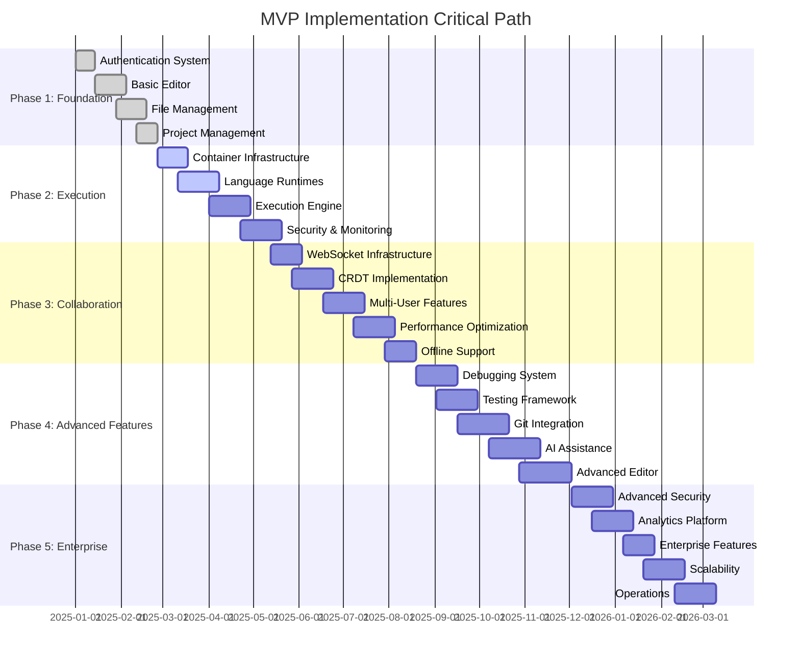

# Cloud-Based IDE Platform - MVP Implementation Roadmap

## Executive Summary

This comprehensive roadmap outlines a strategic 5-phase approach to delivering a Cloud-Based IDE Platform MVP over 36-46 weeks. The phased implementation strategy prioritizes core functionality delivery while building a scalable foundation for advanced features. Each phase includes detailed task breakdowns, resource allocation, testing criteria, and risk mitigation strategies.

The roadmap is designed to deliver value incrementally, with each phase producing a deployable milestone that advances toward the full-featured platform. Total estimated effort: **180-230 person-weeks** with a core team of 8-12 engineers across frontend, backend, DevOps, and QA disciplines.

**Key Milestones:**
- **Week 6**: Basic IDE with authentication and file management
- **Week 14**: Code execution engine with containerized runtime
- **Week 24**: Real-time collaborative editing
- **Week 36**: Advanced IDE features with debugging and Git integration
- **Week 46**: Enterprise-ready platform with advanced security and analytics

---

## Phase 1: Foundation Setup (Weeks 1-6)

**Duration:** 4-6 weeks  
**Team Size:** 6-8 engineers  
**Priority:** Critical Path  

### Overview

Phase 1 establishes the core platform foundation including user authentication, basic code editing capabilities, and file management. This phase creates the minimal viable product that users can access and use for basic code editing tasks.

### Detailed Task Breakdown

#### 1.1 Authentication & User Management (Weeks 1-2)
**Estimated Effort:** 20 person-days  
**Team:** 2 Backend Engineers, 1 Frontend Engineer, 1 DevOps Engineer

**Backend Tasks:**
- [ ] **Auth Service Implementation** (5 days)
  - JWT token generation and validation
  - OAuth2/OIDC integration (Google, GitHub)
  - Password hashing with bcrypt
  - Session management with Redis
  
- [ ] **User Management APIs** (3 days)
  - User registration and login endpoints
  - Profile management (update, preferences)
  - Email verification workflow
  - Password reset functionality

- [ ] **Database Schema Setup** (2 days)
  - Users table with GDPR compliance fields
  - User sessions and OAuth providers tables
  - Database migrations and seed data
  - Row-level security policies

**Frontend Tasks:**
- [ ] **Authentication UI Components** (7 days)
  - Login/register forms with validation
  - OAuth provider buttons
  - Password reset flow
  - User profile and preferences pages

**Infrastructure Tasks:**
- [ ] **Security Configuration** (3 days)
  - JWT secret management
  - HTTPS/TLS setup
  - CORS configuration
  - Rate limiting implementation

#### 1.2 Basic Code Editor Integration (Weeks 2-4)
**Estimated Effort:** 25 person-days  
**Team:** 3 Frontend Engineers, 1 Backend Engineer

**Frontend Tasks:**
- [ ] **Monaco Editor Setup** (5 days)
  - Monaco Editor integration and configuration
  - Basic syntax highlighting for 5+ languages
  - Theme support (light/dark modes)
  - Font and editor preferences

- [ ] **Editor State Management** (4 days)
  - Zustand store for editor state
  - File content caching
  - Undo/redo functionality
  - Auto-save implementation

- [ ] **UI Layout System** (6 days)
  - Resizable panel layout
  - File explorer sidebar
  - Main editor area
  - Status bar and toolbar

- [ ] **Keyboard Shortcuts** (3 days)
  - VS Code compatible shortcuts
  - Customizable keybindings
  - Command palette implementation

**Backend Tasks:**
- [ ] **Editor Configuration API** (4 days)
  - User preferences storage
  - Theme and font settings
  - Language-specific configurations
  - Editor state persistence

- [ ] **WebSocket Foundation** (3 days)
  - Socket.io server setup
  - Connection management
  - Basic message routing
  - Authentication middleware

#### 1.3 File Management System (Weeks 3-5)
**Estimated Effort:** 22 person-days  
**Team:** 2 Backend Engineers, 2 Frontend Engineers

**Backend Tasks:**
- [ ] **File System APIs** (8 days)
  - CRUD operations for files and folders
  - File upload/download endpoints
  - File versioning foundation
  - Hierarchical file structure support

- [ ] **Storage Integration** (4 days)
  - S3-compatible storage setup
  - File metadata management
  - Binary file handling
  - Storage quota enforcement

- [ ] **File Security** (3 days)
  - File access permissions
  - Malware scanning integration
  - File type validation
  - Size limits enforcement

**Frontend Tasks:**
- [ ] **File Explorer Component** (7 days)
  - Tree view with expand/collapse
  - File/folder creation and deletion
  - Drag-and-drop file management
  - Context menus and actions

#### 1.4 Project Management (Weeks 4-6)
**Estimated Effort:** 18 person-days  
**Team:** 2 Backend Engineers, 2 Frontend Engineers

**Backend Tasks:**
- [ ] **Project APIs** (6 days)
  - Project CRUD operations
  - Project settings and configuration
  - User project associations
  - Project templates system

- [ ] **Access Control** (4 days)
  - Role-based permissions
  - Project sharing mechanisms
  - Owner/collaborator roles
  - Permission inheritance

**Frontend Tasks:**
- [ ] **Project Dashboard** (5 days)
  - Project creation wizard
  - Project list and search
  - Project settings interface
  - Template selection

- [ ] **Project Navigation** (3 days)
  - Project switching
  - Breadcrumb navigation
  - Recent projects list
  - Project search functionality

### Technical Requirements

#### Infrastructure Requirements
- **Compute:** 3 t3.medium instances (web, api, db)
- **Database:** PostgreSQL 14+ with 100GB storage
- **Cache:** Redis cluster (2 nodes)
- **Storage:** S3-compatible storage (1TB initial)
- **CDN:** CloudFront for static assets
- **Load Balancer:** Application Load Balancer
- **Monitoring:** Basic CloudWatch/Prometheus setup

#### Security Requirements
- HTTPS/TLS 1.3 encryption
- JWT tokens with 1-hour expiration
- Password complexity requirements
- Rate limiting (100 requests/minute per user)
- Input validation and sanitization
- SQL injection prevention
- XSS protection headers

#### Performance Requirements
- Page load time < 3 seconds
- API response time < 500ms
- File upload support up to 10MB
- Support for 100 concurrent users
- 99.5% uptime target

### Testing Criteria

#### Unit Testing (Target: 80% coverage)
- [ ] Authentication service unit tests
- [ ] File management API tests
- [ ] Frontend component tests
- [ ] Database model tests

#### Integration Testing
- [ ] End-to-end user registration flow
- [ ] OAuth authentication flow
- [ ] File upload/download workflow
- [ ] Project creation and management
- [ ] Editor functionality with file loading

#### Security Testing
- [ ] Authentication bypass attempts
- [ ] SQL injection vulnerability scanning
- [ ] XSS protection validation
- [ ] File upload security testing
- [ ] Rate limiting effectiveness

#### Performance Testing
- [ ] Load testing with 50 concurrent users
- [ ] File operation performance testing
- [ ] Database query optimization validation
- [ ] Memory usage profiling

### Deployment Milestones

#### Week 2 Milestone: Authentication System
**Deliverables:**
- Working user registration and login
- OAuth integration (Google/GitHub)
- Basic user profile management
- Deployed to staging environment

**Success Criteria:**
- Users can create accounts and login
- OAuth providers working correctly
- Session management functional
- Basic security measures in place

#### Week 4 Milestone: Basic Editor
**Deliverables:**
- Monaco Editor integrated with syntax highlighting
- File create/edit/save functionality
- Basic project structure
- User preferences storage

**Success Criteria:**
- Users can edit files with syntax highlighting
- Auto-save functionality working
- Editor preferences persist
- Basic project navigation available

#### Week 6 Milestone: Complete Foundation
**Deliverables:**
- Full file management system
- Project creation and management
- User dashboard and navigation
- Production deployment ready

**Success Criteria:**
- Complete file CRUD operations
- Project sharing and permissions
- Responsive UI across devices
- Performance targets met

### Risk Mitigation Strategies

#### High-Risk Areas

**Risk 1: Monaco Editor Integration Complexity**
- *Probability:* Medium
- *Impact:* High
- *Mitigation:* 
  - Start Monaco integration in Week 1
  - Create proof-of-concept early
  - Have fallback to simpler editor (CodeMirror)
  - Allocate extra frontend developer if needed

**Risk 2: Authentication Security Vulnerabilities**
- *Probability:* Low
- *Impact:* Critical
- *Mitigation:*
  - Use established libraries (Passport.js, JWT)
  - Security audit in Week 2
  - Implement comprehensive logging
  - Multi-factor authentication preparation

**Risk 3: File System Performance Issues**
- *Probability:* Medium
- *Impact:* Medium
- *Mitigation:*
  - Implement file caching strategy
  - Use streaming for large files
  - Set up monitoring early
  - Database indexing optimization

#### Medium-Risk Areas

**Risk 4: Database Schema Evolution**
- *Probability:* High
- *Impact:* Low
- *Mitigation:*
  - Use migration-based schema management
  - Version control all schema changes
  - Test migrations on staging environment
  - Backup and rollback procedures

**Risk 5: Third-Party Service Dependencies**
- *Probability:* Medium
- *Impact:* Medium
- *Mitigation:*
  - Implement circuit breakers
  - Cache OAuth provider responses
  - Monitor service status
  - Have fallback authentication methods

### Resource Allocation

#### Development Team Structure
```
Phase 1 Team (6-8 engineers):
├── Tech Lead (1) - Architecture oversight and code reviews
├── Backend Engineers (2-3)
│   ├── Authentication & User Management specialist
│   ├── File System & Storage specialist
│   └── Database & Infrastructure specialist
├── Frontend Engineers (2-3)
│   ├── UI/UX and Component Library specialist
│   ├── Editor Integration specialist
│   └── State Management specialist
├── DevOps Engineer (1) - Infrastructure and deployment
└── QA Engineer (1) - Testing and quality assurance
```

#### Time Allocation by Discipline
- **Backend Development:** 40% (48 person-days)
- **Frontend Development:** 35% (42 person-days)
- **Infrastructure/DevOps:** 15% (18 person-days)
- **Testing/QA:** 10% (12 person-days)

#### Critical Dependencies
1. **Database schema finalization** - Must complete by Week 1
2. **Authentication system** - Blocks user-related features
3. **Monaco Editor integration** - Critical for editor functionality
4. **Storage system setup** - Required for file operations
5. **WebSocket foundation** - Needed for future real-time features

### Success Metrics

#### Functional Metrics
- [ ] 100% of planned features implemented
- [ ] All integration tests passing
- [ ] User acceptance testing completed
- [ ] Security review approved

#### Performance Metrics
- [ ] Page load time < 3 seconds (target: < 2 seconds)
- [ ] API response time < 500ms (target: < 200ms)
- [ ] File operations < 1 second (target: < 500ms)
- [ ] 99.5% uptime achieved

#### User Experience Metrics
- [ ] User registration completion rate > 90%
- [ ] Editor usability score > 4.0/5.0
- [ ] File management efficiency score > 4.0/5.0
- [ ] Overall user satisfaction > 4.0/5.0

---

## Phase 2: Code Execution Engine (Weeks 7-14)

**Duration:** 6-8 weeks  
**Team Size:** 8-10 engineers  
**Priority:** High  

### Overview

Phase 2 implements secure, containerized code execution capabilities supporting multiple programming languages. This phase transforms the basic editor into a functional development environment where users can run their code safely and efficiently.

### Detailed Task Breakdown

#### 2.1 Containerization Infrastructure (Weeks 7-9)
**Estimated Effort:** 35 person-days  
**Team:** 3 DevOps Engineers, 2 Backend Engineers, 1 Security Engineer

**Infrastructure Tasks:**
- [ ] **Kubernetes Cluster Setup** (8 days)
  - Production-grade K8s cluster configuration
  - Node pools for different workload types
  - Cluster autoscaling configuration
  - Network policies and service mesh (Istio)

- [ ] **Container Runtime Configuration** (6 days)
  - gVisor runtime setup and configuration
  - Kata Containers alternative setup
  - Runtime class definitions
  - Security policy enforcement

- [ ] **Resource Management** (5 days)
  - Resource quotas and limits
  - Pod Security Standards implementation
  - Namespace isolation per user
  - Horizontal Pod Autoscaler setup

**Backend Tasks:**
- [ ] **Execution Service Architecture** (8 days)
  - Microservice for code execution coordination
  - Queue system for execution requests
  - Container lifecycle management
  - Result collection and storage

- [ ] **Security Sandboxing** (8 days)
  - Seccomp profiles for containers
  - AppArmor security profiles
  - Network isolation policies
  - Resource limit enforcement

#### 2.2 Language Runtime Support (Weeks 8-11)
**Estimated Effort:** 42 person-days  
**Team:** 3 Backend Engineers, 2 DevOps Engineers

**Language Support Implementation:**
- [ ] **Python Runtime Environment** (8 days)
  - Python 3.11+ container image
  - Common package pre-installation (numpy, pandas, requests)
  - Virtual environment management
  - Package installation security

- [ ] **JavaScript/Node.js Runtime** (7 days)
  - Node.js 18+ LTS container image
  - npm package management
  - ES module support
  - Browser environment simulation

- [ ] **Java Runtime Environment** (7 days)
  - OpenJDK 17+ container setup
  - Maven/Gradle build tool integration
  - Classpath management
  - Memory optimization for containers

- [ ] **Additional Language Support** (10 days)
  - Go runtime environment
  - C++ compilation environment
  - Basic support for 3-5 additional languages
  - Language detection and selection

**Runtime Management:**
- [ ] **Language Detection System** (5 days)
  - File extension-based detection
  - Content-based language identification
  - Multi-language project support
  - Runtime switching mechanisms

- [ ] **Package Management Integration** (5 days)
  - npm, pip, maven integration
  - Package caching strategies
  - Security scanning for packages
  - Version conflict resolution

#### 2.3 Execution Engine Implementation (Weeks 9-12)
**Estimated Effort:** 38 person-days  
**Team:** 3 Backend Engineers, 2 Frontend Engineers, 1 DevOps Engineer

**Backend Implementation:**
- [ ] **Execution Queue System** (8 days)
  - Redis-based job queue
  - Priority queuing for different user tiers
  - Execution timeout management
  - Dead letter queue handling

- [ ] **Container Orchestration** (10 days)
  - Dynamic container creation and destruction
  - Resource allocation algorithms
  - Container pooling for performance
  - Multi-tenancy isolation enforcement

- [ ] **Code Execution API** (6 days)
  - RESTful APIs for code execution
  - WebSocket support for real-time output
  - File system integration for code files
  - Execution history and logging

**Frontend Implementation:**
- [ ] **Execution Interface** (8 days)
  - Code execution buttons and controls
  - Real-time output display terminal
  - Execution status indicators
  - Error handling and display

- [ ] **Terminal Emulation** (6 days)
  - Web-based terminal using xterm.js
  - Real-time output streaming
  - Input capture for interactive programs
  - Terminal customization options

#### 2.4 Security and Monitoring (Weeks 10-14)
**Estimated Effort:** 32 person-days  
**Team:** 2 Security Engineers, 2 DevOps Engineers, 1 Backend Engineer

**Security Implementation:**
- [ ] **Execution Environment Hardening** (10 days)
  - Container escape prevention
  - System call filtering
  - File system restrictions
  - Network access limitations

- [ ] **Resource Abuse Prevention** (6 days)
  - CPU usage monitoring and limits
  - Memory usage constraints
  - Disk I/O throttling
  - Infinite loop detection

**Monitoring and Observability:**
- [ ] **Execution Metrics Collection** (8 days)
  - Container performance metrics
  - Execution time tracking
  - Resource utilization monitoring
  - Error rate monitoring

- [ ] **Alerting and Incident Response** (8 days)
  - Automated alerting for security issues
  - Performance degradation detection
  - Container failure notifications
  - Incident response procedures

### Technical Requirements

#### Infrastructure Requirements
- **Kubernetes Cluster:** 5-10 nodes (c5.xlarge or equivalent)
- **Container Registry:** Private registry for runtime images
- **Message Queue:** Redis cluster for execution queuing
- **Storage:** Additional 2TB for container images and execution artifacts
- **Monitoring:** Prometheus, Grafana, and Jaeger for observability
- **Security:** Image scanning with Trivy or similar

#### Security Requirements
- gVisor or Kata Containers for container isolation
- Seccomp and AppArmor profiles for all execution containers
- Network policies restricting outbound internet access
- Resource quotas preventing resource exhaustion
- Image vulnerability scanning for all runtime containers
- Audit logging for all execution activities

#### Performance Requirements
- Code execution startup time < 3 seconds
- Support for 100 concurrent code executions
- Container cleanup within 30 seconds of completion
- Real-time output streaming with < 100ms latency
- 99% execution success rate (excluding user code errors)

### Testing Criteria

#### Unit Testing (Target: 85% coverage)
- [ ] Execution service unit tests
- [ ] Container orchestration logic tests
- [ ] Security policy validation tests
- [ ] Language runtime integration tests

#### Integration Testing
- [ ] End-to-end code execution workflows
- [ ] Multi-language execution support
- [ ] Resource limit enforcement testing
- [ ] Security isolation validation
- [ ] Real-time output streaming tests

#### Security Testing
- [ ] Container escape attempt testing
- [ ] Resource exhaustion attack simulation
- [ ] Malicious code execution prevention
- [ ] Network isolation validation
- [ ] Image vulnerability scanning

#### Performance Testing
- [ ] Load testing with 100 concurrent executions
- [ ] Memory usage optimization validation
- [ ] Container startup time optimization
- [ ] Output streaming performance testing

### Deployment Milestones

#### Week 9 Milestone: Basic Container Infrastructure
**Deliverables:**
- Kubernetes cluster with security policies
- Basic container execution capability
- Single language support (Python)
- Resource management implementation

**Success Criteria:**
- Containers can be created and destroyed securely
- Basic Python code execution working
- Resource limits properly enforced
- Security policies preventing escapes

#### Week 11 Milestone: Multi-Language Support
**Deliverables:**
- Support for 5+ programming languages
- Language detection and selection
- Package management integration
- Execution queue system

**Success Criteria:**
- All supported languages execute correctly
- Package installation working securely
- Queue system handles concurrent requests
- Language switching works seamlessly

#### Week 14 Milestone: Production-Ready Execution Engine
**Deliverables:**
- Fully secured execution environment
- Real-time output streaming
- Comprehensive monitoring and alerting
- Performance optimization complete

**Success Criteria:**
- All security tests passing
- Real-time output functioning properly
- Monitoring dashboard operational
- Performance targets achieved

### Risk Mitigation Strategies

#### High-Risk Areas

**Risk 1: Container Security Vulnerabilities**
- *Probability:* Medium
- *Impact:* Critical
- *Mitigation:*
  - Multiple security layers (gVisor + Kata)
  - Regular security audits and penetration testing
  - Automated vulnerability scanning
  - Security expert on team throughout phase

**Risk 2: Performance and Scalability Issues**
- *Probability:* High
- *Impact:* High
- *Mitigation:*
  - Early performance testing and optimization
  - Container pooling and warm-up strategies
  - Horizontal scaling implementation
  - Performance monitoring from day one

**Risk 3: Complex Kubernetes Management**
- *Probability:* Medium
- *Impact:* High
- *Mitigation:*
  - Experienced DevOps team members
  - Use managed Kubernetes services
  - Infrastructure as Code approach
  - Comprehensive monitoring and alerting

#### Medium-Risk Areas

**Risk 4: Language Runtime Compatibility**
- *Probability:* Medium
- *Impact:* Medium
- *Mitigation:*
  - Thorough testing of each language runtime
  - Community feedback integration
  - Gradual rollout of language support
  - Fallback to basic compilation environments

**Risk 5: Resource Management Complexity**
- *Probability:* High
- *Impact:* Medium
- *Mitigation:*
  - Conservative resource limits initially
  - Dynamic resource allocation algorithms
  - Monitoring and alerting for resource issues
  - User education on resource constraints

### Resource Allocation

#### Development Team Structure
```
Phase 2 Team (8-10 engineers):
├── Tech Lead (1) - Architecture and security oversight
├── Backend Engineers (3)
│   ├── Execution Engine specialist
│   ├── Container Orchestration specialist
│   └── Language Runtime specialist
├── DevOps Engineers (3)
│   ├── Kubernetes and Infrastructure specialist
│   ├── Security and Networking specialist
│   └── Monitoring and Operations specialist
├── Frontend Engineers (2)
│   ├── Execution UI specialist
│   └── Terminal Integration specialist
└── Security Engineer (1) - Security auditing and hardening
```

#### Time Allocation by Discipline
- **Backend Development:** 35% (53 person-days)
- **Infrastructure/DevOps:** 40% (60 person-days)
- **Frontend Development:** 15% (23 person-days)
- **Security:** 10% (15 person-days)

#### Critical Dependencies
1. **Kubernetes cluster setup** - Foundation for all container operations
2. **Security framework implementation** - Required before any code execution
3. **Container image creation** - Needed for language runtime support
4. **Resource management system** - Essential for multi-tenancy
5. **Monitoring infrastructure** - Critical for production operations

### Success Metrics

#### Functional Metrics
- [ ] Support for 5+ programming languages
- [ ] 100 concurrent execution capability
- [ ] Real-time output streaming functional
- [ ] Security policies preventing container escapes

#### Performance Metrics
- [ ] Code execution startup < 3 seconds
- [ ] Real-time output latency < 100ms
- [ ] Container cleanup < 30 seconds
- [ ] 99% execution success rate

#### Security Metrics
- [ ] Zero container escape incidents
- [ ] All security tests passing
- [ ] Vulnerability scan results acceptable
- [ ] Resource abuse prevention working

---

## Phase 3: Real-time Collaboration (Weeks 15-24)

**Duration:** 8-10 weeks  
**Team Size:** 8-10 engineers  
**Priority:** High  

### Overview

Phase 3 implements real-time collaborative editing capabilities, enabling multiple users to simultaneously edit documents with conflict-free synchronization. This phase transforms the IDE into a collaborative development platform using CRDT technology and WebSocket communication.

### Detailed Task Breakdown

#### 3.1 WebSocket Infrastructure (Weeks 15-17)
**Estimated Effort:** 28 person-days  
**Team:** 2 Backend Engineers, 2 DevOps Engineers, 1 Frontend Engineer

**Backend Infrastructure:**
- [ ] **WebSocket Server Implementation** (8 days)
  - Socket.io server with clustering support
  - Connection management and authentication
  - Room-based document organization
  - Horizontal scaling with Redis adapter

- [ ] **Connection Management** (6 days)
  - User presence tracking and awareness
  - Reconnection handling and state recovery
  - Connection pooling and optimization
  - Rate limiting for WebSocket connections

- [ ] **Message Routing System** (5 days)
  - Document-based message routing
  - Broadcast optimization for large groups
  - Message queuing for offline users
  - Protocol versioning and compatibility

**Infrastructure Setup:**
- [ ] **Load Balancing for WebSockets** (5 days)
  - Sticky session configuration
  - WebSocket-aware load balancer setup
  - Health checks for WebSocket servers
  - Failover and redundancy implementation

- [ ] **Redis Clustering** (4 days)
  - Redis cluster for WebSocket scaling
  - State synchronization across servers
  - Connection state persistence
  - Performance optimization

#### 3.2 CRDT Implementation with Y.js (Weeks 16-19)
**Estimated Effort:** 45 person-days  
**Team:** 3 Backend Engineers, 3 Frontend Engineers

**CRDT Core Implementation:**
- [ ] **Y.js Integration** (12 days)
  - Y.js document setup and configuration
  - Text CRDT for document editing
  - Awareness protocol for cursor positions
  - Undo/redo with CRDT compatibility

- [ ] **Synchronization Protocol** (8 days)
  - Document state synchronization
  - Delta compression for efficiency
  - Conflict-free merge algorithms
  - State vector management

- [ ] **Persistence Layer** (8 days)
  - Document storage with PostgreSQL
  - Incremental update storage
  - Document history and snapshots
  - Garbage collection for old states

**Frontend Integration:**
- [ ] **Monaco Editor CRDT Binding** (10 days)
  - Y.js Monaco binding integration
  - Real-time cursor synchronization
  - Selection sharing and display
  - Operation transformation for Monaco

- [ ] **Collaboration UI Components** (7 days)
  - User presence indicators
  - Collaborative cursors and selections
  - User list with activity status
  - Conflict resolution UI

#### 3.3 Multi-User Editing Features (Weeks 18-21)
**Estimated Effort:** 38 person-days  
**Team:** 2 Backend Engineers, 3 Frontend Engineers, 1 UX Designer

**Collaborative Features:**
- [ ] **User Awareness System** (8 days)
  - Real-time user presence tracking
  - User activity status indicators
  - Mouse cursor position sharing
  - User identification and avatars

- [ ] **Collaborative Editing Controls** (10 days)
  - Permission-based editing control
  - Read-only mode implementation
  - Edit locking mechanisms
  - Collaborative editing permissions

- [ ] **Comment and Annotation System** (12 days)
  - In-line comment creation and display
  - Comment threading and replies
  - Comment resolution workflows
  - Persistent comment storage

**Real-time Synchronization:**
- [ ] **Conflict Resolution** (8 days)
  - Automatic conflict resolution with CRDT
  - Manual conflict resolution UI
  - Merge conflict visualization
  - Resolution history tracking

#### 3.4 Performance Optimization (Weeks 20-23)
**Estimated Effort:** 32 person-days  
**Team:** 2 Backend Engineers, 2 Frontend Engineers, 1 DevOps Engineer

**Performance Enhancements:**
- [ ] **Delta Compression** (8 days)
  - Efficient delta calculation algorithms
  - Compression for large documents
  - Incremental update optimization
  - Bandwidth usage minimization

- [ ] **State Synchronization Optimization** (8 days)
  - Intelligent state vector management
  - Garbage collection for obsolete operations
  - Memory usage optimization
  - CPU usage profiling and optimization

- [ ] **Scalability Testing** (8 days)
  - Load testing with multiple concurrent editors
  - Performance benchmarking
  - Bottleneck identification and resolution
  - Scaling strategies validation

**Monitoring and Analytics:**
- [ ] **Collaboration Metrics** (8 days)
  - Real-time editing analytics
  - User engagement tracking
  - Performance metrics collection
  - Collaboration effectiveness measurement

#### 3.5 Offline Support and Sync (Weeks 22-24)
**Estimated Effort:** 22 person-days  
**Team:** 2 Backend Engineers, 2 Frontend Engineers

**Offline Functionality:**
- [ ] **Offline Editing Support** (10 days)
  - Local state management during disconnection
  - Offline operation queuing
  - Automatic sync on reconnection
  - Conflict resolution for offline changes

- [ ] **Sync Conflict Resolution** (6 days)
  - Merge strategies for offline changes
  - User notification for sync conflicts
  - Manual resolution interfaces
  - Sync history and audit trail

- [ ] **Progressive Web App Features** (6 days)
  - Service worker implementation
  - Offline document caching
  - Background sync capabilities
  - Offline status indicators

### Technical Requirements

#### Infrastructure Requirements
- **WebSocket Servers:** 3-5 instances with load balancing
- **Redis Cluster:** 3 nodes for WebSocket state management
- **Database:** Enhanced PostgreSQL with CRDT state storage
- **CDN:** WebSocket-compatible CDN for global distribution
- **Monitoring:** Real-time collaboration metrics and alerting

#### Performance Requirements
- **Latency:** < 100ms for collaborative operations
- **Throughput:** Support 1000+ concurrent collaborative sessions
- **Document Size:** Support documents up to 1MB efficiently
- **Concurrent Users:** 50+ users per document
- **Sync Time:** < 500ms for offline reconnection sync

#### Reliability Requirements
- **Availability:** 99.9% uptime for collaboration features
- **Data Consistency:** 100% consistency across all clients
- **Fault Tolerance:** Graceful handling of network partitions
- **Recovery:** < 30 seconds for connection restoration

### Testing Criteria

#### Unit Testing (Target: 85% coverage)
- [ ] CRDT operation unit tests
- [ ] WebSocket message handling tests
- [ ] Synchronization algorithm tests
- [ ] Offline functionality tests

#### Integration Testing
- [ ] Multi-user editing scenarios
- [ ] Network partition and recovery testing
- [ ] Large document collaborative editing
- [ ] Concurrent operation conflict resolution
- [ ] Offline-online synchronization testing

#### Performance Testing
- [ ] 1000 concurrent user load testing
- [ ] Large document performance testing
- [ ] Network latency simulation testing
- [ ] Memory usage optimization validation

#### Collaboration Testing
- [ ] Real-time editing accuracy validation
- [ ] Cursor synchronization testing
- [ ] Comment system functionality testing
- [ ] User presence accuracy validation

### Deployment Milestones

#### Week 17 Milestone: Basic Real-time Infrastructure
**Deliverables:**
- WebSocket server with authentication
- Basic Y.js document synchronization
- Simple multi-user editing capability
- Real-time cursor sharing

**Success Criteria:**
- Multiple users can edit documents simultaneously
- Basic cursor position synchronization working
- WebSocket connections stable and performant
- No data loss during collaborative editing

#### Week 20 Milestone: Advanced Collaborative Features
**Deliverables:**
- Full CRDT implementation with conflict resolution
- User presence and awareness system
- Comment and annotation system
- Permission-based editing controls

**Success Criteria:**
- Conflict-free collaborative editing working
- User awareness system fully functional
- Comments and annotations working properly
- Editing permissions enforced correctly

#### Week 24 Milestone: Production-Ready Collaboration
**Deliverables:**
- Offline support and synchronization
- Performance optimizations complete
- Comprehensive monitoring and analytics
- Scalability testing validated

**Success Criteria:**
- Offline editing and sync working seamlessly
- Performance targets met under load
- Monitoring dashboard providing insights
- System scales to target concurrent users

### Risk Mitigation Strategies

#### High-Risk Areas

**Risk 1: CRDT Complexity and Performance**
- *Probability:* High
- *Impact:* High
- *Mitigation:*
  - Use proven Y.js library instead of custom implementation
  - Early performance testing and optimization
  - Gradual rollout with small user groups
  - Fallback to operation transformation if needed

**Risk 2: WebSocket Scalability Challenges**
- *Probability:* Medium
- *Impact:* High
- *Mitigation:*
  - Implement horizontal scaling from the start
  - Use Redis for state management across servers
  - Load testing throughout development
  - Have alternative communication protocols ready

**Risk 3: Synchronization Bugs and Data Loss**
- *Probability:* Medium
- *Impact:* Critical
- *Mitigation:*
  - Comprehensive testing at every step
  - Implement audit logging for all operations
  - Regular backups and recovery procedures
  - Staged rollout with rollback capabilities

#### Medium-Risk Areas

**Risk 4: Network Partition Handling**
- *Probability:* Medium
- *Impact:* Medium
- *Mitigation:*
  - Implement robust offline support
  - Graceful degradation strategies
  - Clear user communication about connection status
  - Automatic retry mechanisms

**Risk 5: User Experience Complexity**
- *Probability:* High
- *Impact:* Medium
- *Mitigation:*
  - Extensive UX testing and iteration
  - Clear conflict resolution interfaces
  - User education and onboarding
  - Progressive feature disclosure

### Resource Allocation

#### Development Team Structure
```
Phase 3 Team (8-10 engineers):
├── Tech Lead (1) - CRDT and collaboration architecture
├── Backend Engineers (3)
│   ├── WebSocket and Real-time Infrastructure specialist
│   ├── CRDT and Synchronization specialist
│   └── Performance and Scalability specialist
├── Frontend Engineers (3)
│   ├── Collaborative UI specialist
│   ├── Monaco Editor Integration specialist
│   └── Offline and PWA specialist
├── DevOps Engineers (2)
│   ├── Scaling and Load Balancing specialist
│   └── Monitoring and Analytics specialist
└── UX Designer (1) - Collaboration user experience
```

#### Time Allocation by Discipline
- **Backend Development:** 45% (74 person-days)
- **Frontend Development:** 35% (58 person-days)
- **Infrastructure/DevOps:** 15% (25 person-days)
- **UX/Design:** 5% (8 person-days)

#### Critical Dependencies
1. **WebSocket infrastructure** - Foundation for all real-time features
2. **Y.js CRDT implementation** - Core collaboration technology
3. **MongoDB/PostgreSQL CRDT storage** - Persistence for collaborative state
4. **Redis clustering** - Required for horizontal scaling
5. **Performance optimization** - Essential for user experience

### Success Metrics

#### Functional Metrics
- [ ] Multi-user editing working without conflicts
- [ ] Real-time cursor and selection synchronization
- [ ] Offline editing and synchronization functional
- [ ] Comment and annotation system working

#### Performance Metrics
- [ ] Collaborative operation latency < 100ms
- [ ] Support for 50+ concurrent users per document
- [ ] Offline reconnection sync < 500ms
- [ ] Document loading time < 2 seconds

#### User Experience Metrics
- [ ] Collaboration usability score > 4.0/5.0
- [ ] Conflict resolution satisfaction > 4.0/5.0
- [ ] Real-time feature reliability > 99%
- [ ] User engagement with collaborative features > 70%

---

## Phase 4: Advanced IDE Features (Weeks 25-36)

**Duration:** 10-12 weeks  
**Team Size:** 10-12 engineers  
**Priority:** High  

### Overview

Phase 4 transforms the collaborative editor into a full-featured IDE by implementing advanced development tools including debugging capabilities, integrated testing framework, comprehensive Git integration, and AI-powered coding assistance. This phase delivers the sophisticated tooling developers expect from modern IDEs.

### Detailed Task Breakdown

#### 4.1 Integrated Debugging System (Weeks 25-28)
**Estimated Effort:** 48 person-days  
**Team:** 3 Backend Engineers, 2 Frontend Engineers, 1 DevOps Engineer

**Debug Infrastructure:**
- [ ] **Debug Server Implementation** (12 days)
  - Debug Adapter Protocol (DAP) integration
  - Multi-language debugger support
  - Breakpoint management system
  - Debug session lifecycle management

- [ ] **Container Debug Integration** (8 days)
  - Debug-enabled container images
  - Port forwarding for debug connections
  - Debug symbol management
  - Remote debugging configuration

- [ ] **Language-Specific Debuggers** (12 days)
  - Python debugger integration (pdb, debugpy)
  - JavaScript/Node.js debugger (Node Inspector)
  - Java debugger (JDB, JDWP)
  - Go debugger (Delve)
  - C++ debugger (GDB) integration

**Frontend Debug Interface:**
- [ ] **Debug UI Components** (10 days)
  - Breakpoint gutter integration
  - Variables and watch window
  - Call stack visualization
  - Debug console implementation

- [ ] **Debug Controls** (6 days)
  - Step over/into/out controls
  - Continue/pause/stop functionality
  - Conditional breakpoint support
  - Debug session management UI

#### 4.2 Testing Framework Integration (Weeks 26-29)
**Estimated Effort:** 42 person-days  
**Team:** 3 Backend Engineers, 2 Frontend Engineers

**Testing Infrastructure:**
- [ ] **Test Runner Service** (10 days)
  - Multi-framework test execution
  - Test result collection and reporting
  - Test coverage analysis
  - Parallel test execution

- [ ] **Language-Specific Test Integration** (16 days)
  - Python testing (pytest, unittest, nose2)
  - JavaScript testing (Jest, Mocha, Cypress)
  - Java testing (JUnit, TestNG)
  - Go testing (go test, testify)
  - Generic testing framework support

- [ ] **Continuous Integration Pipeline** (8 days)
  - Automated test triggering
  - Git hook integration for testing
  - Test result notifications
  - Failed test analysis and reporting

**Testing UI and UX:**
- [ ] **Test Explorer Interface** (8 days)
  - Test discovery and organization
  - Test execution controls
  - Test result visualization
  - Test coverage display

#### 4.3 Git Integration and Version Control (Weeks 27-31)
**Estimated Effort:** 55 person-days  
**Team:** 3 Backend Engineers, 2 Frontend Engineers, 1 DevOps Engineer

**Git Backend Services:**
- [ ] **Git Service Implementation** (15 days)
  - Git repository initialization and management
  - Branch creation and switching
  - Commit creation and history
  - Remote repository integration

- [ ] **Git Operations API** (10 days)
  - RESTful APIs for Git operations
  - Authentication with Git providers
  - Webhook integration for repository events
  - Git LFS support for large files

- [ ] **Merge and Conflict Resolution** (12 days)
  - Three-way merge implementation
  - Conflict detection and resolution
  - Merge request/pull request creation
  - Branch comparison utilities

**Git Frontend Interface:**
- [ ] **Source Control Panel** (10 days)
  - File status indicators (modified, staged, untracked)
  - Staging and unstaging interface
  - Commit message composition
  - Branch visualization and switching

- [ ] **Diff and Merge UI** (8 days)
  - Side-by-side diff viewer
  - Inline diff display
  - Merge conflict resolution interface
  - Blame and history visualization

#### 4.4 AI-Powered Coding Assistance (Weeks 29-34)
**Estimated Effort:** 58 person-days  
**Team:** 4 Backend Engineers, 2 Frontend Engineers, 1 ML Engineer

**AI Infrastructure:**
- [ ] **Language Server Integration** (15 days)
  - Language Server Protocol (LSP) implementation
  - Multi-language server management
  - IntelliSense and autocompletion
  - Syntax error detection and correction

- [ ] **Code Analysis Engine** (12 days)
  - Static code analysis integration
  - Code quality metrics calculation
  - Security vulnerability detection
  - Performance optimization suggestions

- [ ] **AI Code Generation** (18 days)
  - OpenAI/GitHub Copilot integration
  - Context-aware code suggestions
  - Code completion and generation
  - Documentation generation

**AI Features Implementation:**
- [ ] **Smart Code Suggestions** (8 days)
  - Intelligent autocomplete enhancement
  - Code snippet generation
  - Function signature help
  - Parameter hints and documentation

- [ ] **Code Refactoring Assistance** (5 days)
  - Automated refactoring suggestions
  - Code smell detection
  - Extract method/variable suggestions
  - Code formatting and standardization

#### 4.5 Advanced Editor Features (Weeks 32-36)
**Estimated Effort:** 45 person-days  
**Team:** 2 Backend Engineers, 3 Frontend Engineers, 1 UX Designer

**Enhanced Editor Functionality:**
- [ ] **Multi-Cursor and Selection** (6 days)
  - Multiple cursor editing support
  - Block selection capabilities
  - Column editing mode
  - Find and replace with regex

- [ ] **Code Folding and Minimap** (5 days)
  - Intelligent code folding
  - Minimap with syntax highlighting
  - Code outline and navigation
  - Symbol search and go-to-definition

- [ ] **Extension System Foundation** (12 days)
  - Plugin architecture design
  - Extension API framework
  - Extension marketplace integration
  - Theme and language extension support

**Developer Productivity Features:**
- [ ] **Integrated Terminal Enhancement** (8 days)
  - Multiple terminal sessions
  - Terminal splitting and tabs
  - Terminal history and search
  - Custom shell environment support

- [ ] **Project Search and Navigation** (8 days)
  - Global search across project files
  - Symbol search and navigation
  - File and folder quick navigation
  - Recent files and locations

- [ ] **Code Snippet Management** (6 days)
  - Custom code snippet creation
  - Snippet sharing and templates
  - Language-specific snippet libraries
  - Snippet expansion and customization

### Technical Requirements

#### Infrastructure Requirements
- **Debug Services:** Dedicated debugging infrastructure
- **Language Servers:** LSP servers for each supported language
- **AI Services:** Integration with AI/ML code assistance APIs
- **Git Services:** Git repository management and operations
- **Testing Infrastructure:** Test execution and reporting systems

#### Performance Requirements
- **Debugging:** Debug session startup < 5 seconds
- **Testing:** Test execution results available within 30 seconds
- **Git Operations:** Git commands complete within 3 seconds
- **AI Assistance:** Code suggestions appear within 300ms
- **Search:** Global project search results within 2 seconds

#### Integration Requirements
- **Language Support:** 8+ programming languages fully supported
- **Git Providers:** GitHub, GitLab, Bitbucket integration
- **AI Services:** OpenAI, GitHub Copilot, or similar integration
- **Testing Frameworks:** Popular frameworks for each language
- **Debug Protocols:** Debug Adapter Protocol compliance

### Testing Criteria

#### Unit Testing (Target: 85% coverage)
- [ ] Debug service functionality tests
- [ ] Git operations unit tests
- [ ] Test runner service tests
- [ ] AI integration unit tests
- [ ] Language server integration tests

#### Integration Testing
- [ ] End-to-end debugging workflows
- [ ] Git operation integration testing
- [ ] Testing framework integration validation
- [ ] AI code assistance accuracy testing
- [ ] Cross-language feature testing

#### Performance Testing
- [ ] Debug session performance testing
- [ ] Large repository Git operation testing
- [ ] Test suite execution performance validation
- [ ] AI response time optimization testing

#### User Acceptance Testing
- [ ] Developer workflow usability testing
- [ ] Feature discoverability testing
- [ ] IDE feature parity validation
- [ ] Developer productivity measurement

### Deployment Milestones

#### Week 28 Milestone: Debugging and Testing Foundation
**Deliverables:**
- Integrated debugging system for 3+ languages
- Basic testing framework integration
- Debug UI with breakpoints and variable inspection
- Test execution and reporting capabilities

**Success Criteria:**
- Debugging sessions work reliably
- Breakpoints and variable inspection functional
- Test execution produces accurate results
- UI provides effective debugging experience

#### Week 31 Milestone: Git Integration and Version Control
**Deliverables:**
- Complete Git integration with major providers
- Source control UI with staging and committing
- Branch management and switching capabilities
- Merge conflict resolution interface

**Success Criteria:**
- Git operations work seamlessly
- Branch management is intuitive
- Conflict resolution interface is effective
- Integration with GitHub/GitLab functional

#### Week 34 Milestone: AI-Powered Development Tools
**Deliverables:**
- AI code assistance and suggestions
- Language server integration for IntelliSense
- Code analysis and quality metrics
- Smart refactoring capabilities

**Success Criteria:**
- AI suggestions are relevant and helpful
- IntelliSense works across all languages
- Code analysis provides valuable insights
- Refactoring suggestions improve code quality

#### Week 36 Milestone: Complete Advanced IDE
**Deliverables:**
- Full IDE feature set comparable to VS Code
- Extension system foundation
- Advanced editor features and productivity tools
- Comprehensive developer workflow support

**Success Criteria:**
- All advanced features working correctly
- Developer productivity significantly improved
- Feature parity with major IDEs achieved
- User satisfaction with advanced features > 4.2/5.0

### Risk Mitigation Strategies

#### High-Risk Areas

**Risk 1: AI Integration Complexity and Costs**
- *Probability:* Medium
- *Impact:* High
- *Mitigation:*
  - Start with proven APIs (OpenAI, GitHub Copilot)
  - Implement usage quotas and cost controls
  - Provide fallback to basic language services
  - Gradual rollout to control costs

**Risk 2: Debug Infrastructure Reliability**
- *Probability:* Medium
- *Impact:* High
- *Mitigation:*
  - Use standardized Debug Adapter Protocol
  - Implement comprehensive error handling
  - Provide alternative debugging methods
  - Extensive testing across language ecosystems

**Risk 3: Git Integration Security**
- *Probability:* Low
- *Impact:* Critical
- *Mitigation:*
  - Use OAuth for all Git provider integrations
  - Implement proper token management
  - Regular security audits of Git operations
  - Secure storage of repository credentials

#### Medium-Risk Areas

**Risk 4: Language Server Performance**
- *Probability:* High
- *Impact:* Medium
- *Mitigation:*
  - Implement language server caching
  - Use incremental parsing where possible
  - Optimize language server resource usage
  - Provide language server restart capabilities

**Risk 5: Feature Complexity Overwhelming Users**
- *Probability:* Medium
- *Impact:* Medium
- *Mitigation:*
  - Implement progressive feature disclosure
  - Provide comprehensive onboarding
  - Create feature tutorials and documentation
  - Allow feature customization and hiding

### Resource Allocation

#### Development Team Structure
```
Phase 4 Team (10-12 engineers):
├── Tech Lead (1) - Advanced feature architecture
├── Backend Engineers (4)
│   ├── Debug and Testing Infrastructure specialist
│   ├── Git Integration specialist
│   ├── Language Server specialist
│   └── AI Integration specialist
├── Frontend Engineers (3)
│   ├── Debug UI specialist
│   ├── Git UI specialist
│   └── Advanced Editor Features specialist
├── DevOps Engineers (2)
│   ├── Infrastructure and Language Servers specialist
│   └── AI and External Integration specialist
├── ML Engineer (1) - AI assistance optimization
└── UX Designer (1) - Advanced feature user experience
```

#### Time Allocation by Discipline
- **Backend Development:** 50% (124 person-days)
- **Frontend Development:** 30% (75 person-days)
- **Infrastructure/DevOps:** 12% (30 person-days)
- **AI/ML:** 5% (12 person-days)
- **UX/Design:** 3% (7 person-days)

#### Critical Dependencies
1. **Debug infrastructure** - Foundation for all debugging features
2. **Language servers** - Required for IntelliSense and AI features
3. **Git service integration** - Needed for version control features
4. **AI service agreements** - Required for code assistance features
5. **Testing framework setup** - Foundation for test integration

### Success Metrics

#### Functional Metrics
- [ ] Debugging working for 8+ languages
- [ ] Git operations for all major providers
- [ ] Testing framework integration complete
- [ ] AI code assistance functional
- [ ] All advanced editor features working

#### Performance Metrics
- [ ] Debug session startup < 5 seconds
- [ ] Git operations complete < 3 seconds
- [ ] AI suggestions appear < 300ms
- [ ] Test execution results < 30 seconds
- [ ] Global search results < 2 seconds

#### Developer Experience Metrics
- [ ] Developer productivity increase > 25%
- [ ] Feature adoption rate > 60%
- [ ] IDE feature parity score > 90%
- [ ] Developer satisfaction > 4.2/5.0
- [ ] Time to complete common tasks reduced > 30%

---

## Phase 5: Enterprise & Scaling (Weeks 37-46)

**Duration:** 8-10 weeks  
**Team Size:** 10-12 engineers  
**Priority:** High  

### Overview

Phase 5 focuses on enterprise readiness, advanced security implementations, comprehensive analytics, and platform scaling capabilities. This phase transforms the IDE into an enterprise-grade solution capable of serving large organizations with advanced security, compliance, and operational requirements.

### Detailed Task Breakdown

#### 5.1 Advanced Security Implementation (Weeks 37-40)
**Estimated Effort:** 52 person-days  
**Team:** 3 Security Engineers, 2 Backend Engineers, 1 DevOps Engineer, 1 Compliance Specialist

**Enterprise Security Features:**
- [ ] **Single Sign-On (SSO) Integration** (12 days)
  - SAML 2.0 integration for enterprise identity providers
  - OpenID Connect (OIDC) enterprise compatibility
  - Active Directory and LDAP integration
  - Multi-factor authentication enforcement

- [ ] **Role-Based Access Control (RBAC) Enhancement** (10 days)
  - Fine-grained permission system
  - Organization-level role management
  - Project-level permission inheritance
  - Administrative role delegation

- [ ] **Security Audit and Compliance** (15 days)
  - SOC 2 Type II compliance implementation
  - GDPR compliance enhancements
  - Security audit logging and retention
  - Data encryption at rest and in transit

**Advanced Threat Protection:**
- [ ] **Container Security Hardening** (8 days)
  - Enhanced container image scanning
  - Runtime security monitoring
  - Behavioral anomaly detection
  - Automated security response systems

- [ ] **Network Security Enhancement** (7 days)
  - Zero-trust network architecture
  - Advanced intrusion detection
  - DDoS protection and mitigation
  - Secure API gateway configuration

#### 5.2 Analytics and Monitoring Platform (Weeks 38-41)
**Estimated Effort:** 45 person-days  
**Team:** 3 Backend Engineers, 2 DevOps Engineers, 1 Data Engineer, 1 Frontend Engineer

**Comprehensive Analytics:**
- [ ] **User Analytics Platform** (15 days)
  - User behavior tracking and analysis
  - Feature usage analytics
  - Performance metrics collection
  - Custom dashboard creation

- [ ] **Platform Performance Monitoring** (12 days)
  - Advanced APM integration (Datadog, New Relic)
  - Custom metrics and alerting
  - Performance bottleneck identification
  - Capacity planning analytics

- [ ] **Business Intelligence Dashboard** (10 days)
  - Executive reporting dashboard
  - Usage trends and patterns
  - Revenue and subscription analytics
  - User engagement metrics

**Operational Analytics:**
- [ ] **System Health Monitoring** (8 days)
  - Infrastructure health dashboards
  - Proactive issue detection
  - Automated remediation workflows
  - SLA monitoring and reporting

#### 5.3 Enterprise Features and Administration (Weeks 39-42)
**Estimated Effort:** 48 person-days  
**Team:** 3 Backend Engineers, 2 Frontend Engineers, 1 UX Designer

**Enterprise Administration:**
- [ ] **Organization Management System** (15 days)
  - Multi-tenant organization structure
  - Billing and subscription management
  - User provisioning and deprovisioning
  - Resource quota management per organization

- [ ] **Advanced User Management** (12 days)
  - Bulk user operations
  - User lifecycle management
  - Automated onboarding workflows
  - Integration with HR systems

- [ ] **Compliance and Audit Features** (12 days)
  - Comprehensive audit trail
  - Data retention policy enforcement
  - Export capabilities for compliance
  - Privacy controls and data anonymization

**Enterprise Integration:**
- [ ] **API Management and Rate Limiting** (9 days)
  - Enterprise API rate limiting
  - API usage analytics and billing
  - Custom API key management
  - Webhook integration capabilities

#### 5.4 Scalability and Performance Optimization (Weeks 40-44)
**Estimated Effort:** 55 person-days  
**Team:** 3 Backend Engineers, 3 DevOps Engineers, 1 Performance Engineer

**Infrastructure Scaling:**
- [ ] **Auto-scaling Implementation** (15 days)
  - Kubernetes Horizontal Pod Autoscaler
  - Vertical Pod Autoscaler configuration
  - Custom metrics-based scaling
  - Predictive scaling algorithms

- [ ] **Database Optimization and Scaling** (12 days)
  - PostgreSQL read replicas setup
  - Database sharding strategy
  - Query optimization and indexing
  - Connection pooling optimization

- [ ] **Caching Strategy Enhancement** (10 days)
  - Multi-layer caching implementation
  - Redis cluster optimization
  - CDN integration for global performance
  - Cache invalidation strategies

**Performance Optimization:**
- [ ] **Application Performance Optimization** (10 days)
  - Code-level performance optimizations
  - Memory usage optimization
  - CPU usage profiling and optimization
  - Network latency reduction

- [ ] **Global Distribution Setup** (8 days)
  - Multi-region deployment strategy
  - Edge computing integration
  - Global load balancing
  - Regional data compliance

#### 5.5 Advanced Operational Capabilities (Weeks 42-46)
**Estimated Effort:** 42 person-days  
**Team:** 2 Backend Engineers, 2 DevOps Engineers, 1 Frontend Engineer, 1 Technical Writer

**Operational Excellence:**
- [ ] **Disaster Recovery and Backup** (12 days)
  - Automated backup procedures
  - Point-in-time recovery implementation
  - Cross-region disaster recovery
  - Recovery time optimization

- [ ] **Configuration Management** (8 days)
  - Feature flag management system
  - Environment-specific configuration
  - A/B testing infrastructure
  - Gradual feature rollout capabilities

- [ ] **Support and Troubleshooting Tools** (10 days)
  - Advanced logging and tracing
  - User session replay capabilities
  - Automated troubleshooting workflows
  - Support ticket integration

**Documentation and Training:**
- [ ] **Enterprise Documentation** (12 days)
  - Administrator guides and runbooks
  - API documentation for enterprise features
  - Security and compliance documentation
  - Training materials and videos

### Technical Requirements

#### Infrastructure Requirements
- **Multi-Region Setup:** 3+ AWS regions for global distribution
- **Enhanced Monitoring:** Comprehensive observability stack
- **Security Services:** Enterprise-grade security tools integration
- **Compliance Tools:** SOC 2 and GDPR compliance automation
- **Analytics Platform:** Data warehouse and BI tools

#### Security Requirements
- **Compliance:** SOC 2 Type II, GDPR, HIPAA readiness
- **Encryption:** End-to-end encryption for all data
- **Access Control:** Enterprise-grade RBAC and SSO
- **Audit:** Comprehensive audit logging and retention
- **Monitoring:** 24/7 security monitoring and response

#### Scalability Requirements
- **Concurrent Users:** 10,000+ concurrent active users
- **Organizations:** Support for 1,000+ enterprise organizations
- **Geographic Distribution:** Sub-200ms response times globally
- **High Availability:** 99.99% uptime SLA capability
- **Data Processing:** Handle 1TB+ of analytics data daily

### Testing Criteria

#### Security Testing
- [ ] Penetration testing by third-party security firm
- [ ] SOC 2 Type II audit preparation and execution
- [ ] GDPR compliance validation
- [ ] SSO integration testing with major providers
- [ ] Advanced threat simulation testing

#### Performance Testing
- [ ] Load testing with 10,000+ concurrent users
- [ ] Global performance testing from multiple regions
- [ ] Database performance testing under high load
- [ ] Auto-scaling effectiveness validation
- [ ] Disaster recovery testing and validation

#### Enterprise Feature Testing
- [ ] Multi-tenant isolation testing
- [ ] Organization management workflow testing
- [ ] Billing and subscription integration testing
- [ ] Analytics accuracy and performance testing
- [ ] API rate limiting and management testing

#### Compliance Testing
- [ ] Data retention policy enforcement testing
- [ ] Privacy controls and anonymization testing
- [ ] Audit trail completeness validation
- [ ] Export functionality compliance testing

### Deployment Milestones

#### Week 40 Milestone: Enterprise Security and Compliance
**Deliverables:**
- SSO integration with major enterprise providers
- SOC 2 Type II compliance implementation
- Advanced RBAC and permission system
- Enhanced security monitoring and response

**Success Criteria:**
- SSO working with 5+ major enterprise providers
- Security audit shows no critical vulnerabilities
- RBAC system handles complex organizational structures
- Security monitoring detects and responds to threats

#### Week 42 Milestone: Analytics and Monitoring Platform
**Deliverables:**
- Comprehensive analytics and monitoring dashboard
- Business intelligence reporting system
- Performance monitoring and alerting
- User behavior analytics platform

**Success Criteria:**
- Analytics dashboard provides actionable insights
- Monitoring detects issues before user impact
- Performance metrics meet enterprise SLA requirements
- BI reports support business decision making

#### Week 44 Milestone: Scalability and Global Distribution
**Deliverables:**
- Auto-scaling infrastructure implementation
- Multi-region deployment capability
- Global performance optimization
- Enhanced database scaling solution

**Success Criteria:**
- System auto-scales based on demand
- Performance remains consistent across regions
- Database handles enterprise-scale loads
- Global response times meet requirements

#### Week 46 Milestone: Enterprise-Ready Platform
**Deliverables:**
- Complete enterprise feature set
- Disaster recovery and backup systems
- Comprehensive documentation and training
- Production-ready enterprise deployment

**Success Criteria:**
- All enterprise requirements satisfied
- Disaster recovery tested and validated
- Documentation supports enterprise deployment
- Platform ready for large-scale enterprise adoption

### Risk Mitigation Strategies

#### High-Risk Areas

**Risk 1: Compliance and Security Audit Failures**
- *Probability:* Medium
- *Impact:* Critical
- *Mitigation:*
  - Engage compliance experts early in development
  - Conduct regular internal security audits
  - Implement security-first development practices
  - Plan for multiple audit iterations

**Risk 2: Scalability Bottlenecks**
- *Probability:* High
- *Impact:* High
- *Mitigation:*
  - Conduct regular performance testing
  - Implement monitoring and alerting early
  - Plan for horizontal scaling from the start
  - Have expert performance engineers on team

**Risk 3: Multi-Region Complexity**
- *Probability:* Medium
- *Impact:* High
- *Mitigation:*
  - Start with single region and expand gradually
  - Use proven cloud provider services
  - Implement comprehensive testing across regions
  - Plan for region-specific compliance requirements

#### Medium-Risk Areas

**Risk 4: Enterprise Integration Complexity**
- *Probability:* High
- *Impact:* Medium
- *Mitigation:*
  - Use standard protocols (SAML, OIDC)
  - Provide extensive documentation and examples
  - Implement customer success team for enterprise onboarding
  - Create flexible integration options

**Risk 5: Data Privacy and GDPR Compliance**
- *Probability:* Medium
- *Impact:* High
- *Mitigation:*
  - Implement privacy by design principles
  - Regular privacy impact assessments
  - Automated data retention and deletion
  - Legal team review of all privacy features

### Resource Allocation

#### Development Team Structure
```
Phase 5 Team (10-12 engineers):
├── Tech Lead (1) - Enterprise architecture oversight
├── Security Engineers (3)
│   ├── Enterprise Security specialist
│   ├── Compliance and Audit specialist
│   └── Threat Detection specialist
├── Backend Engineers (3)
│   ├── Analytics and Monitoring specialist
│   ├── Enterprise Features specialist
│   └── Performance Optimization specialist
├── DevOps Engineers (3)
│   ├── Scaling and Infrastructure specialist
│   ├── Multi-Region Deployment specialist
│   └── Monitoring and Operations specialist
├── Frontend Engineer (1) - Enterprise UI specialist
├── Data Engineer (1) - Analytics platform specialist
└── Technical Writer (1) - Enterprise documentation
```

#### Time Allocation by Discipline
- **Backend Development:** 35% (85 person-days)
- **Security/Compliance:** 25% (61 person-days)
- **Infrastructure/DevOps:** 25% (61 person-days)
- **Analytics/Data:** 10% (24 person-days)
- **Documentation:** 5% (12 person-days)

#### Critical Dependencies
1. **Security and compliance framework** - Foundation for enterprise features
2. **Monitoring and analytics infrastructure** - Required for operational excellence
3. **Auto-scaling implementation** - Essential for enterprise scalability
4. **Multi-region setup** - Needed for global enterprise deployment
5. **Documentation and training materials** - Critical for enterprise adoption

### Success Metrics

#### Enterprise Readiness Metrics
- [ ] SOC 2 Type II compliance achieved
- [ ] GDPR compliance validated
- [ ] Enterprise customer onboarding success rate > 95%
- [ ] Security audit results meet enterprise standards
- [ ] SSO integration success rate > 99%

#### Scalability Metrics
- [ ] Support for 10,000+ concurrent users
- [ ] 99.99% uptime achieved
- [ ] Global response times < 200ms
- [ ] Auto-scaling response time < 30 seconds
- [ ] Database performance under enterprise load

#### Operational Excellence Metrics
- [ ] Mean time to resolution (MTTR) < 1 hour
- [ ] Monitoring coverage > 95%
- [ ] Automated incident response > 80%
- [ ] Customer satisfaction score > 4.5/5.0
- [ ] Support ticket resolution time < 24 hours

#### Business Impact Metrics
- [ ] Enterprise customer acquisition rate increase
- [ ] Revenue per enterprise customer increase
- [ ] Customer retention rate > 95%
- [ ] Platform utilization efficiency > 80%
- [ ] Total cost of ownership reduction > 20%

---

## Cross-Phase Dependencies and Critical Path

### Dependency Matrix



### Critical Dependencies

#### Phase 1 → Phase 2 Dependencies
- **Authentication System** must be complete before secure code execution
- **File Management** required for code file handling in containers
- **WebSocket Foundation** needed for real-time execution output
- **Database Schema** must support execution tracking and results

#### Phase 2 → Phase 3 Dependencies
- **Container Infrastructure** provides isolation for collaborative editing
- **Security Framework** essential for multi-user environment security
- **WebSocket Infrastructure** foundation for real-time collaboration
- **Resource Management** prevents abuse in collaborative scenarios

#### Phase 3 → Phase 4 Dependencies
- **Real-time Synchronization** required for collaborative debugging
- **User Management** needed for Git integration permissions
- **Performance Optimization** baseline for advanced feature performance
- **Collaboration Infrastructure** supports pair programming debugging

#### Phase 4 → Phase 5 Dependencies
- **Git Integration** needed for enterprise version control features
- **AI Services** require enterprise-grade security and privacy
- **Advanced Features** form the foundation for enterprise differentiation
- **Testing Framework** essential for enterprise-grade quality assurance

### Resource Planning Across Phases

#### Team Size Progression
```
Phase 1: 6-8 engineers  (Foundation)
Phase 2: 8-10 engineers (Execution Engine)
Phase 3: 8-10 engineers (Collaboration)
Phase 4: 10-12 engineers (Advanced Features)
Phase 5: 10-12 engineers (Enterprise)
```

#### Skill Set Requirements Evolution

**Phase 1-2: Infrastructure Focus**
- DevOps and infrastructure expertise
- Container and Kubernetes specialists
- Security engineering capabilities
- Backend microservices development

**Phase 3-4: Feature Development Focus**
- Real-time systems expertise
- Frontend user experience specialists
- AI/ML integration capabilities
- Developer tooling experience

**Phase 5: Enterprise Focus**
- Enterprise security specialists
- Compliance and audit experts
- Performance and scalability engineers
- Business analytics capabilities

### Risk Management Across Phases

#### Early Warning System
- **Week 2 Review:** Authentication and security foundation
- **Week 6 Review:** Basic platform functionality validation
- **Week 14 Review:** Code execution security and performance
- **Week 24 Review:** Collaboration scalability assessment
- **Week 36 Review:** Advanced features integration validation
- **Week 46 Review:** Enterprise readiness certification

#### Contingency Plans
- **Phase 1 Delay:** Extend timeline but maintain quality standards
- **Security Issues:** Immediate security review and remediation
- **Performance Problems:** Performance engineering team escalation
- **Integration Failures:** Fallback to simpler alternatives
- **Resource Constraints:** Phase scope reduction with stakeholder approval

---

## Resource Allocation and Team Structure

### Overall Team Structure

```
MVP Development Team (36-46 weeks):
├── Engineering Leadership (3)
│   ├── Technical Architect (1) - Cross-phase architecture
│   ├── Engineering Manager (1) - Team coordination and delivery
│   └── Product Manager (1) - Requirements and user experience
├── Backend Engineering (15-18)
│   ├── Microservices Specialists (4-5)
│   ├── Real-time Systems Engineers (3-4)
│   ├── AI/ML Integration Engineers (2-3)
│   ├── Database and Performance Engineers (3-4)
│   └── API and Integration Engineers (3-4)
├── Frontend Engineering (8-10)
│   ├── React/Next.js Specialists (3-4)
│   ├── Editor Integration Specialists (2-3)
│   ├── UI/UX Implementation Engineers (2-3)
│   └── Performance and Optimization Engineers (1-2)
├── DevOps and Infrastructure (8-10)
│   ├── Kubernetes and Container Specialists (3-4)
│   ├── Security Engineers (2-3)
│   ├── Monitoring and Observability Engineers (2-3)
│   └── Cloud Infrastructure Engineers (1-2)
├── Quality Assurance (4-5)
│   ├── Test Automation Engineers (2-3)
│   ├── Security Testing Specialists (1-2)
│   └── Performance Testing Engineers (1)
├── Data and Analytics (2-3)
│   ├── Data Engineers (1-2)
│   └── Analytics Specialists (1)
└── Specialized Roles (4-5)
    ├── UX/UI Designers (2)
    ├── Technical Writers (1-2)
    └── Compliance Specialists (1)
```

### Budget Planning

#### Personnel Costs (Estimated Annual)
```
Senior Engineers: $150,000 - $200,000/year
Mid-Level Engineers: $120,000 - $150,000/year
Junior Engineers: $90,000 - $120,000/year
Specialists (Security, ML, etc.): $160,000 - $220,000/year
Leadership: $180,000 - $250,000/year

Total Team Cost (avg 42 people): $6.3M - $8.4M annually
MVP Development Cost (46 weeks): $5.6M - $7.4M
```

#### Infrastructure Costs (Monthly)
```
Development Environment: $15,000 - $25,000/month
Staging Environment: $8,000 - $12,000/month
Production Infrastructure: $25,000 - $40,000/month
Third-party Services: $10,000 - $15,000/month

Total Infrastructure: $58,000 - $92,000/month
MVP Period Total: $630,000 - $1,000,000
```

#### Additional Costs
```
Security Audits and Compliance: $200,000 - $300,000
Third-party Integrations: $150,000 - $250,000
Legal and Compliance: $100,000 - $150,000
Training and Development: $75,000 - $100,000

Total Additional Costs: $525,000 - $800,000
```

### Total MVP Investment Summary

**Total Estimated Investment: $6.8M - $9.2M**
- Personnel: $5.6M - $7.4M (75-80%)
- Infrastructure: $630K - $1.0M (7-11%)
- Additional Costs: $525K - $800K (8-12%)

---

## Conclusion

This comprehensive 5-phase MVP implementation roadmap provides a strategic path to delivering a world-class Cloud-Based IDE Platform. The phased approach ensures incremental value delivery while building a scalable, secure, and feature-rich development environment.

### Key Success Factors

1. **Experienced Team:** Recruit proven engineers with expertise in distributed systems, real-time collaboration, and enterprise software
2. **Security-First Approach:** Implement security measures from day one, not as an afterthought
3. **Performance Focus:** Optimize for performance at each phase to maintain user experience quality
4. **User Feedback Integration:** Regular user testing and feedback incorporation throughout development
5. **Scalable Architecture:** Design for scale from the foundation to avoid expensive rewrites

### Expected Outcomes

By following this roadmap, the organization will achieve:
- **Market-Ready Product:** A competitive IDE platform ready for commercial launch
- **Enterprise Capabilities:** Features and security suitable for large organizational deployments
- **Scalable Foundation:** Architecture capable of supporting millions of users globally
- **Developer Ecosystem:** Platform ready for third-party extensions and integrations
- **Competitive Advantage:** Advanced features differentiating from existing solutions

### Next Steps

1. **Team Assembly:** Begin recruiting key technical leadership and specialists
2. **Infrastructure Planning:** Finalize cloud provider selection and initial infrastructure setup
3. **Phase 1 Kickoff:** Initiate development with the foundation phase
4. **Stakeholder Communication:** Regular updates and milestone reviews with leadership
5. **Risk Monitoring:** Implement early warning systems for critical risks

This roadmap represents a comprehensive strategy for delivering a Cloud-Based IDE Platform that meets market demands while establishing a foundation for long-term success and growth.
