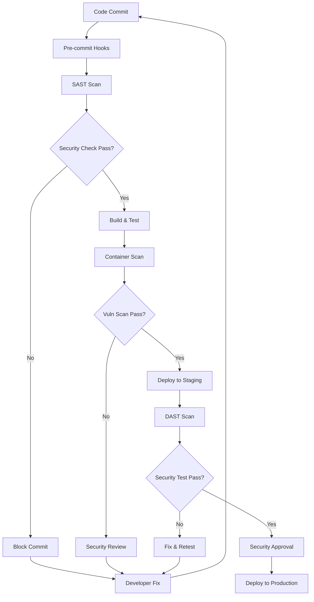

# Security Architecture Design for Cloud-Based IDE Platform

## Executive Summary

This document presents a comprehensive security architecture design for a cloud-based Integrated Development Environment (IDE) platform. The architecture follows security-first principles and addresses critical challenges including code sandboxing, multi-tenant isolation, data protection, and regulatory compliance. This design provides a robust foundation for secure development environments while maintaining scalability and performance.

**Key Security Objectives:**
- Ensure complete isolation of user code execution environments
- Protect sensitive source code and intellectual property
- Maintain compliance with SOC2, GDPR, and industry standards
- Implement defense-in-depth strategies across all system layers
- Enable secure collaboration while maintaining tenant isolation

---

## 1. Security-First Architecture Principles and Threat Modeling

### Core Security Principles

**1. Zero Trust Architecture**
- Never trust, always verify every request and user
- Implement continuous authentication and authorization
- Assume breach and minimize blast radius
- Apply principle of least privilege universally

**2. Defense in Depth**
- Multiple layers of security controls
- Fail-safe defaults across all components
- Redundant security mechanisms
- Progressive security boundaries

**3. Security by Design**
- Integrate security from initial architecture phase
- Secure coding practices and secure defaults
- Threat modeling during design phase
- Regular security architecture reviews

### Threat Modeling Framework

**STRIDE Threat Analysis**

| Threat Type | Definition | IDE-Specific Risks | Mitigation Strategies |
|------------|------------|-------------------|---------------------|
| **Spoofing** | Impersonation of users/systems | Fake user accounts, session hijacking | Multi-factor authentication, JWT tokens, certificate pinning |
| **Tampering** | Modification of data | Code injection, malicious file uploads | Input validation, file integrity checks, immutable containers |
| **Repudiation** | Denial of actions | Users deny malicious code execution | Comprehensive audit logging, digital signatures, blockchain trails |
| **Information Disclosure** | Unauthorized data access | Source code leakage, tenant data exposure | Encryption, access controls, data classification |
| **Denial of Service** | Service unavailability | Resource exhaustion, DDoS attacks | Rate limiting, auto-scaling, circuit breakers |
| **Elevation of Privilege** | Unauthorized access escalation | Container escapes, privilege escalation | Container hardening, RBAC, capability dropping |

**DREAD Risk Assessment Matrix**

```
Risk Score = (Damage + Reproducibility + Exploitability + Affected Users + Discoverability) / 5

Priority Levels:
- Critical (9-10): Immediate action required
- High (7-8): Address within 1 week
- Medium (5-6): Address within 1 month
- Low (1-4): Address in next release cycle
```

**Key Threat Scenarios:**

1. **Malicious Code Execution**
   - Risk Score: 9/10 (Critical)
   - Scenario: User uploads malicious code that attempts to escape sandbox
   - Mitigation: gVisor/Kata Containers, strict resource limits, network isolation

2. **Cross-Tenant Data Access**
   - Risk Score: 8/10 (High)
   - Scenario: Code from one tenant accesses another tenant's data
   - Mitigation: Namespace isolation, encrypted storage, strict access controls

3. **Privilege Escalation**
   - Risk Score: 7/10 (High)
   - Scenario: Container breakout leads to host system compromise
   - Mitigation: Rootless containers, capability restrictions, SELinux/AppArmor

---

## 2. Container-Based Code Sandboxing with gVisor and Kata Containers

### Sandboxing Architecture Overview

The IDE platform employs multiple layers of container-based sandboxing to ensure complete isolation of user code execution environments.

### gVisor Implementation

**gVisor Configuration:**
```yaml
# runsc configuration for gVisor
apiVersion: v1
kind: ConfigMap
metadata:
  name: gvisor-config
data:
  config.toml: |
    [runsc]
    platform = "ptrace"
    file-access = "proxy"
    network = "sandbox"
    log-level = "info"
    debug-log = "/var/log/runsc/"
    strace = false
    
    # Security hardening
    rootless = true
    ignore-cgroups = false
    
    # Resource constraints
    cpu-cgroup-path = "/sys/fs/cgroup/cpu"
    memory-cgroup-path = "/sys/fs/cgroup/memory"
```

**Kubernetes Runtime Configuration:**
```yaml
apiVersion: node.k8s.io/v1
kind: RuntimeClass
metadata:
  name: gvisor
handler: runsc
scheduling:
  nodeClassification:
    requiredDuringSchedulingIgnoredDuringExecution:
      nodeSelectorTerms:
      - matchExpressions:
        - key: runtime
          operator: In
          values: ["gvisor"]
---
apiVersion: v1
kind: Pod
metadata:
  name: user-sandbox
spec:
  runtimeClassName: gvisor
  securityContext:
    runAsNonRoot: true
    runAsUser: 65534
    fsGroup: 65534
    seccompProfile:
      type: RuntimeDefault
  containers:
  - name: code-executor
    image: secure-ide-runtime:latest
    resources:
      limits:
        cpu: "1"
        memory: "512Mi"
        ephemeral-storage: "1Gi"
      requests:
        cpu: "100m"
        memory: "128Mi"
```

### Kata Containers Implementation

**Kata Configuration:**
```toml
# /etc/kata-containers/configuration.toml
[hypervisor.qemu]
path = "/usr/bin/qemu-system-x86_64"
kernel = "/usr/share/kata-containers/vmlinux.container"
image = "/usr/share/kata-containers/kata-containers.img"
machine_type = "q35"

# Security settings
enable_debug = false
default_vcpus = 1
default_maxvcpus = 2
default_memory = 512
disable_block_device_use = true
enable_iommu = true

# Networking
default_bridges = 1
disable_new_netns = false

[agent.kata]
enable_debug = false
dial_timeout = 60
```

**VM-Based Sandbox Pod:**
```yaml
apiVersion: v1
kind: Pod
metadata:
  name: kata-sandbox
  annotations:
    io.katacontainers.config.hypervisor.default_memory: "512"
    io.katacontainers.config.hypervisor.default_vcpus: "1"
spec:
  runtimeClassName: kata-containers
  containers:
  - name: isolated-executor
    image: kata-ide-runtime:latest
    securityContext:
      allowPrivilegeEscalation: false
      readOnlyRootFilesystem: true
      capabilities:
        drop:
        - ALL
    volumeMounts:
    - name: tmp-volume
      mountPath: /tmp
    - name: user-workspace
      mountPath: /workspace
      readOnly: false
  volumes:
  - name: tmp-volume
    emptyDir:
      sizeLimit: "100Mi"
  - name: user-workspace
    persistentVolumeClaim:
      claimName: user-workspace-pvc
```

### Sandbox Security Policies

**Network Policies for Sandboxes:**
```yaml
apiVersion: networking.k8s.io/v1
kind: NetworkPolicy
metadata:
  name: sandbox-network-policy
spec:
  podSelector:
    matchLabels:
      app: code-sandbox
  policyTypes:
  - Ingress
  - Egress
  ingress:
  - from:
    - podSelector:
        matchLabels:
          app: ide-proxy
  egress:
  - to: []
    ports:
    - protocol: TCP
      port: 443  # HTTPS only
    - protocol: TCP
      port: 80   # HTTP (limited)
  - to:
    - namespaceSelector:
        matchLabels:
          name: dns-system
    ports:
    - protocol: UDP
      port: 53
```

**Pod Security Standards:**
```yaml
apiVersion: v1
kind: Namespace
metadata:
  name: user-sandboxes
  labels:
    pod-security.kubernetes.io/enforce: restricted
    pod-security.kubernetes.io/audit: restricted
    pod-security.kubernetes.io/warn: restricted
---
apiVersion: v1
kind: LimitRange
metadata:
  name: sandbox-limits
  namespace: user-sandboxes
spec:
  limits:
  - default:
      cpu: "500m"
      memory: "256Mi"
      ephemeral-storage: "1Gi"
    defaultRequest:
      cpu: "100m"
      memory: "64Mi"
    max:
      cpu: "2"
      memory: "1Gi"
    min:
      cpu: "50m"
      memory: "32Mi"
    type: Container
```

---

## 3. Multi-Tenant Isolation Strategies and Namespace Security

### Namespace Architecture

**Hierarchical Namespace Structure:**
```
├── platform-system/          # Core platform services
├── shared-services/           # Shared utilities (logging, monitoring)
├── tenant-{org-id}/           # Organization-level namespace
│   ├── user-{user-id}/        # Individual user namespaces
│   └── project-{project-id}/  # Project-specific namespaces
└── security-enforcement/      # Security policies and admission controllers
```

### Tenant Isolation Configuration

**Namespace Template:**
```yaml
apiVersion: v1
kind: Namespace
metadata:
  name: tenant-{{.OrgID}}
  labels:
    tenant.ide.platform/org-id: "{{.OrgID}}"
    tenant.ide.platform/tier: "{{.Tier}}"
    pod-security.kubernetes.io/enforce: restricted
  annotations:
    tenant.ide.platform/created-at: "{{.Timestamp}}"
    tenant.ide.platform/admin-contact: "{{.AdminEmail}}"
---
apiVersion: v1
kind: ResourceQuota
metadata:
  name: tenant-quota
  namespace: tenant-{{.OrgID}}
spec:
  hard:
    requests.cpu: "10"
    requests.memory: 20Gi
    requests.storage: 100Gi
    limits.cpu: "20"
    limits.memory: 40Gi
    persistentvolumeclaims: "50"
    pods: "100"
    services: "20"
    secrets: "50"
    configmaps: "50"
```

**Network Segmentation:**
```yaml
apiVersion: networking.k8s.io/v1
kind: NetworkPolicy
metadata:
  name: tenant-isolation
  namespace: tenant-{{.OrgID}}
spec:
  podSelector: {}
  policyTypes:
  - Ingress
  - Egress
  ingress:
  # Allow traffic from same tenant
  - from:
    - namespaceSelector:
        matchLabels:
          tenant.ide.platform/org-id: "{{.OrgID}}"
  # Allow traffic from platform services
  - from:
    - namespaceSelector:
        matchLabels:
          app.kubernetes.io/name: platform-services
  egress:
  # Allow DNS resolution
  - to:
    - namespaceSelector:
        matchLabels:
          name: kube-system
    ports:
    - protocol: UDP
      port: 53
  # Allow HTTPS to external services
  - to: []
    ports:
    - protocol: TCP
      port: 443
  # Allow traffic within tenant
  - to:
    - namespaceSelector:
        matchLabels:
          tenant.ide.platform/org-id: "{{.OrgID}}"
```

### Advanced Isolation Mechanisms

**Virtual Clusters with vcluster:**
```yaml
apiVersion: v1
kind: ConfigMap
metadata:
  name: vcluster-config
data:
  values.yaml: |
    sync:
      nodes:
        enabled: false
      persistentvolumes:
        enabled: false
      storageclasses:
        enabled: false
    
    isolation:
      enabled: true
      namespace: "tenant-{{.OrgID}}-vcluster"
      podSecurityStandard: "restricted"
      
    networking:
      replicateServices:
        fromHost: []
        toHost:
        - type: ClusterIP
      
    security:
      podSecurityStandard: "restricted"
      
    resources:
      limits:
        cpu: "4"
        memory: "8Gi"
      requests:
        cpu: "1"
        memory: "2Gi"
```

**Service Mesh Integration (Istio):**
```yaml
apiVersion: security.istio.io/v1beta1
kind: AuthorizationPolicy
metadata:
  name: tenant-authz-policy
  namespace: tenant-{{.OrgID}}
spec:
  rules:
  - from:
    - source:
        principals: ["cluster.local/ns/tenant-{{.OrgID}}/sa/default"]
    to:
    - operation:
        methods: ["GET", "POST"]
    when:
    - key: custom.tenant_id
      values: ["{{.OrgID}}"]
---
apiVersion: networking.istio.io/v1beta1
kind: Sidecar
metadata:
  name: tenant-sidecar
  namespace: tenant-{{.OrgID}}
spec:
  egress:
  - hosts:
    - "./*"
    - "istio-system/*"
    - "shared-services/*"
  outboundTrafficPolicy:
    mode: REGISTRY_ONLY
```

---

## 4. Identity and Access Management (IAM) with Role-Based Access Control

### IAM Architecture

**Identity Provider Integration:**
```yaml
# OIDC Provider Configuration
apiVersion: v1
kind: ConfigMap
metadata:
  name: oidc-config
data:
  issuer-url: "https://auth.ide-platform.com"
  client-id: "ide-platform-client"
  username-claim: "email"
  groups-claim: "groups"
  scopes: "openid,profile,email,groups"
```

### RBAC Implementation

**Core Roles Definition:**
```yaml
# Platform Admin Role
apiVersion: rbac.authorization.k8s.io/v1
kind: ClusterRole
metadata:
  name: platform-admin
rules:
- apiGroups: ["*"]
  resources: ["*"]
  verbs: ["*"]
- nonResourceURLs: ["*"]
  verbs: ["*"]
---
# Tenant Admin Role
apiVersion: rbac.authorization.k8s.io/v1
kind: Role
metadata:
  namespace: tenant-{{.OrgID}}
  name: tenant-admin
rules:
- apiGroups: [""]
  resources: ["pods", "services", "configmaps", "secrets", "persistentvolumeclaims"]
  verbs: ["get", "list", "create", "update", "patch", "delete"]
- apiGroups: ["apps"]
  resources: ["deployments", "replicasets"]
  verbs: ["get", "list", "create", "update", "patch", "delete"]
- apiGroups: ["networking.k8s.io"]
  resources: ["networkpolicies"]
  verbs: ["get", "list", "create", "update", "patch", "delete"]
---
# Developer Role
apiVersion: rbac.authorization.k8s.io/v1
kind: Role
metadata:
  namespace: user-{{.UserID}}
  name: developer
rules:
- apiGroups: [""]
  resources: ["pods", "pods/log", "pods/exec"]
  verbs: ["get", "list", "create", "delete"]
- apiGroups: [""]
  resources: ["configmaps", "secrets"]
  verbs: ["get", "list", "create", "update", "patch", "delete"]
  resourceNames: ["user-config", "user-secrets"]
---
# Viewer Role
apiVersion: rbac.authorization.k8s.io/v1
kind: Role
metadata:
  namespace: project-{{.ProjectID}}
  name: viewer
rules:
- apiGroups: [""]
  resources: ["pods", "services", "configmaps"]
  verbs: ["get", "list"]
- apiGroups: ["apps"]
  resources: ["deployments"]
  verbs: ["get", "list"]
```

**Dynamic Role Binding:**
```yaml
apiVersion: rbac.authorization.k8s.io/v1
kind: RoleBinding
metadata:
  name: user-{{.UserID}}-binding
  namespace: user-{{.UserID}}
subjects:
- kind: User
  name: {{.UserEmail}}
  apiGroup: rbac.authorization.k8s.io
roleRef:
  kind: Role
  name: developer
  apiGroup: rbac.authorization.k8s.io
---
# Group-based binding
apiVersion: rbac.authorization.k8s.io/v1
kind: RoleBinding
metadata:
  name: project-{{.ProjectID}}-team-binding
  namespace: project-{{.ProjectID}}
subjects:
- kind: Group
  name: project-{{.ProjectID}}-team
  apiGroup: rbac.authorization.k8s.io
roleRef:
  kind: Role
  name: developer
  apiGroup: rbac.authorization.k8s.io
```

### Service Account Security

**Dedicated Service Accounts:**
```yaml
apiVersion: v1
kind: ServiceAccount
metadata:
  name: code-executor-sa
  namespace: user-{{.UserID}}
  annotations:
    kubernetes.io/enforce-mountable-secrets: "true"
secrets:
- name: code-executor-token
---
apiVersion: v1
kind: Secret
metadata:
  name: code-executor-token
  namespace: user-{{.UserID}}
  annotations:
    kubernetes.io/service-account.name: code-executor-sa
type: kubernetes.io/service-account-token
```

### Admission Controllers

**Custom Admission Controller:**
```go
// Tenant Isolation Admission Controller
func (tc *TenantController) ValidateAdmission(req admission.Request) admission.Response {
    // Extract tenant information
    tenantID := extractTenantID(req.Object)
    userID := extractUserID(req.UserInfo)
    
    // Validate tenant access
    if !tc.validateTenantAccess(userID, tenantID) {
        return admission.Errored(http.StatusForbidden, 
            fmt.Errorf("user %s not authorized for tenant %s", userID, tenantID))
    }
    
    // Validate resource quotas
    if err := tc.validateResourceQuotas(req.Namespace, req.Object); err != nil {
        return admission.Errored(http.StatusBadRequest, err)
    }
    
    // Inject security policies
    tc.injectSecurityPolicies(req.Object)
    
    return admission.Allowed("")
}
```

---

## 5. API Security with Authentication, Authorization, and Rate Limiting

### API Gateway Architecture

**Kong Gateway Configuration:**
```yaml
apiVersion: configuration.konghq.com/v1
kind: KongPlugin
metadata:
  name: oauth2-auth
plugin: oauth2
config:
  scopes:
    - read:projects
    - write:projects
    - execute:code
    - admin:tenant
  mandatory_scope: true
  enable_authorization_code: true
  enable_client_credentials: true
  enable_implicit_grant: false
  enable_password_grant: false
  token_expiration: 3600
  refresh_token_ttl: 86400
---
apiVersion: configuration.konghq.com/v1
kind: KongPlugin
metadata:
  name: rate-limiting-advanced
plugin: rate-limiting-advanced
config:
  limit:
    - 1000
  window_size:
    - 3600
  identifier: consumer
  sync_rate: 10
  strategy: redis
  redis:
    host: redis-cluster.cache.svc.cluster.local
    port: 6379
    password: ${REDIS_PASSWORD}
    database: 0
    ssl: true
```

### JWT Token Management

**JWT Configuration:**
```yaml
apiVersion: v1
kind: ConfigMap
metadata:
  name: jwt-config
data:
  jwt-settings.yaml: |
    issuer: "https://api.ide-platform.com"
    audience: "ide-platform-users"
    algorithm: "RS256"
    token_lifetime: 3600  # 1 hour
    refresh_token_lifetime: 604800  # 7 days
    
    claims:
      required:
        - sub  # User ID
        - email
        - tenant_id
        - roles
      optional:
        - name
        - avatar_url
        - preferences
    
    validation:
      verify_signature: true
      verify_expiration: true
      verify_not_before: true
      verify_issued_at: true
      verify_audience: true
      leeway: 30  # 30 seconds clock skew tolerance
```

**Token Validation Middleware:**
```go
func JWTValidationMiddleware() gin.HandlerFunc {
    return func(c *gin.Context) {
        token := extractTokenFromHeader(c)
        if token == "" {
            c.JSON(http.StatusUnauthorized, gin.H{"error": "Missing authorization token"})
            c.Abort()
            return
        }
        
        claims, err := validateJWTToken(token)
        if err != nil {
            c.JSON(http.StatusUnauthorized, gin.H{"error": "Invalid token"})
            c.Abort()
            return
        }
        
        // Validate tenant access
        if !validateTenantAccess(claims.UserID, claims.TenantID) {
            c.JSON(http.StatusForbidden, gin.H{"error": "Insufficient permissions"})
            c.Abort()
            return
        }
        
        c.Set("user_claims", claims)
        c.Next()
    }
}
```

### API Rate Limiting

**Multi-Tier Rate Limiting:**
```yaml
apiVersion: networking.istio.io/v1beta1
kind: EnvoyFilter
metadata:
  name: rate-limit-config
spec:
  configPatches:
  - applyTo: HTTP_FILTER
    match:
      context: SIDECAR_INBOUND
      listener:
        filterChain:
          filter:
            name: "envoy.filters.network.http_connection_manager"
    patch:
      operation: INSERT_BEFORE
      value:
        name: envoy.filters.http.local_ratelimit
        typed_config:
          "@type": type.googleapis.com/udpa.type.v1.TypedStruct
          type_url: type.googleapis.com/envoy.extensions.filters.http.local_ratelimit.v3.LocalRateLimit
          value:
            stat_prefix: local_rate_limiter
            token_bucket:
              max_tokens: 1000
              tokens_per_fill: 100
              fill_interval: 60s
            filter_enabled:
              runtime_key: local_rate_limit_enabled
              default_value:
                numerator: 100
                denominator: HUNDRED
            filter_enforced:
              runtime_key: local_rate_limit_enforced
              default_value:
                numerator: 100
                denominator: HUNDRED
```

**Redis-Based Distributed Rate Limiting:**
```go
type RateLimiter struct {
    redis   redis.UniversalClient
    scripts map[string]*redis.Script
}

func (rl *RateLimiter) CheckLimit(ctx context.Context, identifier string, limits []Limit) (bool, error) {
    script := `
    local identifier = KEYS[1]
    local limits = cjson.decode(ARGV[1])
    local current_time = tonumber(ARGV[2])
    
    for i, limit in ipairs(limits) do
        local key = identifier .. ":" .. limit.window
        local current = redis.call('GET', key)
        
        if current == false then
            redis.call('SETEX', key, limit.window, 1)
        else
            current = tonumber(current)
            if current >= limit.max then
                return 0
            else
                redis.call('INCR', key)
            end
        end
    end
    
    return 1
    `
    
    result, err := rl.scripts["check_limit"].Run(ctx, rl.redis, []string{identifier}, 
        mustMarshal(limits), time.Now().Unix()).Result()
    if err != nil {
        return false, err
    }
    
    return result.(int64) == 1, nil
}
```

### Input Validation and Sanitization

**API Schema Validation:**
```yaml
# OpenAPI 3.0 Schema
openapi: 3.0.0
info:
  title: IDE Platform API
  version: 1.0.0
  
paths:
  /api/v1/projects:
    post:
      security:
        - BearerAuth: []
      requestBody:
        required: true
        content:
          application/json:
            schema:
              type: object
              required:
                - name
                - template
              properties:
                name:
                  type: string
                  pattern: "^[a-zA-Z0-9][a-zA-Z0-9-_]{0,62}[a-zA-Z0-9]$"
                  maxLength: 64
                template:
                  type: string
                  enum: ["nodejs", "python", "java", "go", "rust"]
                description:
                  type: string
                  maxLength: 500
                  pattern: "^[\\w\\s\\.,!?-]*$"
                visibility:
                  type: string
                  enum: ["private", "public", "team"]
                  default: "private"
```

---

## 6. Data Encryption at Rest and in Transit

### Encryption in Transit

**TLS Configuration:**
```yaml
# TLS Certificate Management
apiVersion: cert-manager.io/v1
kind: ClusterIssuer
metadata:
  name: letsencrypt-prod
spec:
  acme:
    server: https://acme-v02.api.letsencrypt.org/directory
    email: security@ide-platform.com
    privateKeySecretRef:
      name: letsencrypt-prod
    solvers:
    - dns01:
        cloudflare:
          email: dns-admin@ide-platform.com
          apiTokenSecretRef:
            name: cloudflare-api-token-secret
            key: api-token
---
apiVersion: cert-manager.io/v1
kind: Certificate
metadata:
  name: api-tls-cert
  namespace: api-gateway
spec:
  secretName: api-tls-secret
  issuerRef:
    name: letsencrypt-prod
    kind: ClusterIssuer
  dnsNames:
  - api.ide-platform.com
  - "*.api.ide-platform.com"
```

**Nginx/Ingress TLS Configuration:**
```yaml
apiVersion: networking.k8s.io/v1
kind: Ingress
metadata:
  name: secure-api-ingress
  annotations:
    kubernetes.io/ingress.class: "nginx"
    nginx.ingress.kubernetes.io/ssl-protocols: "TLSv1.2 TLSv1.3"
    nginx.ingress.kubernetes.io/ssl-ciphers: "ECDHE-RSA-AES128-GCM-SHA256,ECDHE-RSA-AES256-GCM-SHA384,ECDHE-RSA-AES128-SHA256,ECDHE-RSA-AES256-SHA384"
    nginx.ingress.kubernetes.io/ssl-redirect: "true"
    nginx.ingress.kubernetes.io/force-ssl-redirect: "true"
    nginx.ingress.kubernetes.io/hsts: "true"
    nginx.ingress.kubernetes.io/hsts-max-age: "31536000"
    nginx.ingress.kubernetes.io/hsts-include-subdomains: "true"
    nginx.ingress.kubernetes.io/hsts-preload: "true"
spec:
  tls:
  - hosts:
    - api.ide-platform.com
    secretName: api-tls-secret
  rules:
  - host: api.ide-platform.com
    http:
      paths:
      - path: /
        pathType: Prefix
        backend:
          service:
            name: api-service
            port:
              number: 8080
```

### Service Mesh Encryption (Istio mTLS)

```yaml
apiVersion: security.istio.io/v1beta1
kind: PeerAuthentication
metadata:
  name: default
  namespace: istio-system
spec:
  mtls:
    mode: STRICT
---
apiVersion: security.istio.io/v1beta1
kind: DestinationRule
metadata:
  name: default
  namespace: istio-system
spec:
  host: "*.local"
  trafficPolicy:
    tls:
      mode: ISTIO_MUTUAL
```

### Encryption at Rest

**Kubernetes Secret Encryption:**
```yaml
# EncryptionConfiguration for etcd
apiVersion: apiserver.config.k8s.io/v1
kind: EncryptionConfiguration
resources:
- resources:
  - secrets
  - configmaps
  providers:
  - aescbc:
      keys:
      - name: key1
        secret: <base64-encoded-32-byte-key>
  - identity: {}
- resources:
  - events
  providers:
  - identity: {}
```

**Database Encryption (PostgreSQL):**
```sql
-- Enable transparent data encryption
ALTER SYSTEM SET ssl = 'on';
ALTER SYSTEM SET ssl_cert_file = '/etc/ssl/certs/server.crt';
ALTER SYSTEM SET ssl_key_file = '/etc/ssl/private/server.key';
ALTER SYSTEM SET ssl_ca_file = '/etc/ssl/certs/ca.crt';

-- Column-level encryption for sensitive data
CREATE EXTENSION IF NOT EXISTS pgcrypto;

-- Encrypted user data table
CREATE TABLE user_secrets (
    id UUID PRIMARY KEY DEFAULT gen_random_uuid(),
    user_id UUID NOT NULL,
    secret_type VARCHAR(50) NOT NULL,
    encrypted_data BYTEA NOT NULL, -- AES-256 encrypted
    created_at TIMESTAMP WITH TIME ZONE DEFAULT NOW(),
    updated_at TIMESTAMP WITH TIME ZONE DEFAULT NOW()
);

-- Encryption/Decryption functions
CREATE OR REPLACE FUNCTION encrypt_user_data(data TEXT, user_key TEXT)
RETURNS BYTEA AS $$
BEGIN
    RETURN pgp_sym_encrypt(data, user_key, 'compress-algo=1, cipher-algo=aes256');
END;
$$ LANGUAGE plpgsql;

CREATE OR REPLACE FUNCTION decrypt_user_data(encrypted_data BYTEA, user_key TEXT)
RETURNS TEXT AS $$
BEGIN
    RETURN pgp_sym_decrypt(encrypted_data, user_key);
END;
$$ LANGUAGE plpgsql;
```

**File Storage Encryption (S3/MinIO):**
```yaml
apiVersion: v1
kind: ConfigMap
metadata:
  name: storage-encryption-config
data:
  minio-config.yaml: |
    # Server-side encryption
    encryption:
      vault:
        endpoint: "https://vault.security.svc.cluster.local:8200"
        auth_type: "kubernetes"
        role: "minio-storage"
        key_name: "ide-storage-key"
        namespace: "security"
      kms:
        default_key: "ide-platform-storage-key"
      sse_c:
        enabled: true
    
    # Client-side encryption
    client_encryption:
      algorithm: "AES256"
      key_rotation: true
      key_rotation_days: 90
```

**Application-Level Encryption:**
```go
type EncryptionService struct {
    masterKey []byte
    gcm       cipher.AEAD
}

func NewEncryptionService(masterKey string) (*EncryptionService, error) {
    key, err := base64.StdEncoding.DecodeString(masterKey)
    if err != nil {
        return nil, err
    }
    
    block, err := aes.NewCipher(key)
    if err != nil {
        return nil, err
    }
    
    gcm, err := cipher.NewGCM(block)
    if err != nil {
        return nil, err
    }
    
    return &EncryptionService{
        masterKey: key,
        gcm:       gcm,
    }, nil
}

func (es *EncryptionService) EncryptData(plaintext []byte) ([]byte, error) {
    nonce := make([]byte, es.gcm.NonceSize())
    if _, err := io.ReadFull(rand.Reader, nonce); err != nil {
        return nil, err
    }
    
    ciphertext := es.gcm.Seal(nonce, nonce, plaintext, nil)
    return ciphertext, nil
}

func (es *EncryptionService) DecryptData(ciphertext []byte) ([]byte, error) {
    nonceSize := es.gcm.NonceSize()
    if len(ciphertext) < nonceSize {
        return nil, errors.New("ciphertext too short")
    }
    
    nonce, ciphertext := ciphertext[:nonceSize], ciphertext[nonceSize:]
    plaintext, err := es.gcm.Open(nil, nonce, ciphertext, nil)
    if err != nil {
        return nil, err
    }
    
    return plaintext, nil
}
```

---

## 7. Network Security with VPC, Firewalls, and Intrusion Detection

### VPC Architecture

**Network Segmentation Strategy:**
```
┌─────────────────────────────────────────────────────────────────┐
│                     Internet Gateway                            │
└─────────────────────┬───────────────────────────────────────────┘
                      │
┌─────────────────────▼───────────────────────────────────────────┐
│                  Public Subnet                                  │
│  - Load Balancers                                               │
│  - NAT Gateways                                                 │
│  - Bastion Hosts                                                │
└─────────────────────┬───────────────────────────────────────────┘
                      │
┌─────────────────────▼───────────────────────────────────────────┐
│                 Private Subnet (API Layer)                      │
│  - API Gateways                                                 │
│  - Authentication Services                                      │
│  - Web Application Firewall                                     │
└─────────────────────┬───────────────────────────────────────────┘
                      │
┌─────────────────────▼───────────────────────────────────────────┐
│              Private Subnet (Application Layer)                 │
│  - IDE Services                                                 │
│  - Code Execution Environments                                  │
│  - Business Logic Services                                      │
└─────────────────────┬───────────────────────────────────────────┘
                      │
┌─────────────────────▼───────────────────────────────────────────┐
│                Private Subnet (Data Layer)                      │
│  - Databases                                                    │
│  - Cache Clusters                                               │
│  - Storage Services                                             │
└─────────────────────────────────────────────────────────────────┘
```

**AWS VPC Configuration:**
```terraform
# VPC Definition
resource "aws_vpc" "ide_platform" {
  cidr_block           = "10.0.0.0/16"
  enable_dns_hostnames = true
  enable_dns_support   = true
  
  tags = {
    Name        = "ide-platform-vpc"
    Environment = "production"
    Project     = "cloud-ide"
  }
}

# Subnets
resource "aws_subnet" "public" {
  count             = length(var.availability_zones)
  vpc_id            = aws_vpc.ide_platform.id
  cidr_block        = "10.0.${count.index + 1}.0/24"
  availability_zone = var.availability_zones[count.index]
  
  map_public_ip_on_launch = true
  
  tags = {
    Name = "public-subnet-${count.index + 1}"
    Tier = "public"
  }
}

resource "aws_subnet" "private_api" {
  count             = length(var.availability_zones)
  vpc_id            = aws_vpc.ide_platform.id
  cidr_block        = "10.0.${count.index + 10}.0/24"
  availability_zone = var.availability_zones[count.index]
  
  tags = {
    Name = "private-api-subnet-${count.index + 1}"
    Tier = "api"
  }
}

resource "aws_subnet" "private_app" {
  count             = length(var.availability_zones)
  vpc_id            = aws_vpc.ide_platform.id
  cidr_block        = "10.0.${count.index + 20}.0/24"
  availability_zone = var.availability_zones[count.index]
  
  tags = {
    Name = "private-app-subnet-${count.index + 1}"
    Tier = "application"
  }
}

resource "aws_subnet" "private_data" {
  count             = length(var.availability_zones)
  vpc_id            = aws_vpc.ide_platform.id
  cidr_block        = "10.0.${count.index + 30}.0/24"
  availability_zone = var.availability_zones[count.index]
  
  tags = {
    Name = "private-data-subnet-${count.index + 1}"
    Tier = "data"
  }
}
```

### Firewall Configuration

**AWS Security Groups:**
```terraform
# Web Application Firewall Security Group
resource "aws_security_group" "waf" {
  name_prefix = "ide-waf-"
  vpc_id      = aws_vpc.ide_platform.id
  
  ingress {
    from_port   = 80
    to_port     = 80
    protocol    = "tcp"
    cidr_blocks = ["0.0.0.0/0"]
    description = "HTTP from Internet"
  }
  
  ingress {
    from_port   = 443
    to_port     = 443
    protocol    = "tcp"
    cidr_blocks = ["0.0.0.0/0"]
    description = "HTTPS from Internet"
  }
  
  egress {
    from_port       = 8080
    to_port         = 8080
    protocol        = "tcp"
    security_groups = [aws_security_group.api_gateway.id]
    description     = "To API Gateway"
  }
  
  tags = {
    Name = "ide-waf-sg"
  }
}

# API Gateway Security Group
resource "aws_security_group" "api_gateway" {
  name_prefix = "ide-api-"
  vpc_id      = aws_vpc.ide_platform.id
  
  ingress {
    from_port       = 8080
    to_port         = 8080
    protocol        = "tcp"
    security_groups = [aws_security_group.waf.id]
    description     = "From WAF"
  }
  
  egress {
    from_port       = 8080
    to_port         = 8090
    protocol        = "tcp"
    security_groups = [aws_security_group.app_services.id]
    description     = "To Application Services"
  }
  
  tags = {
    Name = "ide-api-gateway-sg"
  }
}

# Application Services Security Group
resource "aws_security_group" "app_services" {
  name_prefix = "ide-app-"
  vpc_id      = aws_vpc.ide_platform.id
  
  ingress {
    from_port       = 8080
    to_port         = 8090
    protocol        = "tcp"
    security_groups = [aws_security_group.api_gateway.id]
    description     = "From API Gateway"
  }
  
  egress {
    from_port       = 5432
    to_port         = 5432
    protocol        = "tcp"
    security_groups = [aws_security_group.database.id]
    description     = "To PostgreSQL"
  }
  
  egress {
    from_port       = 6379
    to_port         = 6379
    protocol        = "tcp"
    security_groups = [aws_security_group.cache.id]
    description     = "To Redis"
  }
  
  tags = {
    Name = "ide-app-services-sg"
  }
}
```

**Kubernetes Network Policies:**
```yaml
# Default Deny All Policy
apiVersion: networking.k8s.io/v1
kind: NetworkPolicy
metadata:
  name: default-deny-all
  namespace: default
spec:
  podSelector: {}
  policyTypes:
  - Ingress
  - Egress
---
# Allow DNS Policy
apiVersion: networking.k8s.io/v1
kind: NetworkPolicy
metadata:
  name: allow-dns
spec:
  podSelector: {}
  policyTypes:
  - Egress
  egress:
  - to:
    - namespaceSelector:
        matchLabels:
          name: kube-system
    ports:
    - protocol: UDP
      port: 53
    - protocol: TCP
      port: 53
---
# API Gateway Policy
apiVersion: networking.k8s.io/v1
kind: NetworkPolicy
metadata:
  name: api-gateway-policy
  namespace: api-gateway
spec:
  podSelector:
    matchLabels:
      app: api-gateway
  policyTypes:
  - Ingress
  - Egress
  ingress:
  - from:
    - namespaceSelector:
        matchLabels:
          name: ingress-nginx
    ports:
    - protocol: TCP
      port: 8080
  egress:
  - to:
    - namespaceSelector:
        matchLabels:
          name: application-services
    ports:
    - protocol: TCP
      port: 8080
```

### Intrusion Detection System (IDS/IPS)

**Suricata Configuration:**
```yaml
apiVersion: apps/v1
kind: DaemonSet
metadata:
  name: suricata-ids
  namespace: security-monitoring
spec:
  selector:
    matchLabels:
      app: suricata-ids
  template:
    metadata:
      labels:
        app: suricata-ids
    spec:
      hostNetwork: true
      containers:
      - name: suricata
        image: suricata:latest
        securityContext:
          privileged: true
        volumeMounts:
        - name: suricata-config
          mountPath: /etc/suricata/suricata.yaml
          subPath: suricata.yaml
        - name: suricata-rules
          mountPath: /etc/suricata/rules
        - name: logs
          mountPath: /var/log/suricata
        env:
        - name: INTERFACE
          value: "eth0"
      volumes:
      - name: suricata-config
        configMap:
          name: suricata-config
      - name: suricata-rules
        configMap:
          name: suricata-rules
      - name: logs
        hostPath:
          path: /var/log/suricata
```

**Suricata Rules for IDE Platform:**
```bash
# Custom rules for IDE platform
# SQL Injection attempts
alert http any any -> any any (msg:"SQL Injection Attempt"; content:"union"; nocase; content:"select"; nocase; sid:1000001; rev:1;)
alert http any any -> any any (msg:"SQL Injection with OR clause"; content:" or "; nocase; content:"="; sid:1000002; rev:1;)

# Code injection attempts
alert http any any -> any any (msg:"Code Injection - eval function"; content:"eval("; nocase; sid:1000003; rev:1;)
alert http any any -> any any (msg:"Code Injection - exec function"; content:"exec("; nocase; sid:1000004; rev:1;)
alert http any any -> any any (msg:"Code Injection - shell_exec"; content:"shell_exec"; nocase; sid:1000005; rev:1;)

# File upload attempts
alert http any any -> any any (msg:"Malicious file upload - .php"; content:".php"; nocase; sid:1000006; rev:1;)
alert http any any -> any any (msg:"Malicious file upload - .exe"; content:".exe"; nocase; sid:1000007; rev:1;)

# Container escape attempts
alert tcp any any -> any 22 (msg:"SSH Brute Force Attempt"; flow:to_server; flags:S; threshold:type both, track by_src, count 10, seconds 60; sid:1000008; rev:1;)
alert tcp any any -> any any (msg:"Docker API access attempt"; content:"GET /containers"; nocase; sid:1000009; rev:1;)

# API abuse detection
alert http any any -> any any (msg:"High frequency API calls"; threshold:type both, track by_src, count 100, seconds 60; sid:1000010; rev:1;)
alert http any any -> any any (msg:"Authentication bypass attempt"; content:"../../../"; sid:1000011; rev:1;)
```

### Network Monitoring and Analytics

**Elastic Stack Integration:**
```yaml
apiVersion: v1
kind: ConfigMap
metadata:
  name: filebeat-config
data:
  filebeat.yml: |
    filebeat.inputs:
    - type: log
      paths:
        - /var/log/suricata/*.json
      json.keys_under_root: true
      json.add_error_key: true
      fields:
        log_type: suricata
        environment: production
    
    - type: log
      paths:
        - /var/log/nginx/access.log
      fields:
        log_type: nginx_access
        
    processors:
    - add_host_metadata: ~
    - add_kubernetes_metadata: ~
    
    output.elasticsearch:
      hosts: ["elasticsearch.logging.svc.cluster.local:9200"]
      index: "security-logs-%{+yyyy.MM.dd}"
      
    setup.template.settings:
      index.number_of_shards: 3
      index.number_of_replicas: 1
```

**Security Dashboard Queries:**
```json
{
  "dashboard": {
    "title": "IDE Platform Security Dashboard",
    "panels": [
      {
        "title": "Top Attack Sources",
        "query": {
          "bool": {
            "must": [
              {"term": {"event_type": "alert"}},
              {"range": {"@timestamp": {"gte": "now-1h"}}}
            ]
          }
        },
        "aggregations": {
          "top_sources": {
            "terms": {
              "field": "src_ip",
              "size": 10
            }
          }
        }
      },
      {
        "title": "Attack Categories",
        "query": {
          "bool": {
            "must": [
              {"term": {"event_type": "alert"}},
              {"range": {"@timestamp": {"gte": "now-24h"}}}
            ]
          }
        },
        "aggregations": {
          "attack_categories": {
            "terms": {
              "field": "alert.category",
              "size": 20
            }
          }
        }
      }
    ]
  }
}
```

---

## 8. Security Monitoring, Incident Response, and Compliance

### Security Information and Event Management (SIEM)

**Security Event Pipeline:**
```yaml
apiVersion: v1
kind: ConfigMap
metadata:
  name: security-pipeline-config
data:
  logstash.conf: |
    input {
      beats {
        port => 5044
      }
      
      kafka {
        bootstrap_servers => "kafka.messaging.svc.cluster.local:9092"
        topics => ["security-events", "audit-logs", "application-logs"]
        group_id => "security-pipeline"
      }
    }
    
    filter {
      # Parse Suricata events
      if [log_type] == "suricata" {
        mutate {
          add_tag => ["security_alert"]
        }
        
        if [alert][severity] >= 2 {
          mutate {
            add_tag => ["high_priority"]
          }
        }
      }
      
      # Parse Kubernetes audit logs
      if [log_type] == "k8s_audit" {
        json {
          source => "message"
        }
        
        if [objectRef][namespace] =~ /user-.*/ {
          mutate {
            add_tag => ["user_action"]
          }
        }
      }
      
      # Enrich with threat intelligence
      translate {
        field => "[src_ip]"
        destination => "[threat_intel]"
        dictionary_path => "/etc/logstash/threat_intel.yaml"
        fallback => "unknown"
      }
      
      # Calculate risk score
      ruby {
        code => '
          severity = event.get("[alert][severity]") || 0
          category_weight = {
            "trojan-activity" => 3,
            "web-application-attack" => 2,
            "attempted-admin" => 3,
            "attempted-user" => 1
          }
          
          category = event.get("[alert][category]") || ""
          weight = category_weight[category] || 1
          
          risk_score = severity * weight
          event.set("risk_score", risk_score)
        '
      }
    }
    
    output {
      # High-priority alerts to Elasticsearch
      if "high_priority" in [tags] {
        elasticsearch {
          hosts => ["elasticsearch.logging.svc.cluster.local:9200"]
          index => "security-alerts-%{+YYYY.MM.dd}"
        }
        
        # Send to incident response system
        http {
          url => "https://incident-response.security.svc.cluster.local/api/alerts"
          http_method => "post"
          headers => {
            "Authorization" => "Bearer ${IR_TOKEN}"
            "Content-Type" => "application/json"
          }
        }
      }
      
      # All events to long-term storage
      s3 {
        region => "us-west-2"
        bucket => "ide-platform-security-logs"
        prefix => "year=%{+YYYY}/month=%{+MM}/day=%{+dd}/hour=%{+HH}"
        codec => "json_lines"
      }
    }
```

### Incident Response Automation

**Incident Response Workflow:**
```go
package incident

import (
    "context"
    "fmt"
    "log"
    "time"
    
    "github.com/ide-platform/security/pkg/alerts"
    "github.com/ide-platform/security/pkg/remediation"
)

type IncidentResponse struct {
    alertManager    *alerts.Manager
    remediationSvc  *remediation.Service
    escalationRules map[string]EscalationRule
}

type EscalationRule struct {
    Severity    int           `json:"severity"`
    TimeToEscalate time.Duration `json:"time_to_escalate"`
    Assignee    string        `json:"assignee"`
    AutoRemediate bool         `json:"auto_remediate"`
}

func (ir *IncidentResponse) ProcessAlert(ctx context.Context, alert *alerts.SecurityAlert) error {
    log.Printf("Processing security alert: ID=%s, Severity=%d", alert.ID, alert.Severity)
    
    // Create incident
    incident := &Incident{
        ID:          generateIncidentID(),
        AlertID:     alert.ID,
        Title:       alert.Title,
        Description: alert.Description,
        Severity:    alert.Severity,
        Status:      "open",
        CreatedAt:   time.Now(),
        UpdatedAt:   time.Now(),
        Source:      alert.Source,
        AffectedResources: alert.AffectedResources,
    }
    
    // Determine response actions
    rule, exists := ir.escalationRules[alert.Category]
    if !exists {
        rule = ir.escalationRules["default"]
    }
    
    // Auto-remediation for high-severity incidents
    if rule.AutoRemediate && alert.Severity >= 3 {
        if err := ir.autoRemediate(ctx, incident); err != nil {
            log.Printf("Auto-remediation failed for incident %s: %v", incident.ID, err)
        }
    }
    
    // Assign incident
    incident.Assignee = rule.Assignee
    
    // Schedule escalation
    go func() {
        time.Sleep(rule.TimeToEscalate)
        if incident.Status == "open" {
            ir.escalateIncident(context.Background(), incident)
        }
    }()
    
    // Send notifications
    return ir.sendNotifications(ctx, incident)
}

func (ir *IncidentResponse) autoRemediate(ctx context.Context, incident *Incident) error {
    switch incident.AlertCategory {
    case "container_escape_attempt":
        return ir.remediationSvc.IsolateContainer(ctx, incident.AffectedResources)
    
    case "brute_force_attack":
        return ir.remediationSvc.BlockIPAddress(ctx, incident.SourceIP)
    
    case "malicious_file_upload":
        return ir.remediationSvc.QuarantineFile(ctx, incident.AffectedResources)
    
    case "privilege_escalation":
        return ir.remediationSvc.SuspendUser(ctx, incident.AffectedUser)
    
    default:
        return fmt.Errorf("no auto-remediation available for category: %s", incident.AlertCategory)
    }
}
```

**Automated Remediation Actions:**
```yaml
apiVersion: v1
kind: ConfigMap
metadata:
  name: remediation-scripts
data:
  block-ip.sh: |
    #!/bin/bash
    IP=$1
    DURATION=${2:-3600}  # Default 1 hour
    
    # Add IP to iptables DROP rule
    iptables -I INPUT -s $IP -j DROP
    
    # Schedule removal
    echo "iptables -D INPUT -s $IP -j DROP" | at now + ${DURATION} seconds
    
    # Log action
    logger "Blocked IP $IP for $DURATION seconds due to security incident"
    
    # Update security dashboard
    curl -X POST "http://security-dashboard.monitoring.svc.cluster.local/api/blocked-ips" \
         -H "Content-Type: application/json" \
         -d "{\"ip\": \"$IP\", \"duration\": $DURATION, \"reason\": \"automated_remediation\"}"
  
  isolate-container.sh: |
    #!/bin/bash
    POD_NAME=$1
    NAMESPACE=$2
    
    # Create network policy to isolate pod
    kubectl apply -f - <<EOF
    apiVersion: networking.k8s.io/v1
    kind: NetworkPolicy
    metadata:
      name: quarantine-$POD_NAME
      namespace: $NAMESPACE
    spec:
      podSelector:
        matchLabels:
          quarantine: "$POD_NAME"
      policyTypes:
      - Ingress
      - Egress
    EOF
    
    # Label pod for quarantine
    kubectl label pod $POD_NAME quarantine=$POD_NAME -n $NAMESPACE
    
    # Create incident ticket
    curl -X POST "http://incident-management.security.svc.cluster.local/api/incidents" \
         -H "Content-Type: application/json" \
         -d "{\"type\": \"container_isolation\", \"pod\": \"$POD_NAME\", \"namespace\": \"$NAMESPACE\"}"
```

### Compliance Management

**SOC2 Compliance Controls:**
```yaml
apiVersion: v1
kind: ConfigMap
metadata:
  name: soc2-controls
data:
  controls.yaml: |
    # CC1: Control Environment
    CC1.1:
      description: "Management maintains integrity and ethical values"
      evidence:
        - security_policies_document
        - code_of_conduct
        - ethics_training_records
      validation_frequency: "annual"
      responsible_party: "CISO"
    
    CC1.2:
      description: "Board exercises oversight responsibility"
      evidence:
        - board_meeting_minutes
        - security_committee_charter
        - quarterly_security_reports
      validation_frequency: "quarterly"
      responsible_party: "Board Security Committee"
    
    # CC6: Logical and Physical Access Controls
    CC6.1:
      description: "Logical access security software, infrastructure, and data"
      technical_controls:
        - multi_factor_authentication
        - role_based_access_control
        - privileged_access_management
        - access_reviews
      evidence:
        - access_control_matrix
        - user_access_reports
        - mfa_enrollment_reports
      validation_frequency: "monthly"
      responsible_party: "Security Operations"
    
    CC6.2:
      description: "Access credentials provisioned and removed"
      automation:
        - automated_provisioning
        - automated_deprovisioning
        - access_certification
      evidence:
        - provisioning_logs
        - deprovisioning_logs
        - access_certification_reports
      validation_frequency: "weekly"
    
    # CC6.7: Transmission and disposal of data
    CC6.7:
      description: "Data transmission and disposal security"
      technical_controls:
        - tls_encryption
        - data_classification
        - secure_data_disposal
      evidence:
        - encryption_certificate
        - data_disposal_logs
        - classification_reports
      validation_frequency: "monthly"
```

**GDPR Compliance Implementation:**
```go
package compliance

import (
    "context"
    "fmt"
    "time"
    
    "github.com/ide-platform/security/pkg/crypto"
    "github.com/ide-platform/security/pkg/audit"
)

type GDPRComplianceService struct {
    encryptionSvc   *crypto.Service
    auditSvc        *audit.Service
    dataRetentionPolicy *DataRetentionPolicy
}

type DataRetentionPolicy struct {
    PersonalData    time.Duration `json:"personal_data"`
    AuditLogs      time.Duration `json:"audit_logs"`
    BackupData     time.Duration `json:"backup_data"`
    Analytics      time.Duration `json:"analytics"`
}

// Right to Erasure (Article 17)
func (g *GDPRComplianceService) ProcessErasureRequest(ctx context.Context, userID string) error {
    audit.Log(ctx, audit.Event{
        Type:      "gdpr_erasure_request",
        UserID:    userID,
        Timestamp: time.Now(),
        Details:   map[string]interface{}{"request_type": "right_to_erasure"},
    })
    
    // 1. Identify all data associated with user
    dataLocations, err := g.identifyUserData(ctx, userID)
    if err != nil {
        return fmt.Errorf("failed to identify user data: %w", err)
    }
    
    // 2. Verify erasure is legally required
    if !g.canEraseData(ctx, userID) {
        return fmt.Errorf("data cannot be erased due to legal obligations")
    }
    
    // 3. Execute erasure
    for _, location := range dataLocations {
        if err := g.eraseDataAtLocation(ctx, location); err != nil {
            return fmt.Errorf("failed to erase data at %s: %w", location.Path, err)
        }
    }
    
    // 4. Verify erasure completion
    return g.verifyErasureCompletion(ctx, userID)
}

// Data Portability (Article 20)
func (g *GDPRComplianceService) ProcessPortabilityRequest(ctx context.Context, userID string) (*DataExport, error) {
    audit.Log(ctx, audit.Event{
        Type:      "gdpr_portability_request",
        UserID:    userID,
        Timestamp: time.Now(),
    })
    
    userData, err := g.collectUserData(ctx, userID)
    if err != nil {
        return nil, err
    }
    
    export := &DataExport{
        UserID:      userID,
        RequestDate: time.Now(),
        Format:      "JSON",
        Data:        userData,
    }
    
    // Encrypt export
    encryptedExport, err := g.encryptionSvc.EncryptData(export.ToJSON())
    if err != nil {
        return nil, err
    }
    
    export.EncryptedData = encryptedExport
    return export, nil
}

// Consent Management
func (g *GDPRComplianceService) ManageConsent(ctx context.Context, userID string, consent *ConsentRecord) error {
    consent.Timestamp = time.Now()
    consent.IPAddress = getClientIP(ctx)
    consent.UserAgent = getUserAgent(ctx)
    
    // Store consent record
    if err := g.storeConsent(ctx, consent); err != nil {
        return err
    }
    
    // Update data processing permissions
    return g.updateProcessingPermissions(ctx, userID, consent)
}
```

**Automated Compliance Reporting:**
```sql
-- SOC2 Access Review Report
WITH user_access AS (
    SELECT 
        u.user_id,
        u.email,
        u.department,
        r.role_name,
        r.permissions,
        ra.granted_at,
        ra.granted_by,
        ra.last_used
    FROM users u
    JOIN role_assignments ra ON u.user_id = ra.user_id
    JOIN roles r ON ra.role_id = r.role_id
    WHERE ra.active = true
),
excessive_access AS (
    SELECT user_id, COUNT(*) as role_count
    FROM user_access
    GROUP BY user_id
    HAVING COUNT(*) > 3
),
dormant_accounts AS (
    SELECT user_id, email, last_used
    FROM user_access
    WHERE last_used < NOW() - INTERVAL '90 days'
)
SELECT 
    'Excessive Privileges' as finding_type,
    ea.user_id,
    u.email,
    ea.role_count as details
FROM excessive_access ea
JOIN users u ON ea.user_id = u.user_id
UNION ALL
SELECT 
    'Dormant Account' as finding_type,
    da.user_id,
    da.email,
    EXTRACT(days FROM NOW() - da.last_used)::text as details
FROM dormant_accounts da;
```

---

## 9. Vulnerability Management and Security Testing Strategies

### Vulnerability Scanning Pipeline

**Container Image Scanning:**
```yaml
apiVersion: tekton.dev/v1beta1
kind: Pipeline
metadata:
  name: secure-build-pipeline
spec:
  params:
  - name: image-name
    type: string
  - name: image-tag
    type: string
  
  tasks:
  - name: build-image
    taskRef:
      name: kaniko
    params:
    - name: IMAGE
      value: "$(params.image-name):$(params.image-tag)"
    - name: DOCKERFILE
      value: "./Dockerfile"
    - name: CONTEXT
      value: "."
  
  - name: vulnerability-scan
    runAfter: ["build-image"]
    taskRef:
      name: trivy-scan
    params:
    - name: IMAGE
      value: "$(params.image-name):$(params.image-tag)"
    - name: SEVERITY_LEVELS
      value: "HIGH,CRITICAL"
    - name: EXIT_CODE
      value: "1"  # Fail pipeline on vulnerabilities
  
  - name: security-policy-check
    runAfter: ["vulnerability-scan"]
    taskRef:
      name: opa-conftest
    params:
    - name: IMAGE
      value: "$(params.image-name):$(params.image-tag)"
    - name: POLICY_PATH
      value: "./security-policies/"
  
  - name: deploy
    runAfter: ["security-policy-check"]
    when:
    - input: "$(tasks.vulnerability-scan.results.scan-result)"
      operator: in
      values: ["passed"]
    taskRef:
      name: kubectl-deploy
```

**Trivy Configuration:**
```yaml
apiVersion: v1
kind: ConfigMap
metadata:
  name: trivy-config
data:
  trivy.yaml: |
    # Scan configuration
    scan:
      security-checks: "vuln,config,secret"
      severity: "HIGH,CRITICAL"
      ignore-unfixed: false
      exit-code: 1
      
    # Database configuration
    db:
      no-progress: true
      cache-dir: "/tmp/trivy-cache"
      
    # Report configuration
    format: "json"
    output: "/tmp/scan-results.json"
    
    # Ignore files
    ignorefile: ".trivyignore"
    
    # Custom policies
    policy:
      - "policy/docker.rego"
      - "policy/kubernetes.rego"
```

### Static Application Security Testing (SAST)

**SonarQube Integration:**
```yaml
apiVersion: v1
kind: ConfigMap
metadata:
  name: sonarqube-quality-gate
data:
  quality-gate.json: |
    {
      "name": "IDE Platform Security Gate",
      "conditions": [
        {
          "metric": "security_rating",
          "op": "GT",
          "error": "1"
        },
        {
          "metric": "reliability_rating",
          "op": "GT", 
          "error": "1"
        },
        {
          "metric": "sqale_rating",
          "op": "GT",
          "error": "2"
        },
        {
          "metric": "security_hotspots_reviewed",
          "op": "LT",
          "error": "100"
        },
        {
          "metric": "new_security_hotspots",
          "op": "GT",
          "error": "0"
        },
        {
          "metric": "vulnerabilities",
          "op": "GT",
          "error": "0"
        }
      ]
    }
```

**Custom Security Rules:**
```java
// Example custom SonarQube rule for IDE platform
@Rule(key = "IDE_HARDCODED_CREDENTIALS")
public class HardcodedCredentialsRule extends BaseTreeVisitor implements JavaFileScanner {
    
    private static final String MESSAGE = "Remove this hardcoded credential";
    private static final Pattern SUSPICIOUS_PATTERNS = Pattern.compile(
        "(?i)(password|passwd|pwd|secret|key|token|api_key)\\s*[=:]\\s*['\"][^'\"]{8,}['\"]"
    );
    
    private JavaFileScannerContext context;
    
    @Override
    public void scanFile(JavaFileScannerContext context) {
        this.context = context;
        scan(context.getTree());
    }
    
    @Override
    public void visitLiteral(LiteralTree tree) {
        if (tree.is(Tree.Kind.STRING_LITERAL)) {
            String value = tree.value();
            if (SUSPICIOUS_PATTERNS.matcher(value).find()) {
                context.reportIssue(this, tree, MESSAGE);
            }
        }
        super.visitLiteral(tree);
    }
}
```

### Dynamic Application Security Testing (DAST)

**OWASP ZAP Integration:**
```yaml
apiVersion: batch/v1
kind: Job
metadata:
  name: security-dast-scan
spec:
  template:
    spec:
      containers:
      - name: owasp-zap
        image: owasp/zap2docker-stable:latest
        command: ["/bin/bash"]
        args:
        - -c
        - |
          # Start ZAP daemon
          zap.sh -daemon -port 8090 -host 0.0.0.0 -config api.addrs.addr.name=.* -config api.addrs.addr.regex=true &
          
          # Wait for ZAP to start
          sleep 30
          
          # Spider the application
          zap-cli --zap-url http://localhost:8090 spider http://api.ide-platform.com
          
          # Active scan
          zap-cli --zap-url http://localhost:8090 active-scan http://api.ide-platform.com
          
          # Generate reports
          zap-cli --zap-url http://localhost:8090 report -o /tmp/zap-report.html -f html
          zap-cli --zap-url http://localhost:8090 report -o /tmp/zap-report.json -f json
          
          # Upload reports to S3
          aws s3 cp /tmp/zap-report.html s3://ide-security-reports/dast/
          aws s3 cp /tmp/zap-report.json s3://ide-security-reports/dast/
        env:
        - name: AWS_ACCESS_KEY_ID
          valueFrom:
            secretKeyRef:
              name: aws-credentials
              key: access-key-id
        - name: AWS_SECRET_ACCESS_KEY
          valueFrom:
            secretKeyRef:
              name: aws-credentials
              key: secret-access-key
        volumeMounts:
        - name: zap-config
          mountPath: /zap/wrk
      volumes:
      - name: zap-config
        configMap:
          name: zap-scan-config
      restartPolicy: Never
```

**Custom ZAP Scripts:**
```python
# Custom authentication script for IDE platform
def authenticate(self, helper, paramsValues, credentials):
    """
    Authenticate to IDE platform using OAuth2
    """
    msg = helper.prepareMessage()
    
    # Step 1: Get OAuth2 authorization code
    auth_url = "https://auth.ide-platform.com/oauth/authorize"
    auth_params = {
        "response_type": "code",
        "client_id": credentials.getParam("client_id"),
        "redirect_uri": credentials.getParam("redirect_uri"),
        "scope": "api:read api:write",
        "state": "zap-security-test"
    }
    
    msg.getRequestHeader().setURI(auth_url + "?" + urlencode(auth_params))
    helper.sendAndReceive(msg)
    
    # Extract authorization code from response
    location = msg.getResponseHeader().getHeader("Location")
    code = parse_qs(urlparse(location).query)["code"][0]
    
    # Step 2: Exchange code for access token
    token_url = "https://auth.ide-platform.com/oauth/token"
    token_data = {
        "grant_type": "authorization_code",
        "code": code,
        "client_id": credentials.getParam("client_id"),
        "client_secret": credentials.getParam("client_secret"),
        "redirect_uri": credentials.getParam("redirect_uri")
    }
    
    msg = helper.prepareMessage()
    msg.getRequestHeader().setURI(token_url)
    msg.getRequestHeader().setMethod("POST")
    msg.setRequestBody(urlencode(token_data))
    helper.sendAndReceive(msg)
    
    # Extract access token
    response_json = json.loads(msg.getResponseBody().toString())
    access_token = response_json["access_token"]
    
    # Set authorization header for future requests
    helper.getHttpState().addAuthentication(
        AuthenticationHelper.createBearerAuthentication(access_token)
    )
    
    return msg

def getRequiredParamsNames():
    return ["client_id", "client_secret", "redirect_uri"]

def getOptionalParamsNames():
    return []
```

### Dependency Scanning

**Snyk Integration:**
```yaml
apiVersion: tekton.dev/v1beta1
kind: Task
metadata:
  name: snyk-security-scan
spec:
  params:
  - name: PROJECT_PATH
    type: string
    default: "."
  - name: SEVERITY_THRESHOLD
    type: string
    default: "high"
  
  steps:
  - name: dependency-scan
    image: snyk/snyk:docker
    workingDir: $(workspaces.source.path)
    script: |
      #!/bin/bash
      set -e
      
      # Authenticate with Snyk
      snyk auth ${SNYK_TOKEN}
      
      # Test for vulnerabilities
      snyk test $(params.PROJECT_PATH) \
        --severity-threshold=$(params.SEVERITY_THRESHOLD) \
        --json > /tmp/snyk-results.json
      
      # Test Docker images
      if [ -f "Dockerfile" ]; then
        snyk container test . \
          --severity-threshold=$(params.SEVERITY_THRESHOLD) \
          --json > /tmp/snyk-container-results.json
      fi
      
      # Generate reports
      snyk-to-html -i /tmp/snyk-results.json -o /tmp/snyk-report.html
      
      # Check for high/critical vulnerabilities
      CRITICAL_VULNS=$(jq '.vulnerabilities[] | select(.severity=="critical") | length' /tmp/snyk-results.json)
      HIGH_VULNS=$(jq '.vulnerabilities[] | select(.severity=="high") | length' /tmp/snyk-results.json)
      
      if [ "$CRITICAL_VULNS" -gt 0 ] || [ "$HIGH_VULNS" -gt 0 ]; then
        echo "❌ Security scan failed: Found $CRITICAL_VULNS critical and $HIGH_VULNS high severity vulnerabilities"
        exit 1
      fi
      
      echo "✅ Security scan passed: No high/critical vulnerabilities found"
    
    env:
    - name: SNYK_TOKEN
      valueFrom:
        secretKeyRef:
          name: snyk-credentials
          key: token
  
  workspaces:
  - name: source
```

### Security Test Automation

**Penetration Testing Automation:**
```python
#!/usr/bin/env python3
"""
Automated penetration testing for IDE platform
"""

import requests
import json
import time
from urllib.parse import urljoin
import logging

class IDEPenTest:
    def __init__(self, base_url, auth_token):
        self.base_url = base_url
        self.session = requests.Session()
        self.session.headers.update({
            'Authorization': f'Bearer {auth_token}',
            'User-Agent': 'IDE-Security-Scanner/1.0'
        })
        self.vulnerabilities = []
    
    def test_authentication_bypass(self):
        """Test for authentication bypass vulnerabilities"""
        logging.info("Testing authentication bypass...")
        
        # Test 1: Direct API access without token
        response = requests.get(
            urljoin(self.base_url, '/api/v1/projects'),
            headers={'User-Agent': 'IDE-Security-Scanner/1.0'}
        )
        
        if response.status_code != 401:
            self.vulnerabilities.append({
                'type': 'Authentication Bypass',
                'severity': 'Critical',
                'description': 'API accessible without authentication',
                'endpoint': '/api/v1/projects',
                'response_code': response.status_code
            })
    
    def test_authorization_flaws(self):
        """Test for authorization vulnerabilities"""
        logging.info("Testing authorization flaws...")
        
        # Test 1: Horizontal privilege escalation
        other_user_id = "user-12345"  # Different user ID
        response = self.session.get(
            urljoin(self.base_url, f'/api/v1/users/{other_user_id}/projects')
        )
        
        if response.status_code == 200:
            self.vulnerabilities.append({
                'type': 'Horizontal Privilege Escalation',
                'severity': 'High',
                'description': 'Can access other user\'s resources',
                'endpoint': f'/api/v1/users/{other_user_id}/projects'
            })
    
    def test_injection_vulnerabilities(self):
        """Test for various injection vulnerabilities"""
        logging.info("Testing injection vulnerabilities...")
        
        # SQL Injection payloads
        sql_payloads = [
            "' OR '1'='1",
            "'; DROP TABLE users; --",
            "' UNION SELECT password FROM users --"
        ]
        
        for payload in sql_payloads:
            response = self.session.get(
                urljoin(self.base_url, '/api/v1/search'),
                params={'q': payload}
            )
            
            if any(error in response.text.lower() for error in ['sql syntax', 'mysql', 'postgresql']):
                self.vulnerabilities.append({
                    'type': 'SQL Injection',
                    'severity': 'Critical',
                    'description': 'SQL injection vulnerability detected',
                    'endpoint': '/api/v1/search',
                    'payload': payload
                })
    
    def test_file_upload_security(self):
        """Test file upload security"""
        logging.info("Testing file upload security...")
        
        malicious_files = [
            ('shell.php', '<?php system($_GET["cmd"]); ?>', 'application/x-php'),
            ('script.js', 'alert("XSS")', 'application/javascript'),
            ('malware.exe', b'\x4d\x5a\x90\x00', 'application/octet-stream')
        ]
        
        for filename, content, content_type in malicious_files:
            files = {'file': (filename, content, content_type)}
            response = self.session.post(
                urljoin(self.base_url, '/api/v1/upload'),
                files=files
            )
            
            if response.status_code == 200:
                self.vulnerabilities.append({
                    'type': 'Malicious File Upload',
                    'severity': 'High',
                    'description': f'Successfully uploaded {filename}',
                    'endpoint': '/api/v1/upload',
                    'filename': filename
                })
    
    def test_rate_limiting(self):
        """Test rate limiting effectiveness"""
        logging.info("Testing rate limiting...")
        
        # Make rapid requests
        responses = []
        for i in range(100):
            response = self.session.get(
                urljoin(self.base_url, '/api/v1/status')
            )
            responses.append(response.status_code)
            time.sleep(0.01)  # 10ms between requests
        
        # Check if any requests were rate limited
        rate_limited = any(code == 429 for code in responses)
        
        if not rate_limited:
            self.vulnerabilities.append({
                'type': 'Missing Rate Limiting',
                'severity': 'Medium',
                'description': 'No rate limiting detected on API endpoints',
                'endpoint': '/api/v1/status'
            })
    
    def generate_report(self):
        """Generate vulnerability report"""
        report = {
            'scan_time': time.strftime('%Y-%m-%d %H:%M:%S'),
            'target': self.base_url,
            'total_vulnerabilities': len(self.vulnerabilities),
            'vulnerabilities': self.vulnerabilities,
            'severity_count': {
                'Critical': len([v for v in self.vulnerabilities if v['severity'] == 'Critical']),
                'High': len([v for v in self.vulnerabilities if v['severity'] == 'High']),
                'Medium': len([v for v in self.vulnerabilities if v['severity'] == 'Medium']),
                'Low': len([v for v in self.vulnerabilities if v['severity'] == 'Low'])
            }
        }
        
        with open('/tmp/pentest-report.json', 'w') as f:
            json.dump(report, f, indent=2)
        
        return report

if __name__ == '__main__':
    logging.basicConfig(level=logging.INFO)
    
    scanner = IDEPenTest(
        base_url='https://api.ide-platform.com',
        auth_token=os.environ.get('TEST_AUTH_TOKEN')
    )
    
    scanner.test_authentication_bypass()
    scanner.test_authorization_flaws()
    scanner.test_injection_vulnerabilities()
    scanner.test_file_upload_security()
    scanner.test_rate_limiting()
    
    report = scanner.generate_report()
    print(f"Scan completed. Found {report['total_vulnerabilities']} vulnerabilities.")
```

---

## 10. Secure Development Lifecycle (SDLC) Integration

### Security-First Development Process

**Development Workflow with Security Gates:**


### Pre-commit Security Hooks

**Git Pre-commit Configuration:**
```yaml
# .pre-commit-config.yaml
repos:
- repo: https://github.com/pre-commit/pre-commit-hooks
  rev: v4.4.0
  hooks:
  - id: check-merge-conflict
  - id: check-yaml
  - id: check-json
  - id: check-added-large-files
    args: ['--maxkb=1000']
  - id: trailing-whitespace
  - id: end-of-file-fixer

- repo: https://github.com/Yelp/detect-secrets
  rev: v1.4.0
  hooks:
  - id: detect-secrets
    args: ['--baseline', '.secrets.baseline']
    exclude: package.lock.json

- repo: https://github.com/gitleaks/gitleaks
  rev: v8.15.0
  hooks:
  - id: gitleaks

- repo: https://github.com/bridgecrewio/checkov
  rev: 2.3.0
  hooks:
  - id: checkov
    files: \.tf$|\.yml$|\.yaml$|\.json$|\.dockerfile$|\.docker$
    args: [
      "--framework", "terraform,dockerfile,kubernetes,secrets",
      "--quiet",
      "--compact"
    ]

- repo: local
  hooks:
  - id: security-audit
    name: Security Audit
    entry: ./scripts/security-audit.sh
    language: system
    stages: [pre-commit]
```

**Custom Security Audit Script:**
```bash
#!/bin/bash
# scripts/security-audit.sh

set -e

echo "🔍 Running security audit..."

# Check for hardcoded credentials
echo "Checking for hardcoded credentials..."
if grep -r -i "password\|secret\|key\|token" --exclude-dir=.git --exclude="*.md" --exclude="security-audit.sh" .; then
    echo "❌ Potential hardcoded credentials found!"
    exit 1
fi

# Validate Docker security
if [ -f "Dockerfile" ]; then
    echo "Validating Dockerfile security..."
    
    # Check for root user
    if grep -q "USER root" Dockerfile; then
        echo "❌ Dockerfile runs as root user"
        exit 1
    fi
    
    # Check for privileged mode
    if grep -q "privileged" docker-compose.yml 2>/dev/null; then
        echo "❌ Docker container running in privileged mode"
        exit 1
    fi
fi

# Validate Kubernetes security
for file in k8s/*.yaml manifests/*.yaml; do
    if [ -f "$file" ]; then
        echo "Validating $file..."
        
        # Check for privileged containers
        if grep -q "privileged: true" "$file"; then
            echo "❌ Privileged container found in $file"
            exit 1
        fi
        
        # Check for hostNetwork
        if grep -q "hostNetwork: true" "$file"; then
            echo "❌ hostNetwork enabled in $file"
            exit 1
        fi
        
        # Check for missing security context
        if ! grep -q "securityContext" "$file"; then
            echo "⚠️  Missing security context in $file"
        fi
    fi
done

echo "✅ Security audit passed!"
```

### Secure Coding Standards

**Code Review Security Checklist:**
```markdown
# Security Code Review Checklist

## Authentication & Authorization
- [ ] All API endpoints require authentication
- [ ] JWT tokens are properly validated
- [ ] Role-based access control is implemented
- [ ] Session management is secure
- [ ] Password policies are enforced

## Input Validation
- [ ] All user inputs are validated
- [ ] SQL injection prevention measures
- [ ] XSS protection implemented
- [ ] CSRF tokens used for state-changing operations
- [ ] File upload restrictions in place

## Data Protection
- [ ] Sensitive data is encrypted at rest
- [ ] TLS used for data in transit
- [ ] PII is properly handled
- [ ] Database credentials are not hardcoded
- [ ] Audit logs are implemented

## Container Security
- [ ] Base images are from trusted sources
- [ ] Images are scanned for vulnerabilities
- [ ] Containers run as non-root users
- [ ] Resource limits are defined
- [ ] Secrets are not embedded in images

## Infrastructure as Code
- [ ] Security groups follow least privilege
- [ ] No hardcoded credentials in code
- [ ] Encryption is enabled for storage
- [ ] Network segmentation is implemented
- [ ] Monitoring and logging are configured
```

### Security Training and Awareness

**Developer Security Training Program:**
```yaml
apiVersion: v1
kind: ConfigMap
metadata:
  name: security-training-curriculum
data:
  curriculum.yaml: |
    # Mandatory Security Training for Developers
    
    foundation_course:
      title: "Secure Development Fundamentals"
      duration: "4 hours"
      frequency: "annual"
      topics:
        - OWASP Top 10 vulnerabilities
        - Secure coding principles
        - Threat modeling basics
        - IDE platform security requirements
      assessment: true
      passing_score: 80
      
    advanced_courses:
      - title: "Container Security"
        duration: "2 hours"
        frequency: "biannual"
        topics:
          - Docker security best practices
          - Kubernetes security
          - Image scanning and hardening
          
      - title: "Cloud Security"
        duration: "3 hours"
        frequency: "biannual"
        topics:
          - AWS/GCP/Azure security
          - IAM and access controls
          - Network security in cloud
          
      - title: "Application Security Testing"
        duration: "2 hours"
        frequency: "annual"
        topics:
          - SAST/DAST tools
          - Security testing in CI/CD
          - Vulnerability remediation
    
    hands_on_labs:
      - title: "SQL Injection Lab"
        platform: "WebGoat"
        duration: "1 hour"
        
      - title: "Container Escape Lab"
        platform: "Custom Lab Environment"
        duration: "1.5 hours"
        
      - title: "Kubernetes Security Lab"
        platform: "KubeHunter Playground"
        duration: "2 hours"
    
    certification_requirements:
      - "Complete all mandatory courses"
      - "Pass hands-on assessments"
      - "Annual security quiz (score >= 85%)"
      - "Participate in security incident response drill"
```

### Security Metrics and KPIs

**Security Dashboard Metrics:**
```python
# security_metrics.py
from typing import Dict, List
from datetime import datetime, timedelta

class SecurityMetrics:
    def __init__(self, metrics_client):
        self.metrics = metrics_client
    
    def calculate_security_kpis(self) -> Dict[str, float]:
        """Calculate key security performance indicators"""
        
        # Vulnerability metrics
        total_vulns = self.metrics.count_vulnerabilities()
        critical_vulns = self.metrics.count_vulnerabilities(severity='critical')
        high_vulns = self.metrics.count_vulnerabilities(severity='high')
        
        # Time to remediation
        avg_time_to_fix = self.metrics.average_time_to_remediation()
        
        # Security test coverage
        total_endpoints = self.metrics.count_api_endpoints()
        tested_endpoints = self.metrics.count_tested_endpoints()
        security_test_coverage = (tested_endpoints / total_endpoints) * 100
        
        # Compliance metrics
        soc2_compliance_score = self.calculate_soc2_compliance()
        gdpr_compliance_score = self.calculate_gdpr_compliance()
        
        # Incident response metrics
        mttr = self.calculate_mean_time_to_resolution()
        incident_recurrence = self.calculate_incident_recurrence_rate()
        
        return {
            'vulnerability_count': {
                'total': total_vulns,
                'critical': critical_vulns,
                'high': high_vulns
            },
            'remediation_metrics': {
                'avg_time_to_fix_days': avg_time_to_fix,
                'mttr_hours': mttr
            },
            'test_coverage': {
                'security_test_coverage_pct': security_test_coverage,
                'endpoints_total': total_endpoints,
                'endpoints_tested': tested_endpoints
            },
            'compliance_scores': {
                'soc2_compliance_pct': soc2_compliance_score,
                'gdpr_compliance_pct': gdpr_compliance_score
            },
            'incident_metrics': {
                'incident_recurrence_pct': incident_recurrence
            }
        }
    
    def generate_security_scorecard(self) -> Dict:
        """Generate executive security scorecard"""
        kpis = self.calculate_security_kpis()
        
        # Define scoring criteria
        scorecard = {
            'overall_security_score': self.calculate_overall_score(kpis),
            'risk_level': self.assess_risk_level(kpis),
            'trend': self.calculate_trend(),
            'top_risks': self.identify_top_risks(kpis),
            'recommendations': self.generate_recommendations(kpis)
        }
        
        return scorecard
    
    def calculate_overall_score(self, kpis: Dict) -> int:
        """Calculate overall security score (0-100)"""
        score = 100
        
        # Deduct points for vulnerabilities
        score -= min(kpis['vulnerability_count']['critical'] * 10, 30)
        score -= min(kpis['vulnerability_count']['high'] * 5, 20)
        
        # Deduct points for poor test coverage
        if kpis['test_coverage']['security_test_coverage_pct'] < 80:
            score -= (80 - kpis['test_coverage']['security_test_coverage_pct'])
        
        # Deduct points for compliance gaps
        compliance_avg = (
            kpis['compliance_scores']['soc2_compliance_pct'] +
            kpis['compliance_scores']['gdpr_compliance_pct']
        ) / 2
        
        if compliance_avg < 90:
            score -= (90 - compliance_avg) / 2
        
        return max(score, 0)
```

### Continuous Security Monitoring

**Security Monitoring Dashboard:**
```json
{
  "dashboard": {
    "title": "IDE Platform Security Dashboard",
    "tags": ["security", "monitoring"],
    "timezone": "browser",
    "panels": [
      {
        "title": "Security Score Trend",
        "type": "stat",
        "targets": [
          {
            "expr": "security_score_overall",
            "legendFormat": "Overall Score"
          }
        ],
        "fieldConfig": {
          "defaults": {
            "thresholds": {
              "steps": [
                {"color": "red", "value": 0},
                {"color": "yellow", "value": 70},
                {"color": "green", "value": 85}
              ]
            }
          }
        }
      },
      {
        "title": "Vulnerability Trends",
        "type": "graph",
        "targets": [
          {
            "expr": "sum(vulnerabilities_total) by (severity)",
            "legendFormat": "{{severity}}"
          }
        ]
      },
      {
        "title": "Security Test Coverage",
        "type": "gauge",
        "targets": [
          {
            "expr": "security_test_coverage_percentage",
            "legendFormat": "Test Coverage %"
          }
        ]
      },
      {
        "title": "Incident Response Metrics",
        "type": "table",
        "targets": [
          {
            "expr": "avg_over_time(incident_mttr_hours[7d])",
            "format": "table"
          }
        ]
      }
    ]
  }
}
```

---

## Conclusion

This comprehensive security architecture design provides a robust foundation for the Cloud-Based IDE platform, addressing all critical security domains from infrastructure to application layers. The implementation emphasizes defense-in-depth strategies, zero-trust principles, and automated security controls throughout the development lifecycle.

**Key Success Factors:**

1. **Layered Security**: Multiple security controls at each architectural layer
2. **Automation**: Automated security testing, monitoring, and incident response
3. **Compliance**: Built-in compliance frameworks for SOC2 and GDPR
4. **Developer Experience**: Security integrated seamlessly into development workflows
5. **Continuous Improvement**: Metrics-driven security program with regular assessments

**Next Steps:**

1. **Phase 1**: Implement core container sandboxing and network security controls
2. **Phase 2**: Deploy comprehensive monitoring and incident response capabilities  
3. **Phase 3**: Integrate advanced security testing and vulnerability management
4. **Phase 4**: Achieve compliance certifications and mature security program

This architecture serves as a living document that should be regularly updated as threats evolve and the platform scales. Regular security assessments, penetration testing, and architecture reviews will ensure continued effectiveness against emerging threats.

---

**Document Information:**
- **Version**: 1.0
- **Last Updated**: 2025-09-11
- **Author**: MiniMax Agent
- **Classification**: Internal Use
- **Review Schedule**: Quarterly

---

*This document contains confidential and proprietary information. Distribution is restricted to authorized personnel only.*