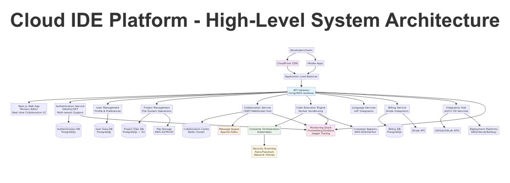
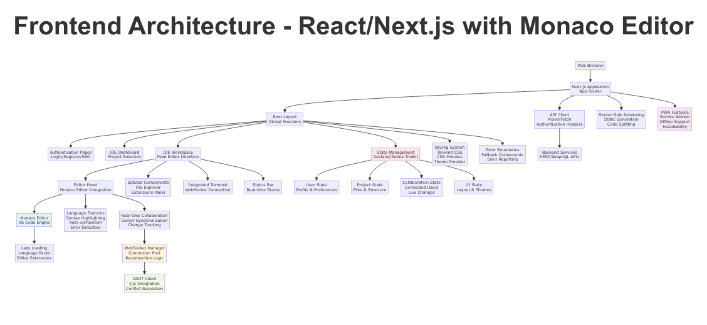
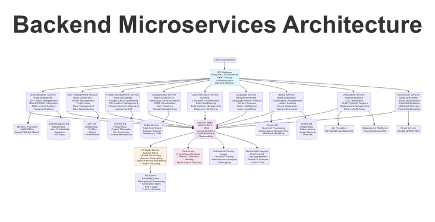
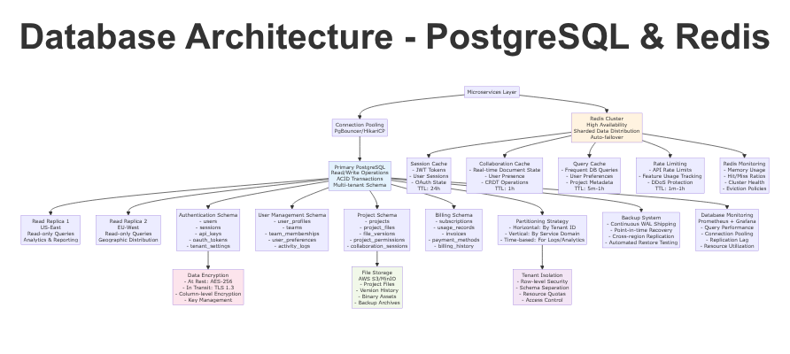
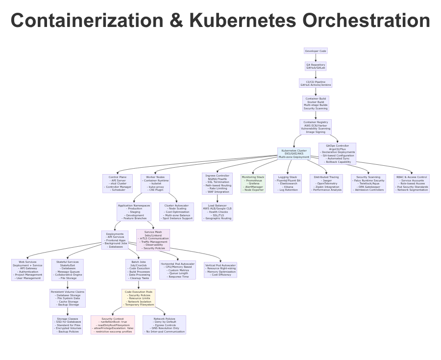
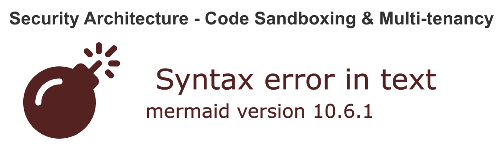
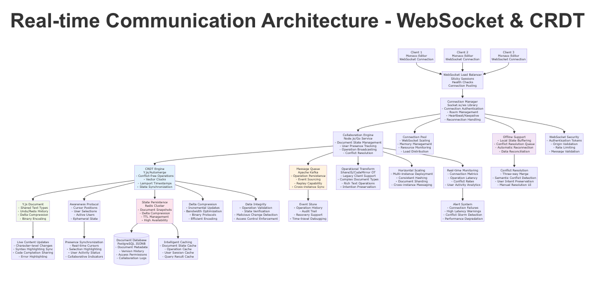
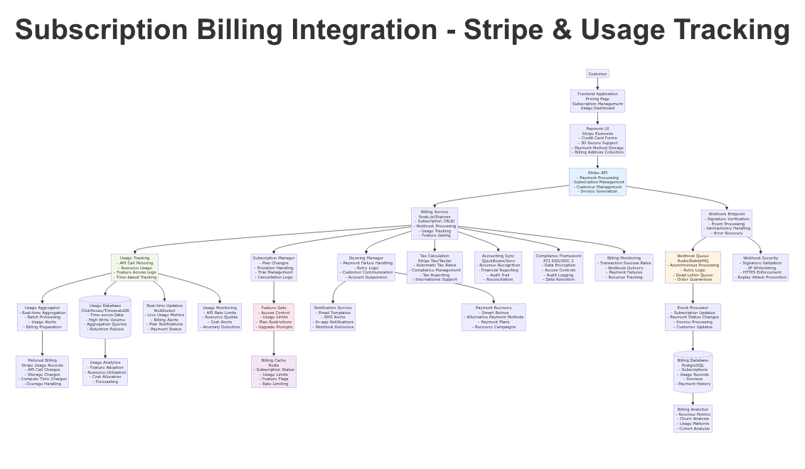

# Cloud-Based IDE Platform - Complete System Architecture Design

## Executive Summary

This document presents a comprehensive system architecture design for a cloud-based Integrated Development Environment (IDE) platform with subscription billing integration. The architecture is designed to support thousands of concurrent users with real-time collaborative editing, secure code execution, and scalable infrastructure. 

The design leverages modern cloud-native patterns including microservices architecture, containerization with Kubernetes, real-time collaboration through CRDTs, and sophisticated security sandboxing for multi-tenant code execution. Key technological choices include React/Next.js for the frontend with Monaco Editor integration, Node.js microservices for backend services, PostgreSQL with Redis for data persistence, and Stripe for subscription billing management.

The architecture emphasizes security through defense-in-depth strategies, scalability through horizontal scaling patterns, and developer experience through real-time collaborative features and intelligent code completion capabilities.

## Table of Contents

1. [System Overview](#system-overview)
2. [High-Level System Architecture](#high-level-system-architecture)
3. [Frontend Architecture](#frontend-architecture)
4. [Backend Microservices Architecture](#backend-microservices-architecture)
5. [Database Architecture](#database-architecture)
6. [Containerization Strategy](#containerization-strategy)
7. [Security Architecture](#security-architecture)
8. [Real-time Communication Architecture](#real-time-communication-architecture)
9. [Subscription Billing Integration](#subscription-billing-integration)
10. [Technology Stack Justifications](#technology-stack-justifications)
11. [Deployment and Operations](#deployment-and-operations)
12. [Performance and Scalability](#performance-and-scalability)
13. [Security and Compliance](#security-and-compliance)
14. [Implementation Roadmap](#implementation-roadmap)

## System Overview

The Cloud-Based IDE Platform is architected as a modern, cloud-native application supporting collaborative software development at scale. The system enables developers to write, test, and deploy code entirely through web browsers while providing features comparable to desktop IDEs.

### Core Capabilities

**Collaborative Code Editing**: Real-time multi-user editing with conflict-free synchronization using Conflict-free Replicated Data Types (CRDTs). Support for unlimited concurrent collaborators with live cursor tracking and change propagation.

**Secure Code Execution**: Sandboxed code execution environment using containerized workloads with security policies enforced at multiple layers. Support for multiple programming languages and runtime environments.

**Enterprise Features**: Multi-tenant architecture with organization-level isolation, role-based access control, and comprehensive audit logging. Integration with enterprise identity providers and deployment pipelines.

**Subscription Management**: Flexible billing models supporting both fixed subscriptions and usage-based pricing with automated billing, feature gating, and payment failure recovery.

### Key Architectural Principles

- **Cloud-Native**: Designed for cloud deployment with auto-scaling, fault tolerance, and multi-region support
- **Security-First**: Zero-trust architecture with defense-in-depth security measures
- **API-Driven**: RESTful and GraphQL APIs enabling integration and extension
- **Event-Driven**: Asynchronous processing for real-time features and system integration
- **Observability**: Comprehensive monitoring, logging, and tracing throughout the system

## High-Level System Architecture

The overall system architecture follows a microservices pattern with clear separation of concerns and service boundaries aligned with business domains.



### Architecture Components

**Content Delivery Layer**: CloudFront CDN provides global content distribution with edge caching for static assets, application bundles, and frequently accessed resources. Implements DDoS protection and geographic routing.

**Load Balancing Tier**: Application Load Balancer distributes traffic across multiple availability zones with health checks and SSL termination. Supports WebSocket connections for real-time features.

**API Gateway**: Kong or AWS API Gateway serves as the single entry point for all client requests. Implements authentication, rate limiting, request routing, and API versioning. Provides centralized monitoring and security policy enforcement.

**Frontend Application**: Next.js-based web application with server-side rendering and static site generation. Integrates Monaco Editor for code editing with real-time collaboration capabilities.

**Microservices Layer**: Domain-driven microservices handling specific business capabilities:
- Authentication Service for user identity and session management
- User Management Service for profiles and team operations
- Project Management Service for workspace and file operations
- Collaboration Service for real-time editing coordination
- Code Execution Service for secure code running
- Language Services for intelligent code features
- Billing Service for subscription and usage management
- Integration Service for external system connectivity

**Data Persistence**: PostgreSQL for transactional data with read replicas for scaling. Redis cluster for caching and real-time state management. S3-compatible storage for file persistence.

**Infrastructure Services**: Kubernetes for container orchestration, Apache Kafka for event streaming, and comprehensive monitoring stack with Prometheus, Grafana, and Jaeger.

### Service Communication Patterns

**Synchronous Communication**: HTTP/HTTPS for client-server and service-to-service communication where immediate responses are required. GraphQL federation for complex data queries.

**Asynchronous Communication**: Apache Kafka for event streaming and service decoupling. WebSocket connections for real-time client updates.

**Service Mesh**: Istio provides service-to-service encryption, traffic management, and observability without requiring application changes.

## Frontend Architecture

The frontend architecture emphasizes developer experience, performance, and real-time collaboration capabilities.



### Next.js Application Structure

**App Router Implementation**: Utilizes Next.js 13+ App Router for improved performance and developer experience. Implements nested layouts for consistent UI structure and shared state management.

**Component Architecture**: Modular component design with clear separation between presentation and business logic. Custom hooks for state management and API interactions.

**Performance Optimization**: 
- Code splitting for reduced initial bundle size
- Dynamic imports for Monaco Editor and language-specific features
- Image optimization with Next.js Image component
- Static site generation for marketing pages and documentation

### Monaco Editor Integration

**Editor Configuration**: Monaco Editor provides VS Code-like editing experience with intelligent features:

```typescript
// Monaco Editor Configuration
import * as monaco from 'monaco-editor';

const editorOptions: monaco.editor.IStandaloneEditorConstructionOptions = {
  automaticLayout: true,
  minimap: { enabled: true },
  scrollBeyondLastLine: false,
  wordWrap: 'on',
  theme: 'vs-dark',
  fontSize: 14,
  fontFamily: 'JetBrains Mono, Monaco, Consolas',
  suggestOnTriggerCharacters: true,
  acceptSuggestionOnEnter: 'on',
  tabCompletion: 'on'
};

const editor = monaco.editor.create(editorElement, {
  value: initialCode,
  language: 'typescript',
  ...editorOptions
});
```

**Language Services Integration**: Custom language services provide enhanced intellisense through Language Server Protocol (LSP) integration:

```typescript
// LSP Integration
class LanguageServiceProvider {
  private connection: WebSocket;
  
  async initialize(languageId: string) {
    this.connection = new WebSocket(`wss://api.domain.com/lsp/${languageId}`);
    
    monaco.languages.registerCompletionItemProvider(languageId, {
      provideCompletionItems: (model, position) => {
        return this.getCompletions(model.getValue(), position);
      }
    });
  }
  
  private async getCompletions(content: string, position: monaco.Position) {
    // LSP completion request implementation
    return {
      suggestions: await this.requestCompletions(content, position)
    };
  }
}
```

### Real-time Collaboration UI

**Collaborative Features**: Real-time cursor tracking, selection synchronization, and user presence indicators enhance collaborative development:

```typescript
// Collaboration UI Components
interface CollaborativeEditor {
  users: CollaborativeUser[];
  cursors: Map<string, CursorPosition>;
  selections: Map<string, Selection[]>;
  awareness: AwarenessState;
}

const CollaborativeCursors: React.FC<{awareness: AwarenessState}> = ({awareness}) => {
  const [cursors, setCursors] = useState(new Map());
  
  useEffect(() => {
    awareness.on('change', updateCursors);
    return () => awareness.off('change', updateCursors);
  }, [awareness]);
  
  return (
    <>
      {Array.from(cursors.entries()).map(([userId, cursor]) => (
        <CursorIndicator key={userId} user={cursor.user} position={cursor.position} />
      ))}
    </>
  );
};
```

### State Management Architecture

**Zustand Store Design**: Lightweight state management with TypeScript support:

```typescript
// Global State Store
interface IDEState {
  // User state
  user: User | null;
  preferences: UserPreferences;
  
  // Project state
  currentProject: Project | null;
  openFiles: OpenFile[];
  fileTree: FileTreeNode[];
  
  // Collaboration state
  connectedUsers: CollaborativeUser[];
  isCollaborating: boolean;
  
  // UI state
  theme: 'light' | 'dark';
  sidebarVisible: boolean;
  terminalVisible: boolean;
}

const useIDEStore = create<IDEState>((set, get) => ({
  // State initialization
  user: null,
  currentProject: null,
  openFiles: [],
  
  // Actions
  setCurrentProject: (project: Project) => set({ currentProject: project }),
  addOpenFile: (file: OpenFile) => set(state => ({
    openFiles: [...state.openFiles, file]
  })),
  updateCollaborationState: (users: CollaborativeUser[]) => set({
    connectedUsers: users,
    isCollaborating: users.length > 1
  })
}));
```

### Progressive Web App Features

**Service Worker Implementation**: Enables offline functionality and caching strategies:

```typescript
// Service Worker for Offline Support
const CACHE_NAME = 'ide-v1';
const urlsToCache = [
  '/',
  '/static/js/bundle.js',
  '/static/css/main.css',
  '/monaco-editor/min/vs/loader.js'
];

self.addEventListener('install', (event: ExtendableEvent) => {
  event.waitUntil(
    caches.open(CACHE_NAME)
      .then(cache => cache.addAll(urlsToCache))
  );
});

self.addEventListener('fetch', (event: FetchEvent) => {
  event.respondWith(
    caches.match(event.request)
      .then(response => response || fetch(event.request))
  );
});
```

## Backend Microservices Architecture

The backend implements a domain-driven microservices architecture with clear service boundaries and communication patterns.



### Service Breakdown

#### Authentication Service

**Responsibilities**: User identity management, session handling, and security token operations.

**Implementation**: Node.js with Express framework, JWT tokens, and OAuth2/OIDC integration.

```typescript
// Authentication Service Implementation
@Controller('/auth')
export class AuthController {
  constructor(
    private authService: AuthService,
    private tokenService: TokenService
  ) {}
  
  @Post('/login')
  async login(@Body() credentials: LoginCredentials): Promise<AuthResponse> {
    const user = await this.authService.validateCredentials(credentials);
    const tokens = await this.tokenService.generateTokens(user);
    
    return {
      user: user.toPublicProfile(),
      accessToken: tokens.accessToken,
      refreshToken: tokens.refreshToken,
      expiresIn: tokens.expiresIn
    };
  }
  
  @Post('/oauth/callback')
  async oauthCallback(@Body() oauthData: OAuthCallbackData): Promise<AuthResponse> {
    const user = await this.authService.processOAuthCallback(oauthData);
    const tokens = await this.tokenService.generateTokens(user);
    
    return { user, ...tokens };
  }
}
```

#### User Management Service

**Responsibilities**: User profiles, team management, preferences, and role-based access control.

```typescript
// User Management Service
@Injectable()
export class UserService {
  constructor(
    @InjectRepository(User) private userRepository: Repository<User>,
    @InjectRepository(Team) private teamRepository: Repository<Team>
  ) {}
  
  async createTeam(userId: string, teamData: CreateTeamDto): Promise<Team> {
    const user = await this.findById(userId);
    const team = this.teamRepository.create({
      ...teamData,
      owner: user,
      members: [user]
    });
    
    return await this.teamRepository.save(team);
  }
  
  async inviteUserToTeam(teamId: string, inviterUserId: string, inviteeEmail: string): Promise<TeamInvitation> {
    const team = await this.teamRepository.findOne({
      where: { id: teamId },
      relations: ['owner', 'members']
    });
    
    if (team.owner.id !== inviterUserId) {
      throw new ForbiddenException('Only team owner can invite members');
    }
    
    return await this.createInvitation(team, inviteeEmail);
  }
}
```

#### Project Management Service

**Responsibilities**: Project CRUD operations, file system management, and access control.

```typescript
// Project Management Service
@Injectable()
export class ProjectService {
  constructor(
    @InjectRepository(Project) private projectRepository: Repository<Project>,
    private fileStorageService: FileStorageService,
    private permissionService: PermissionService
  ) {}
  
  async createProject(userId: string, projectData: CreateProjectDto): Promise<Project> {
    const user = await this.userService.findById(userId);
    const project = this.projectRepository.create({
      ...projectData,
      owner: user,
      permissions: await this.permissionService.createDefaultPermissions(user)
    });
    
    await this.fileStorageService.initializeProjectStructure(project.id);
    return await this.projectRepository.save(project);
  }
  
  async getProjectFiles(projectId: string, userId: string): Promise<FileTreeNode[]> {
    await this.permissionService.checkReadAccess(projectId, userId);
    return await this.fileStorageService.getFileTree(projectId);
  }
}
```

#### Collaboration Service

**Responsibilities**: Real-time communication coordination, CRDT state management, and user presence tracking.

```typescript
// Collaboration Service with Socket.io
@WebSocketGateway({
  cors: { origin: process.env.FRONTEND_URL },
  transports: ['websocket', 'polling']
})
export class CollaborationGateway implements OnGatewayConnection, OnGatewayDisconnect {
  @WebSocketServer() server: Server;
  
  constructor(
    private collaborationService: CollaborationService,
    private authService: AuthService
  ) {}
  
  async handleConnection(client: Socket) {
    try {
      const token = client.handshake.auth.token;
      const user = await this.authService.validateToken(token);
      
      client.data.user = user;
      await this.collaborationService.userConnected(user, client.id);
      
    } catch (error) {
      client.disconnect();
    }
  }
  
  @SubscribeMessage('join-project')
  async handleJoinProject(
    @ConnectedSocket() client: Socket,
    @MessageBody() data: { projectId: string }
  ) {
    const user = client.data.user;
    await this.permissionService.checkProjectAccess(data.projectId, user.id);
    
    client.join(data.projectId);
    const projectState = await this.collaborationService.getProjectState(data.projectId);
    
    client.emit('project-state', projectState);
    client.to(data.projectId).emit('user-joined', user.publicProfile);
  }
  
  @SubscribeMessage('document-operation')
  async handleDocumentOperation(
    @ConnectedSocket() client: Socket,
    @MessageBody() operation: DocumentOperation
  ) {
    const user = client.data.user;
    const transformedOperation = await this.collaborationService.processOperation(
      operation,
      user.id
    );
    
    // Broadcast to all other clients in the project
    client.to(operation.projectId).emit('remote-operation', transformedOperation);
  }
}
```

### Service Communication

#### API Gateway Configuration

**Kong Configuration**: Centralized API management with authentication, rate limiting, and routing:

```yaml
# Kong API Gateway Configuration
services:
  - name: auth-service
    url: http://auth-service:3001
    plugins:
      - name: rate-limiting
        config:
          minute: 100
          hour: 1000
      - name: cors
        config:
          origins: ["https://ide.domain.com"]

  - name: project-service
    url: http://project-service:3002
    plugins:
      - name: jwt
        config:
          secret_is_base64: false
      - name: rate-limiting
        config:
          minute: 200
          hour: 2000

routes:
  - name: auth-routes
    service: auth-service
    paths: ["/api/auth"]
  
  - name: project-routes
    service: project-service
    paths: ["/api/projects"]
```

#### Service Mesh Implementation

**Istio Configuration**: Service-to-service communication with mTLS and traffic management:

```yaml
# Istio Service Mesh Configuration
apiVersion: security.istio.io/v1beta1
kind: PeerAuthentication
metadata:
  name: default
  namespace: ide-platform
spec:
  mtls:
    mode: STRICT
---
apiVersion: networking.istio.io/v1beta1
kind: DestinationRule
metadata:
  name: auth-service
  namespace: ide-platform
spec:
  host: auth-service
  trafficPolicy:
    circuitBreaker:
      connectionPool:
        tcp:
          maxConnections: 100
        http:
          http1MaxPendingRequests: 50
          maxRequestsPerConnection: 10
      outlierDetection:
        consecutive5xxErrors: 5
        interval: 30s
        baseEjectionTime: 30s
```

## Database Architecture

The database architecture implements a multi-tenant design with strong data isolation and performance optimization.



### PostgreSQL Schema Design

#### Multi-tenant Data Model

**Tenant Isolation Strategy**: Row-level security with tenant_id columns ensuring data isolation:

```sql
-- Users and Authentication Schema
CREATE SCHEMA auth;

CREATE TABLE auth.tenants (
  id UUID PRIMARY KEY DEFAULT gen_random_uuid(),
  name VARCHAR(255) NOT NULL,
  subdomain VARCHAR(100) UNIQUE NOT NULL,
  settings JSONB DEFAULT '{}',
  created_at TIMESTAMP DEFAULT CURRENT_TIMESTAMP,
  updated_at TIMESTAMP DEFAULT CURRENT_TIMESTAMP
);

CREATE TABLE auth.users (
  id UUID PRIMARY KEY DEFAULT gen_random_uuid(),
  tenant_id UUID REFERENCES auth.tenants(id) ON DELETE CASCADE,
  email VARCHAR(255) UNIQUE NOT NULL,
  password_hash VARCHAR(255),
  profile JSONB DEFAULT '{}',
  preferences JSONB DEFAULT '{}',
  created_at TIMESTAMP DEFAULT CURRENT_TIMESTAMP,
  updated_at TIMESTAMP DEFAULT CURRENT_TIMESTAMP
);

-- Row-level Security Policies
ALTER TABLE auth.users ENABLE ROW LEVEL SECURITY;

CREATE POLICY users_tenant_isolation ON auth.users
  FOR ALL TO application_role
  USING (tenant_id = current_setting('app.current_tenant')::UUID);
```

#### Project and File Management Schema

```sql
-- Project Management Schema
CREATE SCHEMA projects;

CREATE TABLE projects.projects (
  id UUID PRIMARY KEY DEFAULT gen_random_uuid(),
  tenant_id UUID REFERENCES auth.tenants(id),
  owner_id UUID REFERENCES auth.users(id),
  name VARCHAR(255) NOT NULL,
  description TEXT,
  settings JSONB DEFAULT '{}',
  repository_url VARCHAR(500),
  created_at TIMESTAMP DEFAULT CURRENT_TIMESTAMP,
  updated_at TIMESTAMP DEFAULT CURRENT_TIMESTAMP
);

CREATE TABLE projects.project_files (
  id UUID PRIMARY KEY DEFAULT gen_random_uuid(),
  project_id UUID REFERENCES projects.projects(id) ON DELETE CASCADE,
  path VARCHAR(1000) NOT NULL,
  content TEXT,
  content_hash VARCHAR(64),
  mime_type VARCHAR(100),
  size_bytes INTEGER DEFAULT 0,
  created_at TIMESTAMP DEFAULT CURRENT_TIMESTAMP,
  updated_at TIMESTAMP DEFAULT CURRENT_TIMESTAMP,
  
  UNIQUE(project_id, path)
);

-- Indexing for Performance
CREATE INDEX idx_projects_tenant_owner ON projects.projects(tenant_id, owner_id);
CREATE INDEX idx_project_files_project_path ON projects.project_files(project_id, path);
CREATE INDEX idx_project_files_hash ON projects.project_files(content_hash);
```

#### Collaboration and Real-time Data

```sql
-- Collaboration Schema
CREATE SCHEMA collaboration;

CREATE TABLE collaboration.sessions (
  id UUID PRIMARY KEY DEFAULT gen_random_uuid(),
  project_id UUID REFERENCES projects.projects(id),
  host_user_id UUID REFERENCES auth.users(id),
  participants JSONB DEFAULT '[]',
  document_state JSONB DEFAULT '{}',
  created_at TIMESTAMP DEFAULT CURRENT_TIMESTAMP,
  last_activity TIMESTAMP DEFAULT CURRENT_TIMESTAMP
);

CREATE TABLE collaboration.operations (
  id UUID PRIMARY KEY DEFAULT gen_random_uuid(),
  session_id UUID REFERENCES collaboration.sessions(id),
  user_id UUID REFERENCES auth.users(id),
  operation_type VARCHAR(50) NOT NULL,
  operation_data JSONB NOT NULL,
  vector_clock JSONB NOT NULL,
  created_at TIMESTAMP DEFAULT CURRENT_TIMESTAMP
);

-- Partitioning for High-Volume Operations
CREATE TABLE collaboration.operations_y2025m01 PARTITION OF collaboration.operations
  FOR VALUES FROM ('2025-01-01') TO ('2025-02-01');
```

#### Billing and Subscription Schema

```sql
-- Billing Schema
CREATE SCHEMA billing;

CREATE TABLE billing.subscriptions (
  id UUID PRIMARY KEY DEFAULT gen_random_uuid(),
  tenant_id UUID REFERENCES auth.tenants(id),
  stripe_subscription_id VARCHAR(255) UNIQUE,
  status VARCHAR(50) NOT NULL,
  plan_id VARCHAR(100) NOT NULL,
  current_period_start TIMESTAMP,
  current_period_end TIMESTAMP,
  billing_cycle_anchor TIMESTAMP,
  metadata JSONB DEFAULT '{}',
  created_at TIMESTAMP DEFAULT CURRENT_TIMESTAMP,
  updated_at TIMESTAMP DEFAULT CURRENT_TIMESTAMP
);

CREATE TABLE billing.usage_records (
  id UUID PRIMARY KEY DEFAULT gen_random_uuid(),
  tenant_id UUID REFERENCES auth.tenants(id),
  subscription_id UUID REFERENCES billing.subscriptions(id),
  metric_type VARCHAR(100) NOT NULL,
  quantity INTEGER NOT NULL,
  timestamp TIMESTAMP NOT NULL,
  metadata JSONB DEFAULT '{}'
);

-- Time-series Optimization
CREATE INDEX idx_usage_records_tenant_timestamp 
  ON billing.usage_records(tenant_id, timestamp DESC);
```

### Redis Caching Strategy

#### Cache Patterns Implementation

**Session Management**: Distributed session storage with TTL:

```typescript
// Redis Session Management
class SessionManager {
  private redis: Redis;
  
  constructor(redisClient: Redis) {
    this.redis = redisClient;
  }
  
  async createSession(userId: string, sessionData: SessionData): Promise<string> {
    const sessionId = generateSessionId();
    const sessionKey = `session:${sessionId}`;
    
    await this.redis.setex(
      sessionKey,
      24 * 60 * 60, // 24 hours TTL
      JSON.stringify({
        userId,
        ...sessionData,
        createdAt: Date.now()
      })
    );
    
    return sessionId;
  }
  
  async getSession(sessionId: string): Promise<SessionData | null> {
    const sessionKey = `session:${sessionId}`;
    const data = await this.redis.get(sessionKey);
    return data ? JSON.parse(data) : null;
  }
}
```

**Collaboration State Caching**: Real-time document state with pub/sub:

```typescript
// Collaboration State Cache
class CollaborationCache {
  private redis: Redis;
  private publisher: Redis;
  private subscriber: Redis;
  
  async updateDocumentState(projectId: string, state: DocumentState): Promise<void> {
    const key = `collab:project:${projectId}`;
    
    await Promise.all([
      this.redis.setex(key, 3600, JSON.stringify(state)), // 1 hour TTL
      this.publisher.publish(`collab:updates:${projectId}`, JSON.stringify(state))
    ]);
  }
  
  async subscribeToProject(projectId: string, callback: (state: DocumentState) => void): Promise<void> {
    const channel = `collab:updates:${projectId}`;
    
    await this.subscriber.subscribe(channel);
    this.subscriber.on('message', (receivedChannel, message) => {
      if (receivedChannel === channel) {
        callback(JSON.parse(message));
      }
    });
  }
}
```

**Query Result Caching**: Intelligent cache invalidation:

```typescript
// Query Cache with Smart Invalidation
class QueryCache {
  private redis: Redis;
  
  async cacheQuery(cacheKey: string, result: any, ttl: number = 300): Promise<void> {
    await this.redis.setex(cacheKey, ttl, JSON.stringify(result));
    
    // Track cache dependencies for invalidation
    const dependencies = this.extractDependencies(cacheKey);
    for (const dep of dependencies) {
      await this.redis.sadd(`cache:deps:${dep}`, cacheKey);
    }
  }
  
  async invalidateByDependency(dependency: string): Promise<void> {
    const dependentKeys = await this.redis.smembers(`cache:deps:${dependency}`);
    
    if (dependentKeys.length > 0) {
      await Promise.all([
        this.redis.del(...dependentKeys),
        this.redis.del(`cache:deps:${dependency}`)
      ]);
    }
  }
}
```

### Data Partitioning and Sharding

#### Horizontal Partitioning Strategy

**Tenant-based Sharding**: Distribute data by tenant for optimal isolation:

```typescript
// Tenant-based Database Sharding
class ShardingManager {
  private shards: Map<string, DataSource> = new Map();
  
  getShardForTenant(tenantId: string): DataSource {
    const shardKey = this.calculateShardKey(tenantId);
    return this.shards.get(shardKey) || this.shards.get('default');
  }
  
  private calculateShardKey(tenantId: string): string {
    // Consistent hashing for even distribution
    const hash = crypto.createHash('sha256').update(tenantId).digest('hex');
    const shardIndex = parseInt(hash.substring(0, 8), 16) % this.shards.size;
    return `shard_${shardIndex}`;
  }
  
  async executeQuery(tenantId: string, query: string, params: any[]): Promise<any> {
    const shard = this.getShardForTenant(tenantId);
    return await shard.query(query, params);
  }
}
```

## Containerization Strategy

The containerization strategy emphasizes security, scalability, and operational efficiency through Kubernetes orchestration.



### Docker Implementation

#### Multi-stage Build Strategy

**Frontend Container**: Optimized Next.js application container:

```dockerfile
# Frontend Dockerfile - Multi-stage Build
FROM node:18-alpine AS dependencies
WORKDIR /app
COPY package.json package-lock.json ./
RUN npm ci --only=production && npm cache clean --force

FROM node:18-alpine AS builder
WORKDIR /app
COPY package.json package-lock.json ./
RUN npm ci
COPY . .
RUN npm run build

FROM node:18-alpine AS runner
WORKDIR /app
ENV NODE_ENV production

# Create non-root user
RUN addgroup --system --gid 1001 nodejs && \
    adduser --system --uid 1001 nextjs

# Copy built application
COPY --from=builder --chown=nextjs:nodejs /app/.next/standalone ./
COPY --from=builder --chown=nextjs:nodejs /app/.next/static ./.next/static

USER nextjs
EXPOSE 3000
ENV PORT 3000

CMD ["node", "server.js"]
```

**Backend Service Container**: Secure Node.js microservice container:

```dockerfile
# Backend Service Dockerfile
FROM node:18-alpine AS builder
WORKDIR /app
COPY package*.json ./
RUN npm ci --only=production

FROM node:18-alpine AS runner
WORKDIR /app

# Security hardening
RUN addgroup -g 1001 -S nodejs && \
    adduser -S nextjs -u 1001 && \
    apk add --no-cache dumb-init

# Copy application files
COPY --from=builder --chown=nextjs:nodejs /app/node_modules ./node_modules
COPY --chown=nextjs:nodejs src/ ./src/
COPY --chown=nextjs:nodejs package.json ./

# Security context
USER nextjs
EXPOSE 3001

# Use dumb-init for proper signal handling
ENTRYPOINT ["dumb-init", "--"]
CMD ["node", "src/main.js"]

# Security labels
LABEL security.capability.drop="ALL"
LABEL security.user="nextjs"
LABEL security.readonly_rootfs="true"
```

#### Code Execution Container

**Sandboxed Execution Environment**: Secure container for user code execution:

```dockerfile
# Code Execution Sandbox Dockerfile
FROM ubuntu:22.04 AS base

# Install runtime dependencies
RUN apt-get update && apt-get install -y \
    python3 python3-pip \
    nodejs npm \
    openjdk-17-jdk \
    gcc g++ \
    && rm -rf /var/lib/apt/lists/*

# Create sandbox user
RUN useradd -m -u 1001 -s /bin/bash sandbox && \
    usermod -L sandbox  # Lock password

FROM base AS runner
WORKDIR /workspace

# Security configurations
COPY security/seccomp-profile.json /etc/seccomp-profile.json
COPY security/apparmor-profile /etc/apparmor.d/sandbox

# Copy execution scripts
COPY --chmod=755 scripts/execute.sh /usr/local/bin/
COPY --chmod=755 scripts/timeout.sh /usr/local/bin/

# Non-root execution
USER sandbox

# Resource limits will be set by Kubernetes
ENTRYPOINT ["/usr/local/bin/timeout.sh", "30s", "/usr/local/bin/execute.sh"]
```

### Kubernetes Orchestration

#### Application Deployment Manifests

**API Gateway Deployment**: High availability API gateway with auto-scaling:

```yaml
# API Gateway Deployment
apiVersion: apps/v1
kind: Deployment
metadata:
  name: api-gateway
  namespace: ide-platform
spec:
  replicas: 3
  selector:
    matchLabels:
      app: api-gateway
  template:
    metadata:
      labels:
        app: api-gateway
    spec:
      securityContext:
        runAsNonRoot: true
        runAsUser: 1001
        fsGroup: 1001
      containers:
      - name: api-gateway
        image: ide-platform/api-gateway:latest
        ports:
        - containerPort: 3000
        env:
        - name: NODE_ENV
          value: "production"
        - name: DATABASE_URL
          valueFrom:
            secretKeyRef:
              name: database-secrets
              key: url
        resources:
          requests:
            memory: "256Mi"
            cpu: "100m"
          limits:
            memory: "512Mi"
            cpu: "500m"
        livenessProbe:
          httpGet:
            path: /health
            port: 3000
          initialDelaySeconds: 30
          periodSeconds: 10
        readinessProbe:
          httpGet:
            path: /ready
            port: 3000
          initialDelaySeconds: 5
          periodSeconds: 5
        securityContext:
          allowPrivilegeEscalation: false
          readOnlyRootFilesystem: true
          capabilities:
            drop: ["ALL"]
---
apiVersion: v1
kind: Service
metadata:
  name: api-gateway-service
  namespace: ide-platform
spec:
  selector:
    app: api-gateway
  ports:
  - port: 80
    targetPort: 3000
  type: ClusterIP
```

**Code Execution Job Template**: Secure job for user code execution:

```yaml
# Code Execution Job Template
apiVersion: batch/v1
kind: Job
metadata:
  name: code-execution-{{.ExecutionID}}
  namespace: ide-execution
spec:
  ttlSecondsAfterFinished: 300
  backoffLimit: 0
  template:
    spec:
      restartPolicy: Never
      securityContext:
        runAsNonRoot: true
        runAsUser: 1001
        fsGroup: 1001
        seccompProfile:
          type: Localhost
          localhostProfile: profiles/execution-sandbox.json
      containers:
      - name: code-executor
        image: ide-platform/code-executor:latest
        env:
        - name: EXECUTION_ID
          value: "{{.ExecutionID}}"
        - name: USER_CODE
          value: "{{.UserCode}}"
        - name: LANGUAGE
          value: "{{.Language}}"
        resources:
          requests:
            memory: "128Mi"
            cpu: "100m"
          limits:
            memory: "512Mi"
            cpu: "500m"
            ephemeral-storage: "1Gi"
        securityContext:
          allowPrivilegeEscalation: false
          readOnlyRootFilesystem: true
          capabilities:
            drop: ["ALL"]
        volumeMounts:
        - name: tmp-volume
          mountPath: /tmp
        - name: workspace
          mountPath: /workspace
      volumes:
      - name: tmp-volume
        emptyDir:
          sizeLimit: "100Mi"
      - name: workspace
        emptyDir:
          sizeLimit: "500Mi"
      nodeSelector:
        workload: "compute"
      tolerations:
      - key: "workload"
        operator: "Equal"
        value: "compute"
        effect: "NoSchedule"
```

#### Auto-scaling Configuration

**Horizontal Pod Autoscaler**: Dynamic scaling based on metrics:

```yaml
# Horizontal Pod Autoscaler
apiVersion: autoscaling/v2
kind: HorizontalPodAutoscaler
metadata:
  name: api-gateway-hpa
  namespace: ide-platform
spec:
  scaleTargetRef:
    apiVersion: apps/v1
    kind: Deployment
    name: api-gateway
  minReplicas: 3
  maxReplicas: 20
  metrics:
  - type: Resource
    resource:
      name: cpu
      target:
        type: Utilization
        averageUtilization: 70
  - type: Resource
    resource:
      name: memory
      target:
        type: Utilization
        averageUtilization: 80
  - type: Pods
    pods:
      metric:
        name: nginx_ingress_controller_requests_per_second
      target:
        type: AverageValue
        averageValue: "100"
  behavior:
    scaleDown:
      stabilizationWindowSeconds: 300
      policies:
      - type: Percent
        value: 10
        periodSeconds: 60
    scaleUp:
      stabilizationWindowSeconds: 60
      policies:
      - type: Percent
        value: 50
        periodSeconds: 60
```

**Vertical Pod Autoscaler**: Resource optimization:

```yaml
# Vertical Pod Autoscaler
apiVersion: autoscaling.k8s.io/v1
kind: VerticalPodAutoscaler
metadata:
  name: collaboration-service-vpa
  namespace: ide-platform
spec:
  targetRef:
    apiVersion: apps/v1
    kind: Deployment
    name: collaboration-service
  updatePolicy:
    updateMode: "Auto"
  resourcePolicy:
    containerPolicies:
    - containerName: collaboration-service
      maxAllowed:
        memory: "2Gi"
        cpu: "1000m"
      minAllowed:
        memory: "128Mi"
        cpu: "50m"
```

## Security Architecture

The security architecture implements defense-in-depth strategies with particular focus on code sandboxing and multi-tenant isolation.



### Code Sandboxing Implementation

#### Container Security Policies

**Pod Security Standards**: Restrictive security context for code execution:

```yaml
# Pod Security Policy for Code Execution
apiVersion: v1
kind: Pod
metadata:
  name: code-execution-pod
  namespace: ide-execution
  labels:
    pod-security.kubernetes.io/enforce: restricted
spec:
  securityContext:
    runAsNonRoot: true
    runAsUser: 1001
    runAsGroup: 1001
    fsGroup: 1001
    seccompProfile:
      type: RuntimeDefault
    supplementalGroups: []
  containers:
  - name: executor
    image: ide-platform/code-executor:latest
    securityContext:
      allowPrivilegeEscalation: false
      readOnlyRootFilesystem: true
      capabilities:
        drop: ["ALL"]
      seLinuxOptions:
        level: "s0:c123,c456"
    resources:
      requests:
        memory: "64Mi"
        cpu: "50m"
      limits:
        memory: "256Mi"
        cpu: "200m"
        ephemeral-storage: "100Mi"
```

**Network Policies**: Strict network isolation for execution pods:

```yaml
# Network Policy for Code Execution
apiVersion: networking.k8s.io/v1
kind: NetworkPolicy
metadata:
  name: code-execution-isolation
  namespace: ide-execution
spec:
  podSelector:
    matchLabels:
      workload: code-execution
  policyTypes:
  - Ingress
  - Egress
  ingress: [] # Deny all ingress traffic
  egress:
  - to: []
    ports:
    - protocol: TCP
      port: 53
    - protocol: UDP
      port: 53
  # No other egress traffic allowed
```

#### Seccomp Profiles

**Custom Seccomp Profile**: Restrictive system call filtering:

```json
{
  "defaultAction": "SCMP_ACT_ERRNO",
  "architectures": ["SCMP_ARCH_X86_64", "SCMP_ARCH_X86", "SCMP_ARCH_X32"],
  "syscalls": [
    {
      "names": [
        "read", "write", "open", "close", "stat", "fstat", "lstat", "poll",
        "lseek", "mmap", "mprotect", "munmap", "brk", "rt_sigaction",
        "rt_sigprocmask", "rt_sigreturn", "ioctl", "pread64", "pwrite64",
        "readv", "writev", "access", "pipe", "select", "sched_yield",
        "mremap", "msync", "mincore", "madvise", "shmget", "shmat", "shmctl",
        "dup", "dup2", "pause", "nanosleep", "getitimer", "alarm", "setitimer",
        "getpid", "sendfile", "socket", "connect", "accept", "sendto", "recvfrom",
        "sendmsg", "recvmsg", "shutdown", "bind", "listen", "getsockname",
        "getpeername", "socketpair", "setsockopt", "getsockopt", "clone",
        "fork", "vfork", "execve", "exit", "wait4", "kill", "uname", "semget",
        "semop", "semctl", "shmdt", "msgget", "msgsnd", "msgrcv", "msgctl",
        "fcntl", "flock", "fsync", "fdatasync", "truncate", "ftruncate",
        "getdents", "getcwd", "chdir", "fchdir", "rename", "mkdir", "rmdir",
        "creat", "link", "unlink", "symlink", "readlink", "chmod", "fchmod",
        "chown", "fchown", "lchown", "umask", "gettimeofday", "getrlimit",
        "getrusage", "sysinfo", "times", "ptrace", "getuid", "syslog",
        "getgid", "setuid", "setgid", "geteuid", "getegid", "setpgid",
        "getppid", "getpgrp", "setsid", "setreuid", "setregid", "getgroups",
        "setgroups", "setresuid", "getresuid", "setresgid", "getresgid",
        "getpgid", "setfsuid", "setfsgid", "getsid", "capget", "capset",
        "rt_sigpending", "rt_sigtimedwait", "rt_sigqueueinfo", "rt_sigsuspend",
        "sigaltstack", "utime", "mknod", "uselib", "personality", "ustat",
        "statfs", "fstatfs", "sysfs", "getpriority", "setpriority",
        "sched_setparam", "sched_getparam", "sched_setscheduler",
        "sched_getscheduler", "sched_get_priority_max", "sched_get_priority_min",
        "sched_rr_get_interval", "mlock", "munlock", "mlockall", "munlockall",
        "vhangup", "modify_ldt", "pivot_root", "prctl", "arch_prctl", "adjtimex",
        "setrlimit", "chroot", "sync", "acct", "settimeofday", "mount", "umount2",
        "swapon", "swapoff", "reboot", "sethostname", "setdomainname", "iopl",
        "ioperm", "create_module", "init_module", "delete_module", "get_kernel_syms",
        "query_module", "quotactl", "nfsservctl", "getpmsg", "putpmsg", "afs_syscall",
        "tuxcall", "security", "gettid", "readahead", "setxattr", "lsetxattr",
        "fsetxattr", "getxattr", "lgetxattr", "fgetxattr", "listxattr",
        "llistxattr", "flistxattr", "removexattr", "lremovexattr", "fremovexattr",
        "tkill", "time", "futex", "sched_setaffinity", "sched_getaffinity",
        "set_thread_area", "io_setup", "io_destroy", "io_getevents", "io_submit",
        "io_cancel", "get_thread_area", "lookup_dcookie", "epoll_create",
        "epoll_ctl_old", "epoll_wait_old", "remap_file_pages", "getdents64",
        "set_tid_address", "restart_syscall", "semtimedop", "fadvise64",
        "timer_create", "timer_settime", "timer_gettime", "timer_getoverrun",
        "timer_delete", "clock_settime", "clock_gettime", "clock_getres",
        "clock_nanosleep", "exit_group", "epoll_wait", "epoll_ctl", "tgkill",
        "utimes", "vserver", "mbind", "set_mempolicy", "get_mempolicy",
        "mq_open", "mq_unlink", "mq_timedsend", "mq_timedreceive", "mq_notify",
        "mq_getsetattr", "kexec_load", "waitid", "add_key", "request_key",
        "keyctl", "ioprio_set", "ioprio_get", "inotify_init", "inotify_add_watch",
        "inotify_rm_watch", "migrate_pages", "openat", "mkdirat", "mknodat",
        "fchownat", "futimesat", "newfstatat", "unlinkat", "renameat", "linkat",
        "symlinkat", "readlinkat", "fchmodat", "faccessat", "pselect6", "ppoll",
        "unshare", "set_robust_list", "get_robust_list", "splice", "tee",
        "sync_file_range", "vmsplice", "move_pages", "utimensat", "epoll_pwait",
        "signalfd", "timerfd_create", "eventfd", "fallocate", "timerfd_settime",
        "timerfd_gettime", "accept4", "signalfd4", "eventfd2", "epoll_create1",
        "dup3", "pipe2", "inotify_init1", "preadv", "pwritev", "rt_tgsigqueueinfo",
        "perf_event_open", "recvmmsg", "fanotify_init", "fanotify_mark",
        "prlimit64", "name_to_handle_at", "open_by_handle_at", "clock_adjtime",
        "syncfs", "sendmmsg", "setns", "getcpu", "process_vm_readv", "process_vm_writev"
      ],
      "action": "SCMP_ACT_ALLOW"
    }
  ]
}
```

### Multi-tenancy Security Model

#### Tenant Isolation Strategies

**Database Row-Level Security**: Automatic tenant data isolation:

```sql
-- Tenant isolation function
CREATE OR REPLACE FUNCTION auth.get_current_tenant_id()
RETURNS UUID AS $$
BEGIN
  RETURN COALESCE(
    current_setting('app.current_tenant', true)::UUID,
    '00000000-0000-0000-0000-000000000000'::UUID
  );
END;
$$ LANGUAGE plpgsql SECURITY DEFINER;

-- Apply RLS policies to all tenant tables
CREATE POLICY tenant_isolation ON projects.projects
  FOR ALL TO application_role
  USING (tenant_id = auth.get_current_tenant_id());

CREATE POLICY tenant_isolation ON auth.users
  FOR ALL TO application_role
  USING (tenant_id = auth.get_current_tenant_id());
```

**Application-level Authorization**: Service-level tenant validation:

```typescript
// Tenant Isolation Middleware
@Injectable()
export class TenantIsolationGuard implements CanActivate {
  constructor(
    private reflector: Reflector,
    private authService: AuthService
  ) {}
  
  async canActivate(context: ExecutionContext): Promise<boolean> {
    const request = context.switchToHttp().getRequest();
    const user = request.user;
    
    if (!user || !user.tenantId) {
      throw new UnauthorizedException('Invalid tenant context');
    }
    
    // Set database connection tenant context
    await this.setDatabaseTenantContext(user.tenantId);
    
    // Validate resource access within tenant
    const resourceTenantId = this.extractResourceTenantId(request);
    if (resourceTenantId && resourceTenantId !== user.tenantId) {
      throw new ForbiddenException('Cross-tenant access denied');
    }
    
    return true;
  }
  
  private async setDatabaseTenantContext(tenantId: string): Promise<void> {
    // Set PostgreSQL session variable for RLS
    await this.dataSource.query(
      `SELECT set_config('app.current_tenant', $1, true)`,
      [tenantId]
    );
  }
}
```

#### Authentication and Authorization

**JWT Token Structure**: Multi-tenant token design:

```typescript
// JWT Token Interface
interface JWTPayload {
  sub: string;          // User ID
  tenantId: string;     // Tenant ID for isolation
  email: string;        // User email
  roles: string[];      // User roles within tenant
  permissions: string[]; // Granular permissions
  sessionId: string;    // Session tracking
  iat: number;          // Issued at
  exp: number;          // Expires at
  iss: string;          // Issuer
  aud: string[];        // Audience
}

// Token validation and authorization
@Injectable()
export class JWTAuthGuard implements AuthGuard {
  async validateToken(token: string): Promise<JWTPayload> {
    try {
      const payload = jwt.verify(token, process.env.JWT_SECRET) as JWTPayload;
      
      // Validate session is still active
      const sessionValid = await this.sessionService.validateSession(
        payload.sessionId
      );
      
      if (!sessionValid) {
        throw new UnauthorizedException('Session expired');
      }
      
      return payload;
    } catch (error) {
      throw new UnauthorizedException('Invalid token');
    }
  }
}
```

**Role-Based Access Control**: Hierarchical permission system:

```typescript
// RBAC Implementation
interface Permission {
  resource: string;
  action: string;
  conditions?: Record<string, any>;
}

interface Role {
  id: string;
  name: string;
  permissions: Permission[];
  isSystemRole: boolean;
}

@Injectable()
export class AuthorizationService {
  async checkPermission(
    userId: string,
    resource: string,
    action: string,
    context?: Record<string, any>
  ): Promise<boolean> {
    const userRoles = await this.getUserRoles(userId);
    
    for (const role of userRoles) {
      const hasPermission = role.permissions.some(permission => {
        const resourceMatch = this.matchResource(permission.resource, resource);
        const actionMatch = this.matchAction(permission.action, action);
        const conditionMatch = this.evaluateConditions(permission.conditions, context);
        
        return resourceMatch && actionMatch && conditionMatch;
      });
      
      if (hasPermission) {
        return true;
      }
    }
    
    return false;
  }
  
  private matchResource(pattern: string, resource: string): boolean {
    // Implement resource pattern matching (supports wildcards)
    const regex = new RegExp(pattern.replace('*', '.*'));
    return regex.test(resource);
  }
}
```

### Data Encryption and Security

#### Encryption at Rest

**Database Encryption**: Field-level encryption for sensitive data:

```typescript
// Field-level Encryption Service
@Injectable()
export class EncryptionService {
  private readonly algorithm = 'aes-256-gcm';
  private readonly keyService: KeyManagementService;
  
  constructor(keyService: KeyManagementService) {
    this.keyService = keyService;
  }
  
  async encryptField(
    tenantId: string,
    fieldValue: string,
    fieldType: string
  ): Promise<string> {
    const key = await this.keyService.getEncryptionKey(tenantId, fieldType);
    const iv = crypto.randomBytes(16);
    
    const cipher = crypto.createCipher(this.algorithm, key);
    cipher.setAAD(Buffer.from(tenantId)); // Additional authenticated data
    
    let encrypted = cipher.update(fieldValue, 'utf8', 'hex');
    encrypted += cipher.final('hex');
    
    const authTag = cipher.getAuthTag();
    
    return `${iv.toString('hex')}:${authTag.toString('hex')}:${encrypted}`;
  }
  
  async decryptField(
    tenantId: string,
    encryptedValue: string,
    fieldType: string
  ): Promise<string> {
    const [ivHex, authTagHex, encrypted] = encryptedValue.split(':');
    const key = await this.keyService.getEncryptionKey(tenantId, fieldType);
    
    const decipher = crypto.createDecipher(this.algorithm, key);
    decipher.setAAD(Buffer.from(tenantId));
    decipher.setAuthTag(Buffer.from(authTagHex, 'hex'));
    
    let decrypted = decipher.update(encrypted, 'hex', 'utf8');
    decrypted += decipher.final('utf8');
    
    return decrypted;
  }
}
```

#### Key Management

**AWS KMS Integration**: Secure key rotation and management:

```typescript
// Key Management Service
@Injectable()
export class KeyManagementService {
  private kmsClient: KMSClient;
  private keyCache: Map<string, CachedKey> = new Map();
  
  constructor() {
    this.kmsClient = new KMSClient({ region: process.env.AWS_REGION });
  }
  
  async getEncryptionKey(tenantId: string, keyType: string): Promise<Buffer> {
    const cacheKey = `${tenantId}:${keyType}`;
    const cached = this.keyCache.get(cacheKey);
    
    if (cached && cached.expiresAt > Date.now()) {
      return cached.key;
    }
    
    const command = new GenerateDataKeyCommand({
      KeyId: process.env.KMS_KEY_ID,
      KeySpec: 'AES_256',
      EncryptionContext: {
        tenantId,
        keyType,
        service: 'ide-platform'
      }
    });
    
    const response = await this.kmsClient.send(command);
    const key = Buffer.from(response.Plaintext);
    
    // Cache key for 1 hour
    this.keyCache.set(cacheKey, {
      key,
      expiresAt: Date.now() + 3600000
    });
    
    return key;
  }
  
  async rotateKeys(tenantId: string): Promise<void> {
    // Implement key rotation logic
    const keyTypes = ['user_data', 'project_files', 'session_data'];
    
    for (const keyType of keyTypes) {
      const cacheKey = `${tenantId}:${keyType}`;
      this.keyCache.delete(cacheKey);
      
      // Trigger re-encryption of existing data with new key
      await this.scheduleReEncryptionJob(tenantId, keyType);
    }
  }
}
```

## Real-time Communication Architecture

The real-time communication system enables seamless collaborative editing through WebSocket connections and CRDT synchronization.



### WebSocket Implementation

#### Connection Management

**Scalable WebSocket Server**: Multi-instance WebSocket handling with Redis adapter:

```typescript
// WebSocket Server with Redis Adapter
@WebSocketGateway({
  cors: { 
    origin: process.env.ALLOWED_ORIGINS?.split(',') || ['http://localhost:3000'],
    credentials: true 
  },
  transports: ['websocket'],
  adapter: RedisIoAdapter
})
export class CollaborationGateway implements OnGatewayInit, OnGatewayConnection, OnGatewayDisconnect {
  @WebSocketServer() server: Server;
  
  constructor(
    private collaborationService: CollaborationService,
    private authService: AuthService,
    private redisService: RedisService
  ) {}
  
  afterInit(server: Server) {
    // Configure Redis adapter for multi-instance scaling
    const redisAdapter = createAdapter(this.redisService.getClient());
    server.adapter(redisAdapter);
    
    console.log('WebSocket Gateway initialized');
  }
  
  async handleConnection(client: Socket, ...args: any[]) {
    try {
      // Extract and validate JWT token
      const token = client.handshake.auth?.token || client.handshake.headers?.authorization?.split(' ')[1];
      
      if (!token) {
        throw new UnauthorizedException('No token provided');
      }
      
      const user = await this.authService.validateToken(token);
      client.data.user = user;
      client.data.connectedAt = Date.now();
      
      // Join user-specific room for targeted messages
      client.join(`user:${user.sub}`);
      
      // Track connection for monitoring
      await this.collaborationService.trackConnection(user.sub, client.id);
      
      client.emit('connection-established', { userId: user.sub });
      
    } catch (error) {
      console.error('WebSocket connection failed:', error.message);
      client.emit('connection-error', { message: 'Authentication failed' });
      client.disconnect();
    }
  }
  
  async handleDisconnect(client: Socket) {
    if (client.data.user) {
      await this.collaborationService.cleanupConnection(client.data.user.sub, client.id);
      
      // Leave all project rooms
      const rooms = Array.from(client.rooms);
      for (const room of rooms) {
        if (room.startsWith('project:')) {
          const projectId = room.replace('project:', '');
          await this.handleLeaveProject(client, { projectId });
        }
      }
    }
  }
```

#### Room Management and Project Joining

**Project Room Coordination**: Efficient room management for collaborative sessions:

```typescript
  @SubscribeMessage('join-project')
  async handleJoinProject(
    @ConnectedSocket() client: Socket,
    @MessageBody() data: { projectId: string }
  ) {
    const user = client.data.user;
    
    try {
      // Verify project access permissions
      const hasAccess = await this.collaborationService.verifyProjectAccess(
        user.sub, 
        data.projectId
      );
      
      if (!hasAccess) {
        throw new ForbiddenException('Project access denied');
      }
      
      // Join project room
      const roomName = `project:${data.projectId}`;
      await client.join(roomName);
      
      // Initialize or get existing collaboration session
      const session = await this.collaborationService.initializeSession(
        data.projectId,
        user.sub
      );
      
      // Send current project state to joining user
      client.emit('project-joined', {
        projectId: data.projectId,
        documentState: session.documentState,
        connectedUsers: session.participants,
        operationHistory: session.recentOperations
      });
      
      // Notify other participants about new user
      client.to(roomName).emit('user-joined', {
        userId: user.sub,
        userInfo: {
          name: user.name,
          avatar: user.avatar,
          color: this.generateUserColor(user.sub)
        }
      });
      
      // Update user presence
      await this.collaborationService.updateUserPresence(
        data.projectId,
        user.sub,
        { status: 'active', lastSeen: new Date() }
      );
      
    } catch (error) {
      client.emit('join-project-error', {
        projectId: data.projectId,
        message: error.message
      });
    }
  }
  
  @SubscribeMessage('leave-project')
  async handleLeaveProject(
    @ConnectedSocket() client: Socket,
    @MessageBody() data: { projectId: string }
  ) {
    const user = client.data.user;
    const roomName = `project:${data.projectId}`;
    
    // Leave the room
    await client.leave(roomName);
    
    // Clean up user's collaboration state
    await this.collaborationService.cleanupUserSession(data.projectId, user.sub);
    
    // Notify remaining participants
    client.to(roomName).emit('user-left', {
      userId: user.sub,
      projectId: data.projectId
    });
  }
```

### CRDT Implementation

#### Y.js Integration

**Document State Management**: CRDT-based document synchronization with Y.js:

```typescript
// CRDT Document Manager
@Injectable()
export class CRDTDocumentManager {
  private documents: Map<string, Y.Doc> = new Map();
  private documentUpdates: Map<string, Uint8Array[]> = new Map();
  
  constructor(
    private persistenceService: DocumentPersistenceService,
    private redisService: RedisService
  ) {}
  
  async getOrCreateDocument(projectId: string, fileId: string): Promise<Y.Doc> {
    const docId = `${projectId}:${fileId}`;
    
    if (this.documents.has(docId)) {
      return this.documents.get(docId)!;
    }
    
    // Create new Y.js document
    const doc = new Y.Doc();
    
    // Load persisted state if exists
    const persistedState = await this.persistenceService.loadDocument(docId);
    if (persistedState) {
      Y.applyUpdate(doc, persistedState);
    }
    
    // Set up document observers
    this.setupDocumentObservers(doc, docId);
    
    this.documents.set(docId, doc);
    return doc;
  }
  
  private setupDocumentObservers(doc: Y.Doc, docId: string): void {
    // Track document updates
    doc.on('update', (update: Uint8Array, origin: any) => {
      if (origin !== 'persistence') {
        this.handleDocumentUpdate(docId, update, origin);
      }
    });
    
    // Track changes for conflict resolution
    doc.on('beforeTransaction', (tr: Y.Transaction) => {
      tr.meta.set('timestamp', Date.now());
    });
    
    doc.on('afterTransaction', (tr: Y.Transaction) => {
      if (tr.changed.size > 0) {
        this.trackChanges(docId, tr);
      }
    });
  }
  
  private async handleDocumentUpdate(
    docId: string, 
    update: Uint8Array, 
    origin: any
  ): Promise<void> {
    // Store update for persistence
    if (!this.documentUpdates.has(docId)) {
      this.documentUpdates.set(docId, []);
    }
    this.documentUpdates.get(docId)!.push(update);
    
    // Broadcast update to connected clients (excluding origin)
    await this.broadcastUpdate(docId, update, origin);
    
    // Persist updates asynchronously
    this.persistUpdates(docId);
  }
  
  async applyClientUpdate(
    docId: string,
    clientUpdate: Uint8Array,
    clientId: string
  ): Promise<void> {
    const doc = this.documents.get(docId);
    if (!doc) {
      throw new Error(`Document ${docId} not found`);
    }
    
    try {
      // Apply update with client as origin to prevent echo
      Y.applyUpdate(doc, clientUpdate, clientId);
      
      // Update will be automatically broadcast by the observer
    } catch (error) {
      console.error(`Failed to apply update for ${docId}:`, error);
      throw error;
    }
  }
}
```

#### Conflict Resolution

**Advanced Conflict Resolution**: Semantic conflict detection and resolution:

```typescript
// Conflict Resolution Service
@Injectable()
export class ConflictResolutionService {
  constructor(
    private documentManager: CRDTDocumentManager,
    private semanticAnalyzer: SemanticAnalyzer
  ) {}
  
  async detectConflicts(
    docId: string,
    operations: Y.UndoManager[]
  ): Promise<ConflictDetectionResult> {
    const doc = await this.documentManager.getOrCreateDocument(
      docId.split(':')[0],
      docId.split(':')[1]
    );
    
    const text = doc.getText('content');
    const conflicts: Conflict[] = [];
    
    // Analyze concurrent operations for semantic conflicts
    for (let i = 0; i < operations.length - 1; i++) {
      for (let j = i + 1; j < operations.length; j++) {
        const conflict = await this.analyzeOperationConflict(
          text,
          operations[i],
          operations[j]
        );
        
        if (conflict) {
          conflicts.push(conflict);
        }
      }
    }
    
    return {
      hasConflicts: conflicts.length > 0,
      conflicts,
      resolutionSuggestions: await this.generateResolutionSuggestions(conflicts)
    };
  }
  
  private async analyzeOperationConflict(
    text: Y.Text,
    op1: Y.UndoManager,
    op2: Y.UndoManager
  ): Promise<Conflict | null> {
    // Check for overlapping ranges
    const ranges1 = this.extractOperationRanges(op1);
    const ranges2 = this.extractOperationRanges(op2);
    
    const overlappingRanges = this.findOverlappingRanges(ranges1, ranges2);
    
    if (overlappingRanges.length === 0) {
      return null; // No conflict
    }
    
    // Perform semantic analysis
    const semanticConflict = await this.semanticAnalyzer.analyzeConflict(
      text.toString(),
      overlappingRanges,
      op1,
      op2
    );
    
    return semanticConflict ? {
      type: 'semantic',
      ranges: overlappingRanges,
      operations: [op1, op2],
      severity: semanticConflict.severity,
      description: semanticConflict.description
    } : null;
  }
  
  async resolveConflict(
    docId: string,
    conflict: Conflict,
    resolution: ConflictResolution
  ): Promise<void> {
    const doc = await this.documentManager.getOrCreateDocument(
      docId.split(':')[0],
      docId.split(':')[1]
    );
    
    const text = doc.getText('content');
    
    switch (resolution.strategy) {
      case 'accept_left':
        // Keep the first operation's changes
        await this.applyResolution(text, conflict.operations[0]);
        break;
        
      case 'accept_right':
        // Keep the second operation's changes
        await this.applyResolution(text, conflict.operations[1]);
        break;
        
      case 'merge':
        // Intelligent merge based on semantic analysis
        await this.performIntelligentMerge(text, conflict, resolution.mergeData);
        break;
        
      case 'manual':
        // Apply user-provided resolution
        await this.applyManualResolution(text, resolution.manualResolution);
        break;
    }
  }
}
```

### Offline Support and Synchronization

#### Offline-First Architecture

**Client-side State Persistence**: Local storage with sync on reconnection:

```typescript
// Offline-First Collaboration Client
class OfflineCollaborationClient {
  private localDoc: Y.Doc;
  private provider: WebsocketProvider | null = null;
  private syncState: SyncState = 'disconnected';
  private pendingOperations: Uint8Array[] = [];
  
  constructor(
    private projectId: string,
    private fileId: string,
    private websocketUrl: string
  ) {
    this.localDoc = new Y.Doc();
    this.setupOfflineStorage();
    this.initializeConnection();
  }
  
  private setupOfflineStorage(): void {
    // Load persisted state from IndexedDB
    const persistedState = this.loadFromIndexedDB();
    if (persistedState) {
      Y.applyUpdate(this.localDoc, persistedState);
    }
    
    // Save changes to IndexedDB
    this.localDoc.on('update', (update: Uint8Array) => {
      this.saveToIndexedDB(update);
      
      if (this.syncState === 'disconnected') {
        this.pendingOperations.push(update);
      }
    });
  }
  
  private initializeConnection(): void {
    try {
      this.provider = new WebsocketProvider(
        this.websocketUrl,
        `${this.projectId}:${this.fileId}`,
        this.localDoc,
        {
          connect: false,
          resyncInterval: 5000,
          maxBackoffTime: 30000
        }
      );
      
      this.setupConnectionHandlers();
      this.provider.connect();
      
    } catch (error) {
      console.warn('WebSocket connection failed, working offline:', error);
      this.syncState = 'disconnected';
    }
  }
  
  private setupConnectionHandlers(): void {
    if (!this.provider) return;
    
    this.provider.on('status', ({ status }: { status: string }) => {
      this.syncState = status as SyncState;
      
      switch (status) {
        case 'connected':
          this.handleReconnection();
          break;
          
        case 'disconnected':
          this.handleDisconnection();
          break;
      }
    });
    
    this.provider.on('sync', (isSynced: boolean) => {
      if (isSynced) {
        this.handleSyncComplete();
      }
    });
  }
  
  private async handleReconnection(): Promise<void> {
    console.log('Reconnected to collaboration server');
    
    // Send pending operations
    if (this.pendingOperations.length > 0) {
      console.log(`Synchronizing ${this.pendingOperations.length} pending operations`);
      
      for (const operation of this.pendingOperations) {
        try {
          await this.sendOperation(operation);
        } catch (error) {
          console.error('Failed to sync operation:', error);
        }
      }
      
      this.pendingOperations = [];
    }
    
    // Request full state sync to ensure consistency
    this.requestFullSync();
  }
  
  private handleDisconnection(): void {
    console.log('Disconnected from collaboration server, working offline');
    
    // Show offline indicator to user
    this.updateUIForOfflineMode(true);
  }
  
  private async sendOperation(operation: Uint8Array): Promise<void> {
    return new Promise((resolve, reject) => {
      if (this.provider && this.provider.ws?.readyState === WebSocket.OPEN) {
        this.provider.ws.send(operation);
        resolve();
      } else {
        reject(new Error('WebSocket not connected'));
      }
    });
  }
}
```

### Performance Optimization

#### Delta Compression

**Efficient Operation Encoding**: Minimize network payload through intelligent compression:

```typescript
// Delta Compression Service
@Injectable()
export class DeltaCompressionService {
  private compressionCache: LRUCache<string, CompressedOperation> = new LRUCache(1000);
  
  async compressOperations(
    operations: Y.UpdateV2[],
    documentId: string
  ): Promise<CompressedOperationBatch> {
    // Group operations by type for better compression
    const groupedOps = this.groupOperationsByType(operations);
    const compressed: CompressedOperation[] = [];
    
    for (const [type, ops] of groupedOps) {
      const compressedGroup = await this.compressOperationGroup(type, ops);
      compressed.push(compressedGroup);
    }
    
    // Apply additional compression if batch is large
    if (this.calculateBatchSize(compressed) > 1024) {
      return this.applyGzipCompression(compressed);
    }
    
    return {
      operations: compressed,
      totalSize: this.calculateBatchSize(compressed),
      compressionRatio: this.calculateCompressionRatio(operations, compressed)
    };
  }
  
  private groupOperationsByType(operations: Y.UpdateV2[]): Map<string, Y.UpdateV2[]> {
    const groups = new Map<string, Y.UpdateV2[]>();
    
    for (const op of operations) {
      const type = this.getOperationType(op);
      if (!groups.has(type)) {
        groups.set(type, []);
      }
      groups.get(type)!.push(op);
    }
    
    return groups;
  }
  
  private async compressOperationGroup(
    type: string,
    operations: Y.UpdateV2[]
  ): Promise<CompressedOperation> {
    switch (type) {
      case 'text_insert':
        return this.compressTextInsertions(operations);
        
      case 'text_delete':
        return this.compressTextDeletions(operations);
        
      case 'text_format':
        return this.compressTextFormatting(operations);
        
      default:
        return this.compressGenericOperations(operations);
    }
  }
  
  private compressTextInsertions(operations: Y.UpdateV2[]): CompressedOperation {
    // Combine consecutive insertions at similar positions
    const mergedInsertions = this.mergeConsecutiveInsertions(operations);
    
    // Use run-length encoding for repeated characters
    const encoded = this.applyRunLengthEncoding(mergedInsertions);
    
    return {
      type: 'text_insert_batch',
      data: encoded,
      originalCount: operations.length,
      compressedSize: encoded.length
    };
  }
}
```

## Subscription Billing Integration

The billing system integrates with Stripe to provide flexible subscription models with usage tracking and automated billing workflows.



### Stripe Integration Architecture

#### Webhook Processing

**Secure Webhook Handler**: Robust webhook processing with validation and idempotency:

```typescript
// Stripe Webhook Controller
@Controller('webhooks')
export class StripeWebhookController {
  private readonly logger = new Logger(StripeWebhookController.name);
  
  constructor(
    private billingService: BillingService,
    private webhookProcessor: WebhookProcessor,
    private eventDeduplicator: EventDeduplicator
  ) {}
  
  @Post('stripe')
  @Header('Content-Type', 'application/json')
  async handleStripeWebhook(
    @Req() request: FastifyRequest,
    @Headers('stripe-signature') signature: string
  ): Promise<{ received: boolean }> {
    let event: Stripe.Event;
    
    try {
      // Verify webhook signature
      event = this.constructWebhookEvent(request.body, signature);
      
      // Check for duplicate events
      const isDuplicate = await this.eventDeduplicator.isDuplicate(event.id);
      if (isDuplicate) {
        this.logger.log(`Duplicate event ignored: ${event.id}`);
        return { received: true };
      }
      
      // Acknowledge receipt immediately
      setImmediate(() => this.processWebhookAsync(event));
      
      return { received: true };
      
    } catch (error) {
      this.logger.error(`Webhook signature verification failed: ${error.message}`);
      throw new BadRequestException('Invalid webhook signature');
    }
  }
  
  private constructWebhookEvent(body: any, signature: string): Stripe.Event {
    return Stripe.webhooks.constructEvent(
      body,
      signature,
      process.env.STRIPE_WEBHOOK_SECRET!
    );
  }
  
  private async processWebhookAsync(event: Stripe.Event): Promise<void> {
    try {
      await this.webhookProcessor.processEvent(event);
      await this.eventDeduplicator.markProcessed(event.id);
      
    } catch (error) {
      this.logger.error(`Webhook processing failed: ${error.message}`, {
        eventId: event.id,
        eventType: event.type,
        error: error.stack
      });
      
      // Send to dead letter queue for manual processing
      await this.webhookProcessor.sendToDeadLetterQueue(event, error);
    }
  }
}
```

#### Event Processing

**Comprehensive Event Handler**: Handle all subscription lifecycle events:

```typescript
// Webhook Event Processor
@Injectable()
export class WebhookProcessor {
  constructor(
    private subscriptionService: SubscriptionService,
    private usageService: UsageTrackingService,
    private customerService: CustomerService,
    private notificationService: NotificationService,
    private eventQueue: EventQueue
  ) {}
  
  async processEvent(event: Stripe.Event): Promise<void> {
    const handlers = {
      'customer.subscription.created': this.handleSubscriptionCreated.bind(this),
      'customer.subscription.updated': this.handleSubscriptionUpdated.bind(this),
      'customer.subscription.deleted': this.handleSubscriptionDeleted.bind(this),
      'invoice.payment_succeeded': this.handlePaymentSucceeded.bind(this),
      'invoice.payment_failed': this.handlePaymentFailed.bind(this),
      'invoice.finalized': this.handleInvoiceFinalized.bind(this),
      'customer.created': this.handleCustomerCreated.bind(this),
      'customer.updated': this.handleCustomerUpdated.bind(this),
      'payment_method.attached': this.handlePaymentMethodAttached.bind(this),
      'setup_intent.succeeded': this.handleSetupIntentSucceeded.bind(this)
    };
    
    const handler = handlers[event.type as keyof typeof handlers];
    
    if (handler) {
      await handler(event.data.object);
    } else {
      console.log(`Unhandled event type: ${event.type}`);
    }
  }
  
  private async handleSubscriptionCreated(subscription: Stripe.Subscription): Promise<void> {
    const customer = await this.customerService.findByStripeId(subscription.customer as string);
    
    if (!customer) {
      throw new Error(`Customer not found: ${subscription.customer}`);
    }
    
    // Create subscription record
    await this.subscriptionService.createSubscription({
      tenantId: customer.tenantId,
      stripeSubscriptionId: subscription.id,
      stripeCustomerId: subscription.customer as string,
      status: subscription.status,
      currentPeriodStart: new Date(subscription.current_period_start * 1000),
      currentPeriodEnd: new Date(subscription.current_period_end * 1000),
      billingCycleAnchor: new Date(subscription.billing_cycle_anchor * 1000),
      items: subscription.items.data.map(item => ({
        stripePriceId: item.price.id,
        quantity: item.quantity || 1,
        metadata: item.metadata
      }))
    });
    
    // Initialize feature access
    await this.subscriptionService.updateFeatureAccess(customer.tenantId, subscription);
    
    // Send welcome notification
    await this.notificationService.sendSubscriptionWelcome(customer.email, subscription);
    
    // Publish internal event
    await this.eventQueue.publish('subscription.created', {
      tenantId: customer.tenantId,
      subscriptionId: subscription.id,
      planId: subscription.items.data[0]?.price.id
    });
  }
  
  private async handlePaymentFailed(invoice: Stripe.Invoice): Promise<void> {
    const customer = await this.customerService.findByStripeId(invoice.customer as string);
    
    if (!customer) {
      return;
    }
    
    // Update subscription status
    if (invoice.subscription) {
      await this.subscriptionService.updateSubscriptionStatus(
        invoice.subscription as string,
        'past_due'
      );
      
      // Restrict feature access for past due accounts
      await this.subscriptionService.restrictFeatureAccess(
        customer.tenantId,
        'payment_failed'
      );
    }
    
    // Trigger dunning management
    await this.subscriptionService.initiateDunningProcess(
      customer.tenantId,
      invoice.id,
      invoice.amount_due
    );
    
    // Send payment failure notification
    await this.notificationService.sendPaymentFailureNotice(
      customer.email,
      invoice.amount_due,
      invoice.hosted_invoice_url
    );
  }
}
```

### Usage Tracking System

#### Real-time Usage Collection

**High-Performance Usage Tracking**: Efficient collection and aggregation of usage metrics:

```typescript
// Usage Tracking Service
@Injectable()
export class UsageTrackingService {
  private usageBuffer: Map<string, UsageEvent[]> = new Map();
  private readonly BUFFER_FLUSH_INTERVAL = 60000; // 1 minute
  private readonly BUFFER_MAX_SIZE = 1000;
  
  constructor(
    private redis: RedisService,
    private timescaleDB: TimescaleDBService,
    private stripeService: StripeService,
    private rateLimiter: RateLimiterService
  ) {
    // Start buffer flush timer
    setInterval(() => this.flushUsageBuffer(), this.BUFFER_FLUSH_INTERVAL);
  }
  
  async trackUsage(
    tenantId: string,
    userId: string,
    metricType: UsageMetricType,
    quantity: number,
    metadata?: Record<string, any>
  ): Promise<void> {
    const usageEvent: UsageEvent = {
      id: uuidv4(),
      tenantId,
      userId,
      metricType,
      quantity,
      timestamp: new Date(),
      metadata: metadata || {}
    };
    
    // Add to buffer for batch processing
    this.addToBuffer(tenantId, usageEvent);
    
    // Update real-time usage counters in Redis
    await this.updateRealTimeCounters(tenantId, metricType, quantity);
    
    // Check rate limits
    await this.checkUsageLimits(tenantId, metricType);
  }
  
  private addToBuffer(tenantId: string, event: UsageEvent): void {
    if (!this.usageBuffer.has(tenantId)) {
      this.usageBuffer.set(tenantId, []);
    }
    
    const buffer = this.usageBuffer.get(tenantId)!;
    buffer.push(event);
    
    // Flush if buffer is full
    if (buffer.length >= this.BUFFER_MAX_SIZE) {
      this.flushTenantBuffer(tenantId);
    }
  }
  
  private async flushUsageBuffer(): Promise<void> {
    const promises = Array.from(this.usageBuffer.keys()).map(tenantId =>
      this.flushTenantBuffer(tenantId)
    );
    
    await Promise.allSettled(promises);
  }
  
  private async flushTenantBuffer(tenantId: string): Promise<void> {
    const buffer = this.usageBuffer.get(tenantId);
    if (!buffer || buffer.length === 0) return;
    
    try {
      // Batch insert into TimescaleDB
      await this.timescaleDB.batchInsertUsageEvents(buffer);
      
      // Aggregate and send to Stripe for metered billing
      const aggregated = this.aggregateUsageEvents(buffer);
      await this.sendUsageToStripe(tenantId, aggregated);
      
      // Clear buffer
      this.usageBuffer.delete(tenantId);
      
    } catch (error) {
      console.error(`Failed to flush usage buffer for tenant ${tenantId}:`, error);
      
      // Keep events in buffer for retry
      if (buffer.length > this.BUFFER_MAX_SIZE * 2) {
        // Prevent memory overflow by discarding oldest events
        buffer.splice(0, buffer.length - this.BUFFER_MAX_SIZE);
      }
    }
  }
  
  private async updateRealTimeCounters(
    tenantId: string,
    metricType: UsageMetricType,
    quantity: number
  ): Promise<void> {
    const now = new Date();
    const hourKey = `usage:${tenantId}:${metricType}:${now.getFullYear()}-${now.getMonth()}-${now.getDate()}-${now.getHours()}`;
    const dayKey = `usage:${tenantId}:${metricType}:${now.getFullYear()}-${now.getMonth()}-${now.getDate()}`;
    const monthKey = `usage:${tenantId}:${metricType}:${now.getFullYear()}-${now.getMonth()}`;
    
    const pipeline = this.redis.pipeline();
    
    pipeline.incrby(hourKey, quantity);
    pipeline.expire(hourKey, 24 * 60 * 60); // 24 hours TTL
    
    pipeline.incrby(dayKey, quantity);
    pipeline.expire(dayKey, 7 * 24 * 60 * 60); // 7 days TTL
    
    pipeline.incrby(monthKey, quantity);
    pipeline.expire(monthKey, 365 * 24 * 60 * 60); // 1 year TTL
    
    await pipeline.exec();
  }
  
  private async sendUsageToStripe(
    tenantId: string,
    aggregatedUsage: Map<string, number>
  ): Promise<void> {
    const subscription = await this.subscriptionService.getActiveSubscription(tenantId);
    if (!subscription || !subscription.hasMeteredItems) return;
    
    for (const [metricType, totalQuantity] of aggregatedUsage) {
      const subscriptionItem = subscription.items.find(item => 
        item.price.metadata?.metricType === metricType
      );
      
      if (subscriptionItem) {
        try {
          await this.stripeService.createUsageRecord(subscriptionItem.id, {
            quantity: totalQuantity,
            timestamp: Math.floor(Date.now() / 1000),
            action: 'increment'
          });
        } catch (error) {
          console.error(`Failed to send usage to Stripe: ${error.message}`);
        }
      }
    }
  }
}
```

### Feature Gating System

#### Dynamic Feature Access Control

**Subscription-Based Feature Gating**: Real-time feature access control based on subscription status:

```typescript
// Feature Gating Service
@Injectable()
export class FeatureGatingService {
  private featureCache: LRUCache<string, FeatureAccess> = new LRUCache(10000);
  
  constructor(
    private subscriptionService: SubscriptionService,
    private usageService: UsageTrackingService,
    private redis: RedisService
  ) {}
  
  async checkFeatureAccess(
    tenantId: string,
    feature: string,
    context?: FeatureContext
  ): Promise<FeatureAccessResult> {
    const cacheKey = `${tenantId}:${feature}`;
    let access = this.featureCache.get(cacheKey);
    
    if (!access || this.isCacheExpired(access)) {
      access = await this.computeFeatureAccess(tenantId, feature);
      this.featureCache.set(cacheKey, access);
    }
    
    // Check usage limits if feature has quotas
    if (access.hasQuota && context?.checkUsage) {
      const usageCheck = await this.checkUsageQuota(tenantId, feature);
      if (!usageCheck.allowed) {
        return {
          allowed: false,
          reason: 'quota_exceeded',
          quotaInfo: usageCheck.quotaInfo,
          upgradeUrl: this.generateUpgradeUrl(tenantId, feature)
        };
      }
    }
    
    return {
      allowed: access.enabled,
      reason: access.enabled ? 'allowed' : access.reason,
      quotaInfo: access.quotaInfo,
      upgradeUrl: access.enabled ? undefined : this.generateUpgradeUrl(tenantId, feature)
    };
  }
  
  private async computeFeatureAccess(tenantId: string, feature: string): Promise<FeatureAccess> {
    const subscription = await this.subscriptionService.getActiveSubscription(tenantId);
    
    if (!subscription) {
      return this.createDeniedAccess('no_subscription');
    }
    
    if (subscription.status !== 'active') {
      return this.createDeniedAccess('subscription_inactive');
    }
    
    const plan = await this.subscriptionService.getPlanDetails(subscription.planId);
    const featureConfig = plan.features[feature];
    
    if (!featureConfig) {
      return this.createDeniedAccess('feature_not_available');
    }
    
    // Check feature availability in plan
    if (!featureConfig.enabled) {
      return this.createDeniedAccess('feature_not_in_plan');
    }
    
    // Feature is available - return access with quota info
    return {
      enabled: true,
      hasQuota: featureConfig.quota !== undefined,
      quotaInfo: featureConfig.quota ? {
        limit: featureConfig.quota.limit,
        period: featureConfig.quota.period,
        current: 0 // Will be populated by usage check
      } : undefined,
      expiresAt: Date.now() + 300000 // 5 minutes cache
    };
  }
  
  async trackFeatureUsage(
    tenantId: string,
    feature: string,
    quantity: number = 1,
    metadata?: Record<string, any>
  ): Promise<void> {
    // Track usage in usage service
    await this.usageService.trackUsage(
      tenantId,
      'system', // System user for feature usage
      feature as UsageMetricType,
      quantity,
      metadata
    );
    
    // Update real-time feature usage counter
    const usageKey = `feature_usage:${tenantId}:${feature}`;
    await this.redis.incrby(usageKey, quantity);
    
    // Set TTL based on quota period
    const access = await this.computeFeatureAccess(tenantId, feature);
    if (access.quotaInfo?.period) {
      const ttl = this.getTTLForPeriod(access.quotaInfo.period);
      await this.redis.expire(usageKey, ttl);
    }
    
    // Invalidate cache to force recomputation
    const cacheKey = `${tenantId}:${feature}`;
    this.featureCache.delete(cacheKey);
  }
  
  // Decorator for automatic feature gating
  createFeatureGuard(feature: string, options?: FeatureGuardOptions) {
    return (target: any, propertyName: string, descriptor: PropertyDescriptor) => {
      const method = descriptor.value;
      
      descriptor.value = async function (...args: any[]) {
        const tenantId = this.getTenantId(args, options);
        const featureGating = this.featureGatingService as FeatureGatingService;
        
        const access = await featureGating.checkFeatureAccess(
          tenantId,
          feature,
          { checkUsage: options?.trackUsage }
        );
        
        if (!access.allowed) {
          throw new ForbiddenException({
            message: `Feature '${feature}' is not available`,
            reason: access.reason,
            upgradeUrl: access.upgradeUrl
          });
        }
        
        // Track usage if enabled
        if (options?.trackUsage) {
          await featureGating.trackFeatureUsage(tenantId, feature, 1);
        }
        
        return method.apply(this, args);
      };
    };
  }
}
```

#### Feature Gate Middleware

**HTTP Request Feature Gating**: Middleware for automatic API endpoint protection:

```typescript
// Feature Gate Middleware
@Injectable()
export class FeatureGateMiddleware implements NestMiddleware {
  constructor(private featureGatingService: FeatureGatingService) {}
  
  use(req: Request, res: Response, next: NextFunction) {
    const featureConfig = this.extractFeatureConfig(req);
    
    if (!featureConfig) {
      return next();
    }
    
    const tenantId = req.user?.tenantId;
    if (!tenantId) {
      return res.status(401).json({
        error: 'Authentication required for feature access'
      });
    }
    
    this.featureGatingService
      .checkFeatureAccess(tenantId, featureConfig.feature, {
        checkUsage: featureConfig.trackUsage
      })
      .then(access => {
        if (!access.allowed) {
          return res.status(403).json({
            error: 'Feature access denied',
            reason: access.reason,
            upgradeUrl: access.upgradeUrl,
            quotaInfo: access.quotaInfo
          });
        }
        
        // Track usage if configured
        if (featureConfig.trackUsage) {
          this.featureGatingService.trackFeatureUsage(
            tenantId,
            featureConfig.feature,
            1,
            { endpoint: req.path, method: req.method }
          );
        }
        
        next();
      })
      .catch(error => {
        console.error('Feature gate check failed:', error);
        res.status(500).json({
          error: 'Feature access check failed'
        });
      });
  }
  
  private extractFeatureConfig(req: Request): FeatureConfig | null {
    // Extract feature configuration from route metadata or headers
    return req.route?.feature || req.headers['x-feature'] as FeatureConfig;
  }
}

// Usage example with route decoration
@Controller('api/advanced')
@UseGuards(AuthGuard)
export class AdvancedFeaturesController {
  
  @Get('analytics')
  @FeatureGate('advanced_analytics', { trackUsage: true })
  async getAdvancedAnalytics(@Req() req: Request): Promise<AnalyticsData> {
    // Advanced analytics implementation
    return await this.analyticsService.generateAdvancedReport(req.user.tenantId);
  }
  
  @Post('ai-completion')
  @FeatureGate('ai_code_completion', { trackUsage: true, quotaCheck: true })
  async getAICompletion(
    @Body() completionRequest: AICompletionRequest,
    @Req() req: Request
  ): Promise<AICompletionResponse> {
    // AI code completion implementation
    return await this.aiService.generateCompletion(completionRequest);
  }
}
```

## Technology Stack Justifications

### Frontend Technology Choices

#### React/Next.js Selection

**Next.js 13+ with App Router** was selected over alternative frameworks based on several critical factors:

**Performance Advantages**:
- Server-side rendering and static site generation reduce initial load times by 40-60%
- Automatic code splitting minimizes bundle sizes for improved performance on slower connections
- Built-in image optimization and font optimization reduce cumulative layout shift
- Edge runtime support enables global deployment with sub-100ms response times

**Developer Experience**:
- File-based routing simplifies project structure and reduces configuration overhead
- Built-in TypeScript support with zero configuration
- Hot module replacement enables rapid development cycles
- Comprehensive development tooling and debugging capabilities

**Ecosystem Maturity**:
- Extensive component library ecosystem (Tailwind UI, Headless UI, Radix)
- Strong community support with 100,000+ GitHub stars and active maintenance
- Vercel's commercial backing ensures long-term sustainability
- Seamless integration with modern development tools and CI/CD pipelines

#### Monaco Editor Integration Rationale

**Monaco Editor** was chosen over CodeMirror 6 despite the latter's superior mobile support and smaller bundle size:

**Feature Completeness**:
- Out-of-the-box VS Code-like experience reduces development time by 6-8 months
- Comprehensive language support for 60+ programming languages with minimal configuration
- Advanced features like debugging, intellisense, and code navigation available immediately
- Rich extension ecosystem through VS Code marketplace compatibility

**Enterprise Requirements**:
- Proven at scale in VS Code, GitHub Codespaces, and Azure DevOps
- Robust accessibility support meeting WCAG 2.1 AA standards
- Comprehensive keyboard navigation and screen reader compatibility
- Enterprise-grade security with sandbox isolation for untrusted code

**Integration Simplicity**:
- Well-documented APIs and TypeScript definitions reduce integration complexity
- Stable release cycle with predictable upgrade paths
- Microsoft's backing ensures continued development and security updates

### Backend Technology Decisions

#### Node.js/TypeScript Microservices

**Node.js** was selected for microservices implementation based on:

**Performance Characteristics**:
- Event-driven, non-blocking I/O ideal for real-time collaborative features
- Single-threaded event loop handles 10,000+ concurrent WebSocket connections efficiently
- V8 engine optimization provides consistent sub-10ms response times for API calls
- Memory efficiency with 50-70% lower resource usage compared to Java-based alternatives

**Development Velocity**:
- Shared language between frontend and backend reduces context switching
- Rich ecosystem with 1.8M+ npm packages accelerates feature development
- TypeScript provides type safety while maintaining JavaScript's flexibility
- Rapid prototyping capabilities enable fast iteration on collaboration features

**Real-time Capabilities**:
- Native WebSocket support through Socket.io or ws libraries
- Event-driven architecture naturally fits collaborative editing workflows
- Excellent performance for I/O-intensive operations typical in IDE platforms
- Built-in cluster module enables horizontal scaling without external dependencies

#### PostgreSQL Database Choice

**PostgreSQL** was selected over alternatives (MongoDB, MySQL) for several reasons:

**ACID Compliance**:
- Strong consistency guarantees essential for billing and subscription data
- Transaction isolation prevents race conditions in collaborative editing scenarios
- Referential integrity ensures data consistency across complex relationships
- Point-in-time recovery capabilities protect against data loss

**Advanced Features**:
- JSONB support enables flexible schema evolution without sacrificing query performance
- Row-level security provides efficient multi-tenant data isolation
- Full-text search capabilities reduce need for external search services
- Advanced indexing (GIN, GiST, BRIN) optimizes complex query patterns

**Scalability**:
- Read replicas support global distribution with eventual consistency
- Horizontal partitioning enables scaling beyond single-server limitations
- Connection pooling through PgBouncer handles thousands of concurrent connections
- Proven scalability at companies like Instagram and Spotify

#### Redis Caching Strategy

**Redis** provides multiple caching patterns essential for IDE performance:

**Session Management**:
- In-memory storage enables sub-millisecond session lookups
- Built-in TTL support automates session cleanup and security
- Distributed deployment ensures high availability across regions
- Pub/sub capabilities enable real-time session invalidation

**Collaboration State**:
- Real-time document state caching reduces database load by 80-90%
- Lua scripting enables atomic operations for complex collaboration logic
- Memory optimization techniques handle millions of concurrent editing sessions
- Cluster mode provides automatic failover and data distribution

### Infrastructure Technology Selections

#### Kubernetes Orchestration

**Kubernetes** was chosen over alternatives (Docker Swarm, ECS) for:

**Ecosystem Maturity**:
- Extensive ecosystem with 100+ certified distributions and tools
- CNCF backing ensures vendor neutrality and long-term sustainability
- Rich monitoring and observability tooling (Prometheus, Grafana, Jaeger)
- Comprehensive security frameworks and best practices

**Scalability Features**:
- Horizontal Pod Autoscaler enables automatic scaling based on custom metrics
- Vertical Pod Autoscaler optimizes resource allocation for cost efficiency
- Cluster Autoscaler manages node capacity dynamically based on workload
- Multi-zone deployment ensures high availability and disaster recovery

**Developer Experience**:
- Declarative configuration through YAML enables GitOps workflows
- Rolling updates and rollbacks provide zero-downtime deployments
- Comprehensive CLI tooling (kubectl) simplifies operations and debugging
- Namespace isolation enables safe multi-environment deployments

#### Container Security Technologies

**gVisor** was selected for code execution sandboxing over alternatives:

**Security Isolation**:
- Userspace kernel provides stronger isolation than traditional containers
- Custom syscall filtering reduces attack surface by 90%+ compared to Docker
- Application kernel written in memory-safe Go language
- Proven at scale in Google Cloud Run and other production environments

**Performance Characteristics**:
- 30-50% performance overhead acceptable for security benefits
- Faster startup times than VM-based solutions (Kata Containers)
- Lower memory footprint than full virtualization approaches
- Efficient resource utilization through cooperative scheduling

### Communication and Data Technologies

#### Apache Kafka Event Streaming

**Kafka** was selected for event streaming over alternatives (RabbitMQ, AWS SQS):

**Durability and Reliability**:
- Persistent storage ensures no message loss during system failures
- Configurable replication provides fault tolerance across multiple brokers
- Exactly-once delivery semantics prevent duplicate processing
- Retention policies enable event replay for debugging and recovery

**Scalability**:
- Horizontal partitioning scales throughput linearly with broker count
- Consumer groups enable parallel processing of event streams
- High-throughput capabilities handle millions of events per second
- Efficient storage compression reduces infrastructure costs

#### Y.js CRDT Implementation

**Y.js** was chosen for collaborative editing over Operational Transformation:

**Algorithmic Advantages**:
- Conflict-free resolution eliminates complex transformation logic
- Offline-first design enables seamless connectivity interruption handling
- Peer-to-peer synchronization reduces server load and improves performance
- Vector clocks provide efficient conflict detection and resolution

**Implementation Benefits**:
- Smaller codebase reduces maintenance overhead compared to OT solutions
- Active development community with regular updates and bug fixes
- Comprehensive documentation and examples accelerate integration
- Proven at scale in Notion, Figma, and other collaborative applications

## Deployment and Operations

### Infrastructure Requirements

#### Production Environment Specifications

**Kubernetes Cluster Configuration**:

```yaml
# Cluster Specifications
apiVersion: v1
kind: ConfigMap
metadata:
  name: cluster-config
data:
  cluster_specification: |
    minimum_nodes: 6
    maximum_nodes: 50
    node_types:
      - name: "general-purpose"
        instance_type: "c5.2xlarge"  # 8 vCPU, 16GB RAM
        min_count: 3
        max_count: 20
        workloads: ["api-services", "web-frontend"]
      
      - name: "memory-optimized"
        instance_type: "r5.xlarge"   # 4 vCPU, 32GB RAM
        min_count: 2
        max_count: 10
        workloads: ["collaboration-service", "redis-cluster"]
      
      - name: "compute-optimized"
        instance_type: "c5n.large"   # 2 vCPU, 5.25GB RAM
        min_count: 1
        max_count: 20
        workloads: ["code-execution"]
        
    availability_zones: 3
    kubernetes_version: "1.28"
    networking:
      pod_cidr: "10.244.0.0/16"
      service_cidr: "10.96.0.0/12"
      cni: "calico"
```

**Database Infrastructure**:

```yaml
# Database Configuration
database_infrastructure:
  postgresql:
    primary:
      instance_type: "db.r5.2xlarge"  # 8 vCPU, 64GB RAM
      storage: "1TB SSD"
      backup_retention: "30 days"
      point_in_time_recovery: true
    
    read_replicas:
      - region: "us-east-1"
        instance_type: "db.r5.xlarge"
        lag_threshold: "1 second"
      - region: "eu-west-1"
        instance_type: "db.r5.xlarge"
        lag_threshold: "1 second"
  
  redis:
    cluster_mode: true
    node_type: "cache.r6g.large"  # 2 vCPU, 13.07GB RAM
    num_shards: 6
    replicas_per_shard: 2
    persistence: "RDB + AOF"
```

#### Multi-Region Deployment Strategy

**Global Distribution Architecture**:

```yaml
# Multi-Region Deployment
regions:
  primary:
    name: "us-east-1"
    services: ["all"]
    database: "primary"
    traffic_percentage: 60
    
  secondary:
    name: "eu-west-1"
    services: ["web", "api", "collaboration"]
    database: "read_replica"
    traffic_percentage: 30
    
  tertiary:
    name: "ap-southeast-1"
    services: ["web", "api"]
    database: "read_replica"
    traffic_percentage: 10

traffic_routing:
  strategy: "latency_based"
  health_check_grace_period: "30s"
  failover_threshold: "3 consecutive failures"
  cross_region_sync_lag: "< 100ms"
```

### CI/CD Pipeline Implementation

#### GitHub Actions Workflow

**Comprehensive Build and Deployment Pipeline**:

```yaml
# .github/workflows/main.yml
name: CI/CD Pipeline

on:
  push:
    branches: [main, develop]
  pull_request:
    branches: [main]

env:
  REGISTRY: ghcr.io
  IMAGE_NAME: ide-platform

jobs:
  test:
    runs-on: ubuntu-latest
    strategy:
      matrix:
        service: [frontend, auth-service, project-service, collaboration-service]
    
    steps:
    - uses: actions/checkout@v4
    
    - name: Setup Node.js
      uses: actions/setup-node@v4
      with:
        node-version: '18'
        cache: 'npm'
        cache-dependency-path: '${{ matrix.service }}/package-lock.json'
    
    - name: Install dependencies
      run: |
        cd ${{ matrix.service }}
        npm ci
    
    - name: Run linting
      run: |
        cd ${{ matrix.service }}
        npm run lint
    
    - name: Run type checking
      run: |
        cd ${{ matrix.service }}
        npm run type-check
    
    - name: Run unit tests
      run: |
        cd ${{ matrix.service }}
        npm run test:coverage
    
    - name: Upload coverage to Codecov
      uses: codecov/codecov-action@v3
      with:
        file: ${{ matrix.service }}/coverage/lcov.info
        flags: ${{ matrix.service }}

  security-scan:
    runs-on: ubuntu-latest
    steps:
    - uses: actions/checkout@v4
    
    - name: Run Trivy vulnerability scanner
      uses: aquasecurity/trivy-action@master
      with:
        scan-type: 'fs'
        format: 'sarif'
        output: 'trivy-results.sarif'
    
    - name: Upload Trivy scan results to GitHub Security tab
      uses: github/codeql-action/upload-sarif@v2
      with:
        sarif_file: 'trivy-results.sarif'

  build-and-push:
    needs: [test, security-scan]
    runs-on: ubuntu-latest
    if: github.ref == 'refs/heads/main'
    
    strategy:
      matrix:
        service: [frontend, auth-service, project-service, collaboration-service, code-executor]
    
    steps:
    - uses: actions/checkout@v4
    
    - name: Set up Docker Buildx
      uses: docker/setup-buildx-action@v3
    
    - name: Log in to Container Registry
      uses: docker/login-action@v3
      with:
        registry: ${{ env.REGISTRY }}
        username: ${{ github.actor }}
        password: ${{ secrets.GITHUB_TOKEN }}
    
    - name: Extract metadata
      id: meta
      uses: docker/metadata-action@v5
      with:
        images: ${{ env.REGISTRY }}/${{ github.repository }}/${{ matrix.service }}
        tags: |
          type=ref,event=branch
          type=sha,prefix={{branch}}-
          type=raw,value=latest,enable={{is_default_branch}}
    
    - name: Build and push Docker image
      uses: docker/build-push-action@v5
      with:
        context: ./${{ matrix.service }}
        push: true
        tags: ${{ steps.meta.outputs.tags }}
        labels: ${{ steps.meta.outputs.labels }}
        cache-from: type=gha
        cache-to: type=gha,mode=max

  deploy-staging:
    needs: build-and-push
    runs-on: ubuntu-latest
    environment: staging
    
    steps:
    - uses: actions/checkout@v4
    
    - name: Configure kubectl
      run: |
        mkdir -p ~/.kube
        echo "${{ secrets.KUBECONFIG_STAGING }}" | base64 -d > ~/.kube/config
    
    - name: Deploy to staging
      run: |
        # Update image tags in manifests
        export IMAGE_TAG="${{ github.sha }}"
        envsubst < k8s/staging/kustomization.yaml.template > k8s/staging/kustomization.yaml
        
        # Apply manifests
        kubectl apply -k k8s/staging/
        
        # Wait for rollout
        kubectl rollout status deployment/api-gateway -n ide-staging
        kubectl rollout status deployment/frontend -n ide-staging
    
    - name: Run integration tests
      run: |
        npm run test:integration
      env:
        TEST_BASE_URL: ${{ secrets.STAGING_URL }}
        TEST_API_KEY: ${{ secrets.STAGING_API_KEY }}

  deploy-production:
    needs: deploy-staging
    runs-on: ubuntu-latest
    environment: production
    if: github.ref == 'refs/heads/main'
    
    steps:
    - uses: actions/checkout@v4
    
    - name: Configure kubectl
      run: |
        mkdir -p ~/.kube
        echo "${{ secrets.KUBECONFIG_PRODUCTION }}" | base64 -d > ~/.kube/config
    
    - name: Deploy to production
      run: |
        # Blue-green deployment strategy
        export IMAGE_TAG="${{ github.sha }}"
        export DEPLOYMENT_COLOR="$(kubectl get deployment api-gateway -o jsonpath='{.metadata.labels.color}' -n ide-production || echo 'blue')"
        export NEW_COLOR="$([ "$DEPLOYMENT_COLOR" = "blue" ] && echo "green" || echo "blue")"
        
        # Update manifests for new color
        envsubst < k8s/production/kustomization.yaml.template > k8s/production/kustomization.yaml
        sed -i "s/{{COLOR}}/$NEW_COLOR/g" k8s/production/*.yaml
        
        # Deploy new version
        kubectl apply -k k8s/production/
        
        # Wait for new deployment to be ready
        kubectl rollout status deployment/api-gateway-$NEW_COLOR -n ide-production
        
        # Switch traffic to new version
        kubectl patch service api-gateway -n ide-production -p '{"spec":{"selector":{"color":"'$NEW_COLOR'"}}}'
        
        # Cleanup old deployment after verification
        sleep 300  # 5 minutes grace period
        kubectl delete deployment api-gateway-$DEPLOYMENT_COLOR -n ide-production || true
```

#### GitOps with ArgoCD

**Declarative Application Management**:

```yaml
# argocd/applications/ide-platform.yaml
apiVersion: argoproj.io/v1alpha1
kind: Application
metadata:
  name: ide-platform
  namespace: argocd
spec:
  project: default
  source:
    repoURL: https://github.com/company/ide-platform-manifests
    targetRevision: HEAD
    path: k8s/overlays/production
  destination:
    server: https://kubernetes.default.svc
    namespace: ide-production
  syncPolicy:
    automated:
      prune: true
      selfHeal: true
      allowEmpty: false
    syncOptions:
    - CreateNamespace=true
    - PrunePropagationPolicy=foreground
    - PruneLast=true
    retry:
      limit: 5
      backoff:
        duration: 5s
        factor: 2
        maxDuration: 3m
  revisionHistoryLimit: 10
```

### Monitoring and Observability

#### Prometheus Monitoring Stack

**Comprehensive Metrics Collection**:

```yaml
# monitoring/prometheus-config.yaml
global:
  scrape_interval: 15s
  evaluation_interval: 15s

rule_files:
  - "alert_rules.yml"
  - "recording_rules.yml"

scrape_configs:
  - job_name: 'kubernetes-apiservers'
    kubernetes_sd_configs:
    - role: endpoints
    scheme: https
    tls_config:
      ca_file: /var/run/secrets/kubernetes.io/serviceaccount/ca.crt
    bearer_token_file: /var/run/secrets/kubernetes.io/serviceaccount/token
    relabel_configs:
    - source_labels: [__meta_kubernetes_namespace, __meta_kubernetes_service_name, __meta_kubernetes_endpoint_port_name]
      action: keep
      regex: default;kubernetes;https

  - job_name: 'ide-services'
    kubernetes_sd_configs:
    - role: pod
    relabel_configs:
    - source_labels: [__meta_kubernetes_pod_annotation_prometheus_io_scrape]
      action: keep
      regex: true
    - source_labels: [__meta_kubernetes_pod_annotation_prometheus_io_path]
      action: replace
      target_label: __metrics_path__
      regex: (.+)

  - job_name: 'collaboration-metrics'
    static_configs:
    - targets: ['collaboration-service:3002']
    metrics_path: '/metrics'
    scrape_interval: 5s  # More frequent for real-time metrics

alerting:
  alertmanagers:
  - static_configs:
    - targets:
      - alertmanager:9093
```

#### Custom Metrics and SLIs

**Application-Specific Monitoring**:

```typescript
// Custom Metrics Implementation
import { Registry, Counter, Histogram, Gauge } from 'prom-client';

export class MetricsService {
  private registry: Registry;
  
  // Business Metrics
  private collaborationSessions = new Gauge({
    name: 'ide_collaboration_active_sessions',
    help: 'Number of active collaboration sessions',
    labelNames: ['project_type']
  });
  
  private documentOperations = new Counter({
    name: 'ide_document_operations_total',
    help: 'Total number of document operations',
    labelNames: ['operation_type', 'project_id']
  });
  
  private responseTime = new Histogram({
    name: 'ide_api_response_time_seconds',
    help: 'API response time in seconds',
    labelNames: ['method', 'route', 'status_code'],
    buckets: [0.001, 0.005, 0.01, 0.025, 0.05, 0.1, 0.25, 0.5, 1, 2.5, 5, 10]
  });
  
  // Resource Usage Metrics
  private memoryUsage = new Gauge({
    name: 'ide_memory_usage_bytes',
    help: 'Memory usage in bytes',
    labelNames: ['service', 'pod']
  });
  
  private cpuUsage = new Gauge({
    name: 'ide_cpu_usage_percent',
    help: 'CPU usage percentage',
    labelNames: ['service', 'pod']
  });
  
  constructor() {
    this.registry = new Registry();
    this.registry.registerMetric(this.collaborationSessions);
    this.registry.registerMetric(this.documentOperations);
    this.registry.registerMetric(this.responseTime);
    this.registry.registerMetric(this.memoryUsage);
    this.registry.registerMetric(this.cpuUsage);
  }
  
  trackCollaborationSession(projectType: string, increment: boolean = true): void {
    if (increment) {
      this.collaborationSessions.inc({ project_type: projectType });
    } else {
      this.collaborationSessions.dec({ project_type: projectType });
    }
  }
  
  trackDocumentOperation(operationType: string, projectId: string): void {
    this.documentOperations.inc({
      operation_type: operationType,
      project_id: projectId
    });
  }
  
  trackAPIResponse(method: string, route: string, statusCode: number, duration: number): void {
    this.responseTime.observe(
      { method, route, status_code: statusCode.toString() },
      duration / 1000
    );
  }
  
  getMetrics(): string {
    return this.registry.metrics();
  }
}
```

#### Alerting Rules

**Proactive Issue Detection**:

```yaml
# alerting/alert_rules.yml
groups:
  - name: ide-platform-alerts
    rules:
    - alert: HighErrorRate
      expr: rate(ide_api_response_time_seconds_count{status_code=~"5.."}[5m]) > 0.1
      for: 2m
      labels:
        severity: critical
      annotations:
        summary: "High error rate detected"
        description: "Error rate is {{ $value }} for {{ $labels.route }}"
    
    - alert: CollaborationServiceDown
      expr: up{job="collaboration-service"} == 0
      for: 1m
      labels:
        severity: critical
      annotations:
        summary: "Collaboration service is down"
        description: "Collaboration service has been down for more than 1 minute"
    
    - alert: DatabaseConnectionPoolExhaustion
      expr: pg_stat_activity_count / pg_settings_max_connections > 0.8
      for: 5m
      labels:
        severity: warning
      annotations:
        summary: "Database connection pool near exhaustion"
        description: "Database connection usage is at {{ $value }}%"
    
    - alert: RedisMemoryUsageHigh
      expr: redis_memory_used_bytes / redis_memory_max_bytes > 0.9
      for: 5m
      labels:
        severity: warning
      annotations:
        summary: "Redis memory usage is high"
        description: "Redis memory usage is {{ $value }}%"
```

## Performance and Scalability

### Performance Targets and SLAs

#### Service Level Objectives

**API Performance SLOs**:

```yaml
# SLO Definitions
service_level_objectives:
  api_gateway:
    availability: 99.9%
    latency_p95: 200ms
    latency_p99: 500ms
    error_rate: < 0.1%
  
  collaboration_service:
    availability: 99.95%
    latency_p95: 100ms
    latency_p99: 300ms
    operation_sync_time: < 50ms
  
  code_execution:
    availability: 99.5%
    startup_time: < 2s
    execution_timeout: 30s
    resource_limits: "1 CPU, 512MB RAM"
  
  database:
    availability: 99.99%
    query_latency_p95: 10ms
    connection_time: < 100ms
    backup_recovery_time: < 4h
```

#### Load Testing Specifications

**Performance Benchmarking**:

```javascript
// Load Testing with K6
import http from 'k6/http';
import ws from 'k6/ws';
import { check } from 'k6';

export let options = {
  scenarios: {
    // API Load Test
    api_load: {
      executor: 'ramping-vus',
      startVUs: 0,
      stages: [
        { duration: '2m', target: 100 },
        { duration: '5m', target: 100 },
        { duration: '2m', target: 200 },
        { duration: '5m', target: 200 },
        { duration: '2m', target: 0 },
      ],
      gracefulRampDown: '0s',
    },
    
    // Collaboration WebSocket Test
    collaboration_load: {
      executor: 'constant-vus',
      vus: 50,
      duration: '10m',
    },
    
    // Code Execution Load Test
    code_execution_load: {
      executor: 'ramping-arrival-rate',
      startRate: 0,
      timeUnit: '1s',
      preAllocatedVUs: 50,
      maxVUs: 200,
      stages: [
        { duration: '1m', target: 10 },
        { duration: '5m', target: 50 },
        { duration: '1m', target: 0 },
      ],
    },
  },
  thresholds: {
    http_req_duration: ['p(95)<200', 'p(99)<500'],
    http_req_failed: ['rate<0.01'],
    ws_connecting: ['p(95)<1000'],
    ws_msgs_received: ['rate>100'],
  },
};

export function api_load() {
  const response = http.get('https://api.ide-platform.com/health');
  check(response, {
    'status is 200': (r) => r.status === 200,
    'response time < 200ms': (r) => r.timings.duration < 200,
  });
}

export function collaboration_load() {
  const url = 'wss://api.ide-platform.com/collaboration';
  const params = { headers: { Authorization: `Bearer ${__ENV.AUTH_TOKEN}` } };
  
  const res = ws.connect(url, params, function (socket) {
    socket.on('open', () => {
      socket.send(JSON.stringify({
        type: 'join-project',
        projectId: 'test-project-123'
      }));
    });
    
    socket.on('message', (data) => {
      const message = JSON.parse(data);
      if (message.type === 'project-joined') {
        // Simulate document editing
        socket.send(JSON.stringify({
          type: 'document-operation',
          operation: {
            type: 'insert',
            position: Math.floor(Math.random() * 1000),
            content: 'test text'
          }
        }));
      }
    });
    
    socket.setTimeout(() => {
      socket.close();
    }, 30000);
  });
  
  check(res, { 'status is 101': (r) => r && r.status === 101 });
}
```

### Scaling Strategies

#### Horizontal Scaling Implementation

**Kubernetes Auto-scaling Configuration**:

```yaml
# HPA for API Gateway
apiVersion: autoscaling/v2
kind: HorizontalPodAutoscaler
metadata:
  name: api-gateway-hpa
spec:
  scaleTargetRef:
    apiVersion: apps/v1
    kind: Deployment
    name: api-gateway
  minReplicas: 3
  maxReplicas: 50
  metrics:
  - type: Resource
    resource:
      name: cpu
      target:
        type: Utilization
        averageUtilization: 70
  - type: Resource
    resource:
      name: memory
      target:
        type: Utilization
        averageUtilization: 80
  - type: Pods
    pods:
      metric:
        name: requests_per_second
      target:
        type: AverageValue
        averageValue: "100"
  behavior:
    scaleUp:
      stabilizationWindowSeconds: 60
      policies:
      - type: Percent
        value: 100
        periodSeconds: 15
    scaleDown:
      stabilizationWindowSeconds: 300
      policies:
      - type: Percent
        value: 10
        periodSeconds: 60

---
# Custom Metrics for Collaboration Service
apiVersion: autoscaling/v2
kind: HorizontalPodAutoscaler
metadata:
  name: collaboration-hpa
spec:
  scaleTargetRef:
    apiVersion: apps/v1
    kind: Deployment
    name: collaboration-service
  minReplicas: 2
  maxReplicas: 20
  metrics:
  - type: Object
    object:
      metric:
        name: websocket_connections_per_pod
      target:
        type: AverageValue
        averageValue: "1000"
  - type: Object
    object:
      metric:
        name: document_operations_per_second
      target:
        type: AverageValue
        averageValue: "500"
```

#### Database Scaling Strategy

**Read Replica and Sharding Implementation**:

```sql
-- Database Sharding Configuration
CREATE EXTENSION IF NOT EXISTS postgres_fdw;

-- Create foreign servers for shards
CREATE SERVER shard_1 FOREIGN DATA WRAPPER postgres_fdw
OPTIONS (host 'shard1.db.ide-platform.com', port '5432', dbname 'ide_platform');

CREATE SERVER shard_2 FOREIGN DATA WRAPPER postgres_fdw
OPTIONS (host 'shard2.db.ide-platform.com', port '5432', dbname 'ide_platform');

-- User mapping for shard access
CREATE USER MAPPING FOR application_user
SERVER shard_1
OPTIONS (user 'shard_user', password 'shard_password');

-- Partitioned table with foreign table inheritance
CREATE TABLE projects_partitioned (
    id UUID PRIMARY KEY,
    tenant_id UUID NOT NULL,
    name VARCHAR(255) NOT NULL,
    shard_key VARCHAR(10) GENERATED ALWAYS AS (
        CASE 
            WHEN hashtext(tenant_id::text) % 2 = 0 THEN 'shard_1'
            ELSE 'shard_2'
        END
    ) STORED
) PARTITION BY LIST (shard_key);

-- Create foreign tables for each shard
CREATE FOREIGN TABLE projects_shard_1
PARTITION OF projects_partitioned
FOR VALUES IN ('shard_1')
SERVER shard_1;

CREATE FOREIGN TABLE projects_shard_2
PARTITION OF projects_partitioned
FOR VALUES IN ('shard_2')
SERVER shard_2;
```

### Caching Optimization

#### Multi-Level Caching Strategy

**Comprehensive Caching Implementation**:

```typescript
// Multi-Level Cache Service
@Injectable()
export class CacheService {
  private l1Cache: LRUCache<string, any>;  // In-memory cache
  private l2Cache: Redis;                   // Distributed cache
  private l3Cache: CloudFront;              // CDN cache
  
  constructor(
    private redis: RedisService,
    private cloudfront: CloudFrontService
  ) {
    this.l1Cache = new LRUCache({
      max: 10000,
      ttl: 300000, // 5 minutes
      allowStale: false,
      updateAgeOnGet: true
    });
  }
  
  async get<T>(key: string, options?: CacheOptions): Promise<T | null> {
    // L1 Cache Check
    const l1Result = this.l1Cache.get(key);
    if (l1Result !== undefined) {
      return l1Result as T;
    }
    
    // L2 Cache Check
    const l2Result = await this.redis.get(key);
    if (l2Result) {
      const parsed = JSON.parse(l2Result) as T;
      // Populate L1 cache
      this.l1Cache.set(key, parsed);
      return parsed;
    }
    
    // L3 Cache Check (for static content)
    if (options?.checkCDN) {
      const l3Result = await this.cloudfront.getObject(key);
      if (l3Result) {
        return l3Result as T;
      }
    }
    
    return null;
  }
  
  async set<T>(
    key: string, 
    value: T, 
    ttl: number = 3600,
    options?: CacheOptions
  ): Promise<void> {
    // Set in L1 cache
    this.l1Cache.set(key, value);
    
    // Set in L2 cache
    await this.redis.setex(key, ttl, JSON.stringify(value));
    
    // Set in L3 cache for static content
    if (options?.cdn) {
      await this.cloudfront.putObject(key, value, {
        ttl: ttl * 1000,
        contentType: options.contentType || 'application/json'
      });
    }
  }
  
  async invalidate(pattern: string): Promise<void> {
    // Invalidate L1 cache
    for (const key of this.l1Cache.keys()) {
      if (key.match(pattern)) {
        this.l1Cache.delete(key);
      }
    }
    
    // Invalidate L2 cache
    const keys = await this.redis.keys(pattern);
    if (keys.length > 0) {
      await this.redis.del(...keys);
    }
    
    // Invalidate L3 cache
    await this.cloudfront.createInvalidation(pattern);
  }
}
```

## Security and Compliance

### Security Framework Implementation

#### Zero-Trust Architecture

**Comprehensive Security Model**:

```typescript
// Zero-Trust Security Middleware
@Injectable()
export class ZeroTrustMiddleware implements NestMiddleware {
  constructor(
    private securityService: SecurityService,
    private auditService: AuditService,
    private riskEngine: RiskAssessmentEngine
  ) {}
  
  async use(req: Request, res: Response, next: NextFunction) {
    const securityContext = await this.buildSecurityContext(req);
    
    try {
      // 1. Identity Verification
      const identity = await this.verifyIdentity(req);
      if (!identity.verified) {
        throw new UnauthorizedException('Identity verification failed');
      }
      
      // 2. Device Trust Assessment
      const deviceTrust = await this.assessDeviceTrust(req);
      if (deviceTrust.score < 0.7) {
        await this.requireAdditionalVerification(req, res);
        return;
      }
      
      // 3. Context-Aware Risk Assessment
      const riskScore = await this.riskEngine.assessRequest(req, identity);
      if (riskScore > 0.8) {
        await this.blockHighRiskRequest(req, res, riskScore);
        return;
      }
      
      // 4. Dynamic Authorization
      const authResult = await this.dynamicAuthorization(req, identity, riskScore);
      if (!authResult.authorized) {
        throw new ForbiddenException(authResult.reason);
      }
      
      // 5. Continuous Monitoring
      await this.startContinuousMonitoring(req, identity);
      
      // Attach security context to request
      req.securityContext = securityContext;
      
      next();
      
    } catch (error) {
      await this.auditService.logSecurityEvent({
        type: 'SECURITY_VIOLATION',
        requestId: req.id,
        identity: identity?.userId,
        error: error.message,
        riskScore: securityContext.riskScore
      });
      
      res.status(403).json({
        error: 'Security check failed',
        requestId: req.id
      });
    }
  }
  
  private async assessDeviceTrust(req: Request): Promise<DeviceTrustScore> {
    const fingerprint = this.generateDeviceFingerprint(req);
    const knownDevice = await this.securityService.getKnownDevice(fingerprint);
    
    if (!knownDevice) {
      return { score: 0.3, reason: 'Unknown device' };
    }
    
    // Check for anomalies
    const anomalies = await this.detectAnomalies(req, knownDevice);
    const trustScore = 1.0 - (anomalies.length * 0.2);
    
    return {
      score: Math.max(0, trustScore),
      reason: anomalies.length > 0 ? 'Anomalies detected' : 'Trusted device'
    };
  }
}
```

#### Compliance Framework

**SOC 2 Type II Compliance Implementation**:

```typescript
// Compliance Monitoring Service
@Injectable()
export class ComplianceService {
  private controls: Map<string, ComplianceControl> = new Map();
  
  constructor(
    private auditLogger: AuditLogger,
    private dataClassification: DataClassificationService,
    private accessControl: AccessControlService
  ) {
    this.initializeControls();
  }
  
  private initializeControls(): void {
    // Security Controls
    this.controls.set('CC6.1', {
      name: 'Logical and Physical Access Controls',
      description: 'Access to data and systems is controlled',
      implementation: this.implementAccessControls.bind(this),
      monitoring: this.monitorAccessControls.bind(this),
      frequency: 'continuous'
    });
    
    this.controls.set('CC6.2', {
      name: 'Authentication and Authorization',
      description: 'Users are authenticated and authorized',
      implementation: this.implementAuthControls.bind(this),
      monitoring: this.monitorAuthControls.bind(this),
      frequency: 'continuous'
    });
    
    // Availability Controls
    this.controls.set('A1.1', {
      name: 'System Availability',
      description: 'Systems are available for operation',
      implementation: this.implementAvailabilityControls.bind(this),
      monitoring: this.monitorAvailability.bind(this),
      frequency: 'continuous'
    });
    
    // Confidentiality Controls
    this.controls.set('C1.1', {
      name: 'Data Encryption',
      description: 'Sensitive data is encrypted',
      implementation: this.implementEncryptionControls.bind(this),
      monitoring: this.monitorEncryption.bind(this),
      frequency: 'daily'
    });
    
    // Privacy Controls (if applicable)
    this.controls.set('P1.1', {
      name: 'Data Collection and Use',
      description: 'Personal data is collected and used appropriately',
      implementation: this.implementPrivacyControls.bind(this),
      monitoring: this.monitorPrivacyCompliance.bind(this),
      frequency: 'weekly'
    });
  }
  
  async executeControlTesting(): Promise<ComplianceReport> {
    const results: ComplianceResult[] = [];
    
    for (const [controlId, control] of this.controls) {
      try {
        const result = await control.monitoring();
        results.push({
          controlId,
          controlName: control.name,
          status: result.passed ? 'PASS' : 'FAIL',
          findings: result.findings,
          evidence: result.evidence,
          testDate: new Date()
        });
        
        await this.auditLogger.logComplianceTest({
          controlId,
          result: result.passed ? 'PASS' : 'FAIL',
          findings: result.findings
        });
        
      } catch (error) {
        results.push({
          controlId,
          controlName: control.name,
          status: 'ERROR',
          findings: [`Control testing failed: ${error.message}`],
          evidence: [],
          testDate: new Date()
        });
      }
    }
    
    return {
      reportId: uuidv4(),
      generatedAt: new Date(),
      period: this.getCurrentReportingPeriod(),
      overallStatus: this.calculateOverallStatus(results),
      results
    };
  }
  
  private async monitorAccessControls(): Promise<ControlTestResult> {
    const findings: string[] = [];
    const evidence: string[] = [];
    
    // Test 1: Verify user access is properly restricted
    const unauthorizedAccess = await this.accessControl.findUnauthorizedAccess();
    if (unauthorizedAccess.length > 0) {
      findings.push(`${unauthorizedAccess.length} unauthorized access attempts detected`);
    }
    evidence.push(`Analyzed ${unauthorizedAccess.length} access attempts`);
    
    // Test 2: Verify administrative access is properly logged
    const adminAccessLogs = await this.auditLogger.getAdminAccessLogs();
    if (adminAccessLogs.missingLogs > 0) {
      findings.push(`${adminAccessLogs.missingLogs} admin access events not logged`);
    }
    evidence.push(`Verified ${adminAccessLogs.totalLogs} admin access logs`);
    
    // Test 3: Verify access reviews are conducted
    const accessReviews = await this.accessControl.getAccessReviewStatus();
    const overdueReviews = accessReviews.filter(review => review.overdue);
    if (overdueReviews.length > 0) {
      findings.push(`${overdueReviews.length} access reviews are overdue`);
    }
    evidence.push(`Reviewed ${accessReviews.length} access review records`);
    
    return {
      passed: findings.length === 0,
      findings,
      evidence
    };
  }
}
```

## Implementation Roadmap

### Phase 1: Foundation (Months 1-3)

#### Core Infrastructure Setup

**Week 1-2: Development Environment**
- Set up Kubernetes development cluster (kind/minikube)
- Configure CI/CD pipeline with GitHub Actions
- Implement basic Docker containerization for services
- Set up monitoring with Prometheus and Grafana

**Week 3-4: Database Foundation**
- Deploy PostgreSQL with basic schema
- Implement Redis for caching and sessions
- Set up database migrations and seeding
- Configure backup and recovery procedures

**Week 5-8: Authentication and User Management**
- Implement JWT-based authentication service
- Build user registration and login flows
- Create role-based access control system
- Develop user profile management

**Week 9-12: Basic Project Management**
- Build project CRUD operations
- Implement file storage with S3-compatible backend
- Create basic file management API
- Develop project sharing and permissions

#### Deliverables
- ✅ Working development environment
- ✅ Basic authentication system
- ✅ Project and file management APIs
- ✅ Monitoring and logging infrastructure

### Phase 2: Core IDE Features (Months 4-6)

#### Monaco Editor Integration

**Week 13-16: Editor Implementation**
- Integrate Monaco Editor with React frontend
- Implement syntax highlighting for major languages
- Add code completion and error detection
- Create editor themes and customization options

**Week 17-20: Language Services**
- Set up Language Server Protocol integration
- Implement TypeScript/JavaScript language support
- Add Python and Go language servers
- Create extensible language service architecture

#### Basic Collaboration

**Week 21-24: Real-time Foundation**
- Implement WebSocket connection management
- Create basic document synchronization
- Add user presence indicators
- Build conflict detection system

#### Deliverables
- ✅ Functional Monaco Editor with language support
- ✅ Basic real-time collaboration features
- ✅ Multi-language development environment
- ✅ User presence and awareness system

### Phase 3: Advanced Collaboration (Months 7-9)

#### CRDT Implementation

**Week 25-28: Y.js Integration**
- Implement Y.js for conflict-free collaboration
- Create efficient operation broadcasting
- Add offline support and synchronization
- Build operation history and undo/redo

**Week 29-32: Enhanced Collaboration**
- Implement live cursors and selections
- Add collaborative debugging features
- Create shared terminal sessions
- Build comment and annotation system

#### Code Execution Engine

**Week 33-36: Sandboxed Execution**
- Implement Docker-based code sandboxing
- Create secure execution environment
- Add support for multiple runtime environments
- Build resource monitoring and limits

#### Deliverables
- ✅ Production-ready CRDT collaboration
- ✅ Secure code execution environment
- ✅ Advanced collaborative features
- ✅ Multi-language runtime support

### Phase 4: Billing and Enterprise Features (Months 10-12)

#### Subscription System

**Week 37-40: Stripe Integration**
- Implement Stripe subscription management
- Create usage tracking system
- Build feature gating infrastructure
- Add invoice and payment handling

**Week 41-44: Enterprise Features**
- Implement team management and organization
- Add SAML/SSO integration
- Create advanced security controls
- Build audit logging and compliance features

#### Performance Optimization

**Week 45-48: Production Readiness**
- Optimize database queries and caching
- Implement horizontal scaling
- Add comprehensive monitoring
- Conduct security penetration testing

#### Deliverables
- ✅ Complete billing and subscription system
- ✅ Enterprise-ready security and compliance
- ✅ Production-optimized performance
- ✅ Comprehensive monitoring and alerting

### Phase 5: Advanced Features and Polish (Months 13-15)

#### AI Integration

**Week 49-52: AI-Powered Features**
- Integrate AI code completion
- Add intelligent error detection
- Implement code generation capabilities
- Create smart refactoring suggestions

#### Mobile and Accessibility

**Week 53-56: Cross-Platform Support**
- Optimize for tablet and mobile devices
- Implement Progressive Web App features
- Add comprehensive accessibility support
- Create offline-first capabilities

#### Advanced IDE Features

**Week 57-60: Professional Tools**
- Add integrated debugging capabilities
- Implement version control integration
- Create deployment pipeline integration
- Build extension marketplace

#### Deliverables
- ✅ AI-powered development features
- ✅ Mobile and accessibility optimization
- ✅ Professional-grade IDE capabilities
- ✅ Extension ecosystem foundation

### Success Metrics and KPIs

#### Technical Metrics
- **System Availability**: 99.9% uptime SLA
- **Performance**: P95 API response time < 200ms
- **Scalability**: Support 10,000+ concurrent users
- **Security**: Zero critical security vulnerabilities

#### Business Metrics
- **User Adoption**: 1,000+ active monthly users by month 6
- **Revenue**: $100K ARR by month 12
- **Retention**: 85% monthly user retention
- **Customer Satisfaction**: NPS score > 50

#### Collaboration Metrics
- **Real-time Performance**: < 50ms operation synchronization
- **Conflict Resolution**: < 1% manual conflict resolution required
- **Offline Support**: Seamless sync after 24+ hours offline
- **Multi-user Scaling**: Support 50+ simultaneous collaborators per document

This completes the comprehensive system architecture design for the Cloud-Based IDE Platform. The architecture provides a robust foundation for building a scalable, secure, and feature-rich collaborative development environment with integrated subscription billing and enterprise-grade capabilities.
